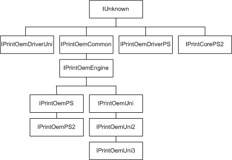

# COM Interfaces for Rendering Plug-Ins

The following COM interfaces are defined for communication between Microsoft's printer drivers and rendering plug-ins:

[IPrintOemUni COM Interface](iprintoemuni-com-interface.md), which allows the [printer graphics DLL](printer-graphics-dll.md) for Unidrv to call rendering plug-ins.

[IPrintOemUni2 COM Interface](iprintoemuni2-com-interface.md), which extends the capabilities of the IPrintOemUni COM interface.

[IPrintOemUni3 COM Interface](iprintoemuni3-com-interface.md), which extends the capabilities of the IPrintOemUni and IPrintOemUni2 COM interfaces.

[IPrintOemDriverUni COM Interface](iprintoemdriveruni-com-interface.md), which supplies utility operations to rendering plug-ins for Unidrv.

[IPrintOemPS COM Interface](iprintoemps-com-interface.md), which allows the [printer graphics DLL](printer-graphics-dll.md) for Pscript5 to call rendering plug-ins.

[IPrintOemPS2 COM Interface](iprintoemps2-com-interface.md), which extends the capabilities of the IPrintOemPS COM interface.

[IPrintOemDriverPS COM Interface](iprintoemdriverps-com-interface.md), which supplies utility operations to rendering plug-ins for Pscript5.

[IPrintCorePS2 COM Interface](iprintcoreps2-com-interface.md), which provides helper methods for Pscript5 minidriver render plug-ins.

The following figure shows the inheritance tree for the COM interfaces used in render plug-ins.

 

 

