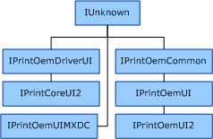

# COM Interfaces for UI Plug-Ins

The following COM interfaces are defined for communication between Microsoft's printer drivers and UI plug-ins:

-   [IPrintOemCommon COM interface](iprintoemcommon-com-interface.md), which provides methods to specify and get device information.

-   [IPrintOemUI COM interface](iprintoemui-com-interface.md), which enables the [printer interface DLL](printer-interface-dll.md) for Unidrv or Pscript5 to call UI plug-ins.

-   [IPrintOemUI2 COM interface](iprintoemui2-com-interface.md), which extends the [IPrintOemUI COM interface](iprintoemui-com-interface.md).

-   [IPrintOemUIMXDC COM interface](iprintoemuimxdc-com-interface.md), which enables UI plug-ins to control the conversion from GDI calls to XPS output in filter pipeline drivers.

-   [IPrintOemDriverUI COM interface](iprintoemdriverui-com-interface.md), which supplies utility operations to UI plug-ins.

-   [IPrintCoreUI2 COM interface](iprintcoreui2-com-interface.md), which provides helper methods for minidriver UI plug-ins.

The following figure shows the inheritance tree for the COM interfaces that are used in UI plug-ins.

 

 

