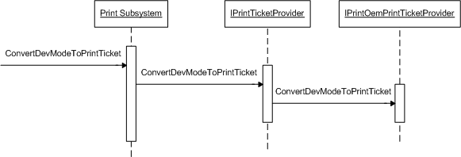

# ConvertDevModeToPrintTicket overview

Unidrv and PScript5 print drivers create the Print Ticket by using the elements from the public and private parts of the [**DEVMODEW**](/windows/win32/api/wingdi/ns-wingdi-devmodew) structure that the drivers support. The [**IPrintOemPrintTicketProvider::ConvertDevModeToPrintTicket**](/previous-versions/windows/hardware/drivers/ff553161(v=vs.85)) method is called for each print driver plug-in that was installed.

The following illustration shows the order of the calls to IPrintOemPrintTicketProvider::ConvertDevModeToPrintTicket when the driver call ConvertDevModeToPrintTicket.

 

