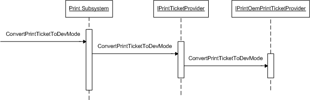

# ConvertPrintTicketToDevMode overview

Unidrv and PScript5 print drivers fill in the public and private parts of the [**DEVMODEW**](https://msdn.microsoft.com/library/windows/hardware/ff552837) structure that they support by using the information from the Print Ticket that was passed in the application's call to ConvertPrintTicketToDevMode. The [**IPrintOemPrintTicketProvider::ConvertPrintTicketToDevMode**](https://msdn.microsoft.com/library/windows/hardware/ff553167) method is called for each print driver plug-in that was installed.

The following illustration shows the order of the calls to **IPrintOemPrintTicketProvider::ConvertPrintTicketToDevMode** when the driver calls **ConvertPrintTicketToDevMode**.

