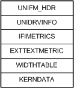
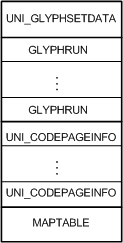
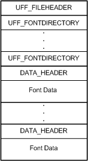

# Customized Font Management

For [*PCL*](https://msdn.microsoft.com/library/windows/hardware/ff556325#wdkgloss-pcl) printers, Unidrv supports downloading soft fonts as bitmaps or TrueType outlines. For device fonts, Unidrv supports PCL, CAPSL, and PPDS printer command formats. For other formats, customized font management code must be provided in a rendering plug-in. The following set of IPrintOemUni methods can be implemented:

[**IPrintOemUni::DownloadFontHeader**](https://msdn.microsoft.com/library/windows/hardware/ff554242)  
Used to obtain a soft font's header information from Unidrv and then download the information to the printer.

[**IPrintOemUni::DownloadCharGlyph**](https://msdn.microsoft.com/library/windows/hardware/ff554241)  
Used to download a soft font's character glyphs to the printer.

[**IPrintOemUni::OutputCharStr**](https://msdn.microsoft.com/library/windows/hardware/ff554267)  
Used to control the printing of characters.

[**IPrintOemUni::SendFontCmd**](https://msdn.microsoft.com/library/windows/hardware/ff554274)  
Used to modify a printer's device font selection command, and if necessary, send it to the printer.

[**IPrintOemUni::TextOutAsBitmap**](https://msdn.microsoft.com/library/windows/hardware/ff554277)  
Used to create a bitmap image of a text string.

[**IPrintOemUni::TTDownloadMethod**](https://msdn.microsoft.com/library/windows/hardware/ff554279)  
Used to specify the glyph format that the Unidrv should use when it sends a specified soft font to the printer.

Unidrv provides a callback function, [*UNIFONTOBJ\_GetInfo*](https://msdn.microsoft.com/library/windows/hardware/ff563594), that rendering plug-ins can call to obtain font or glyph information.

For device fonts, font descriptions must be provided as explained in the **Unidrv font metrics files** section and the **Glyph translation table files** section.

For cartridge fonts, font descriptions can be provided in resource DLLs and specified using [font cartridges](font-cartridges.md) entries in a [*GPD*](https://msdn.microsoft.com/library/windows/hardware/ff556283#wdkgloss-generic-printer-description--gpd-) file. Font descriptions can also be provided in the form of Unidrv font format files.

For downloadable PCL soft fonts, font descriptions must be provided as explained in the **Unidrv font format files** section.

### Unidrv Font Metrics Files

Each device font that a printer supports must be represented by a Unidrv Font Metrics (.ufm) file. A .ufm file is a binary file that is constructed using the structures described in [Unidrv Font Metrics Structures](https://msdn.microsoft.com/library/windows/hardware/ff563547). The first structure in a .ufm file is [**UNIFM\_HDR**](https://msdn.microsoft.com/library/windows/hardware/ff563587), which contains offsets to the file's other structures. The following figure shows the layout of a Unidrv Font Metrics file.

Unidrv also supports .ifi files, the font metrics files created for Windows NT 4.0.

### Glyph Translation Table Files

Each device font that a printer supports must be represented by a Glyph Translation Table (.gtt) file. A .gtt file is a binary file that is constructed using the structures described in [Unidrv Glyph Translation Table Structures](https://msdn.microsoft.com/library/windows/hardware/ff563549). The first structure in a .gtt file is a [**UNI\_GLYPHSETDATA**](https://msdn.microsoft.com/library/windows/hardware/ff563597) structure, which contains offsets to the file's other structures.

The following figure shows the layout of a glyph translation table file.

In the preceding figure, the UNI\_GLYPHSETDATA structure contains the offsets from the beginning of the file to the first [**GLYPHRUN**](https://msdn.microsoft.com/library/windows/hardware/ff550544) structure, to the first [**UNI\_CODEPAGEINFO**](https://msdn.microsoft.com/library/windows/hardware/ff563596) structure, and to the [**MAPTABLE**](https://msdn.microsoft.com/library/windows/hardware/ff556509) structure.

Unidrv also supports glyph translation files created for Windows NT 4.0, which use run-length encoding (RLE) compression and have an .rle extension.

### Unidrv Font Format Files

For cartridge fonts that are not specified using [font cartridges](font-cartridges.md) entries in a GPD file, the fonts must be described in a Unidrv Font Format (.uff) file. Additionally, downloadable [*PCL*](https://msdn.microsoft.com/library/windows/hardware/ff556325#wdkgloss-pcl) soft fonts must be specified using .uff files.

A .uff file is a binary file that is constructed using the following sets of structures:

-   [Unidrv font format structures](https://msdn.microsoft.com/library/windows/hardware/ff562892), which define the contents and structure of a .uff file.

-   [Unidrv font metrics structures](https://msdn.microsoft.com/library/windows/hardware/ff563547), which define the metrics for each font.

-   [Unidrv glyph translation table structures](https://msdn.microsoft.com/library/windows/hardware/ff563549), which define the glyph sets used by the fonts.

The following figure shows the layout of a Unidrv Font Format file.

A Unidrv Font Format file consists of a [**UFF\_FILEHEADER**](https://msdn.microsoft.com/library/windows/hardware/ff562862) structure, and one or more [**UFF\_FONTDIRECTORY**](https://msdn.microsoft.com/library/windows/hardware/ff562866) and [**DATA\_HEADER**](https://msdn.microsoft.com/library/windows/hardware/ff547364) structure pairs. Each DATA\_HEADER structure is associated with a block of font data. The UFF\_FILEHEADER structure contains the offset from the beginning of the file to the first UFF\_FONTDIRECTORY structure. Each UFF\_FONTDRECTORY structure contains the offset from the beginning of the file to a DATA\_HEADER structure that contains font data.

Additionally, for downloadable [*PCL*](https://msdn.microsoft.com/library/windows/hardware/ff556325#wdkgloss-pcl) soft fonts, the binary data to be downloaded is stored in a .uff file.

.uff files creation is the responsibility of vendor-supplied font installation software. Unidrv reads a printer's .uff files to obtain font and glyph information. The font installer should modify .uff file contents when fonts are added or deleted. For more information about creating a font installer, see [Customized Font Installers for Unidrv](customized-font-installers-for-unidrv.md).

All .uff files must be stored in the %SystemRoot%\\System32\\Spool\\Drivers\\Unifont directory. To associate individual .uff files with specific printers, installation software must call the SetPrinterData function (described in the Windows SDK documentation) to create registry values under each printer's registry key. The following table lists the registry value names that must be used, and indicates the maintainer of each value.

<table>
<colgroup>
<col width="33%" />
<col width="33%" />
<col width="33%" />
</colgroup>
<thead>
<tr class="header">
<th>Registry Value Name and Type</th>
<th>Value Definition</th>
<th>Maintainer</th>
</tr>
</thead>
<tbody>
<tr class="odd">
<td>
&quot;ExternalFontFile&quot;

REG_SZ
</td>
<td>
Filename of a .uff file that specifies the current installed fonts. Fonts can be downloadable or contained in a cartridge.
</td>
<td>
Font Installer
</td>
</tr>
<tr class="even">
<td>
&quot;ExtFontCartFile&quot;

REG_SZ
</td>
<td>
Filename of a .uff file that specifies all the fonts contained in all the font cartridges listed for &quot;ExtFontCartNames&quot;.
</td>
<td>
Font Installer
</td>
</tr>
<tr class="odd">
<td>
&quot;ExtFontCartNames&quot;

REG_MULTI_SZ
</td>
<td>
Names of all the font cartridges that could possibly be installed on the printer.
</td>
<td>
Font Installer
</td>
</tr>
<tr class="even">
<td>
&quot;FontCart&quot;

REG_MULTI_SZ
</td>
<td>
Names of all the font cartridges currently installed for the printer.
</td>
<td>
Unidrv user interface
</td>
</tr>
</tbody>
</table>

 

After you add a font cartridge to a printer, the system administrator must run the font installer, which is responsible to copy font descriptions from the .uff file specified by "ExtFontCartFile" into the .uff file specified by "ExternalFontFile". Likewise, the font installer must remove font descriptions from the .uff file specified by "ExtFontCartFile" when a cartridge is removed.

 

 

