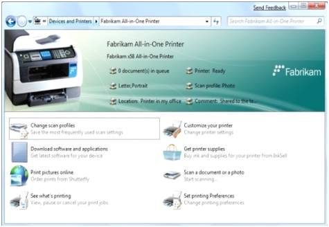

# Device Stage Custom Experience

With Device Stage, manufacturers can easily extend their product and corporate brands to the desktop. Figure 4 shows a typical branded Device Stage Custom Experience.

Manufacturers customize the device experience. They can include their own tasks (launch applications, download software, access product manuals, update firmware, buy accessories), include a wide range of device status, and update the experience at any time to reflect their most current offerings. Device Stage experiences can be created for specific models of a device. Depending on your product strategy, you can opt to create a general device experience for a whole line of devices or modify each experience down to the color of each individual device model.

Device Stage experiences are distributed through Microsoft servers to Windows 7 clients in device metadata packages. Any updates to the custom device experience will be available on Microsoft's servers, downloaded to Windows if found, and installed automatically. If the user is using Device Stage at the time, an option to upgrade immediately will be offered. Otherwise, the update will be applied the next time Device Stage is used.

Device Stage experiences may be distributed with manufacture's setup applications as well.

 

 

