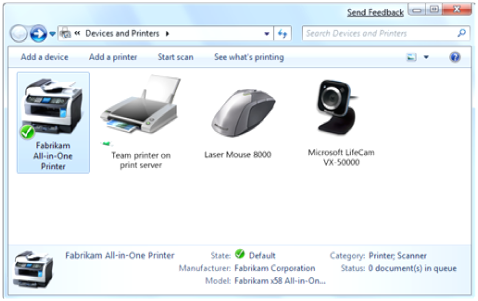
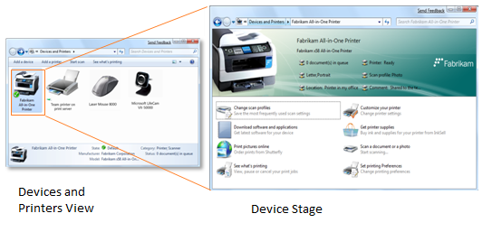

# Devices and Printers

The Devices and Printers folder is a new experience in Windows 7. Devices and Printers folder shows devices that are connected to a computer, including the document devices.

The following screen shot shows a typical Devices and Printers folder.

The following screen shot shows a Devices and Printers view and Device Stage.

 

 

