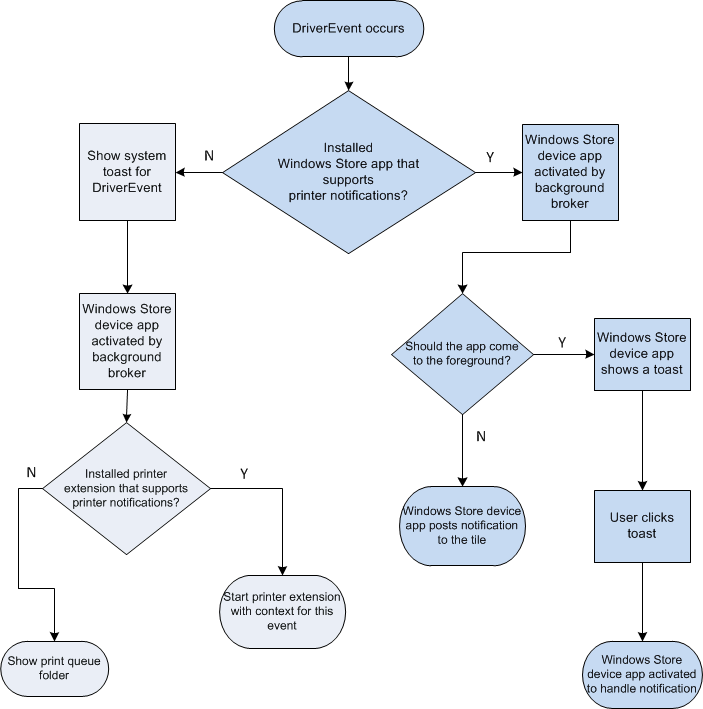
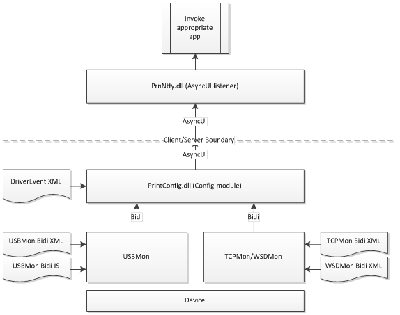

# Driver Support for Customized UI


The v4 print driver model was developed with built-in support for UI customization using printer extensions or UWP device apps for printing.

Additional UI customization design considerations are described in the following sections.

**Print Preferences**

All v4 print drivers work with print preferences, however, it is important to maintain the boundaries between the configuration and UI layers in order to ensure maximum consistency across all scenarios. Since there may not be any printer extensions or UWP device apps installed (or they may have been installed automatically), v4 print drivers need to ensure that the print drivers are functional without a customized printer preferences experience. In particular, this means that the PrintTicket and PrintCapabilities support should be complete and comprehensive in the GPD/PPD + JavaScript constraints implementation in the driver.

Some constraint validation in the printer extension or UWP device app could be helpful in terms of providing a highly informative, interactive experience, but it should not replace the driver's validation, which is considered authoritative.

Printer extensions and UWP device apps should use the [**IPrinterQueue::SendBidiQuery**](https://msdn.microsoft.com/library/windows/hardware/hh846197) method instead of making any direct network calls to a network resource. If a network resource must be contacted, it should be done on another thread, or asynchronously in order to prevent UI from hanging. Data should be cached after it is retrieved to make future calls faster.

**Printer Notifications**

Printer notifications are driven by Bidi and by the DriverEvent XML file. In order to better manage battery life and to minimize interruptions, however, notifications will only be shown when a user is printing.

While print preferences are contextual to the app that is printing, printer notifications are not. The following flow chart explains the decision tree that Windows uses to determine the behavior of printer notifications. If available, UWP device apps take precedence over printer extensions.



**Note**  It is important to be aware of the fact that, if you try to use a custom UI to show a notification in the Windows 8 environment by calling [GetForegroundWindow](https://msdn.microsoft.com/library/windows/desktop/ms633505.aspx), the notification window will not be displayed. This is because the operating system tries to assign a higher priority to the thread that creates a foreground window using GetForegroundWindow, and this is not allowed for dialogs in the Windows 8 environment. If you want to use a custom UI to display a notification in the Windows 8 environment, you must do so by calling [GetDesktopWindow.](https://msdn.microsoft.com/library/windows/desktop/ms633504.aspx)

 

**Creating Driver Events**. V4 print drivers use a DriverEvent XML file to describe Bidi queries and the triggers that should cause a driver event to be raised. And it is important to note that driver events only support standard strings. For more information about standard strings, see [AsyncUI Default Resource File String Resources](https://msdn.microsoft.com/library/cc746159.aspx). In the current implementation, this will cause an [AsyncUIBalloon](https://msdn.microsoft.com/library/cc238009(PROT.10).aspx) message to be created and published using the [MS-PAN protocol](https://msdn.microsoft.com/library/cc237960(PROT.13).aspx). This implementation may change in the future to improve performance, so it is crucial to develop your v4 print driver such that it does not take dependencies on the underlying protocol.

The following diagram shows the protocol utilization.



**Driver Event XML Sample**. The following XML code snippet specifies one driver event. The event checks for yellow ink to be less than 21% of the total capacity as reported by Bidi. If this occurs, an AsyncUIBalloon message is created with the string that is referenced by resourceID 132. In other words, the message would say that "'%1' is low on toner/ink." where Resource 2002 ("Yellow"), would be substituted for %1.

```xml
<de:DriverEvents xmlns:de="http://schemas.microsoft.com/windows/2011/08/printing/driverevents" schemaVersion="4.0">
  <DriverEvent eventId="{A04CF0FC-1CEB-4C62-B967-6F0AE5C5F81E}">
    <Transport>USB</Transport>
    <Transport>WSD</Transport>
    <Query>\Printer.Consumables</Query>
    <Trigger result="\Printer.Consumables.Yellow:Level" comparison="LessThan" value="21">
      <StandardMessage resourceId="132">
        <StringParameter index="1" resourceId="2002" />
      </StandardMessage>
    </Trigger>
  </DriverEvent>
</de:DriverEvents>
```

**Driver Event Schema**. The DriverEvent schema is available in the Windows Driver Kit as \\Include\\um\\PrinterDriverEvents.xsd.

**Driver Event XML Validation**. As long as you describe your DriverEvent XML properly in the driver manifest, the XML file is automatically validated by the INFGate tool.

## Related topics
[AsyncUIBalloon](https://msdn.microsoft.com/library/cc238009(PROT.10).aspx)  
[AsyncUI Default Resource File String Resources](https://msdn.microsoft.com/library/cc746159.aspx)  
[**IPrinterQueue::SendBidiQuery**](https://msdn.microsoft.com/library/windows/hardware/hh846197)  
[MS-PAN protocol](https://msdn.microsoft.com/library/cc237960(PROT.13).aspx)  


