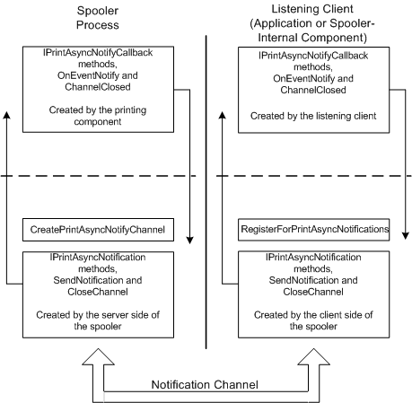

# Interfaces Implemented at Both Ends of the Notification Channel

The following figure shows the COM interfaces that are used in spooler asynchronous notification.

The left side of the picture depicts the sender end of the notification channel, along with the interfaces that the spooler implements. The right side of the picture depicts the listener side of the notification channel, along with the interfaces that are implemented by the application or printing component, and those implemented by the server side of the spooler. The sender and listeners implement the interfaces shown above the dashed line. The spooler implements the interfaces and functions shown below the dashed line.

 

 

