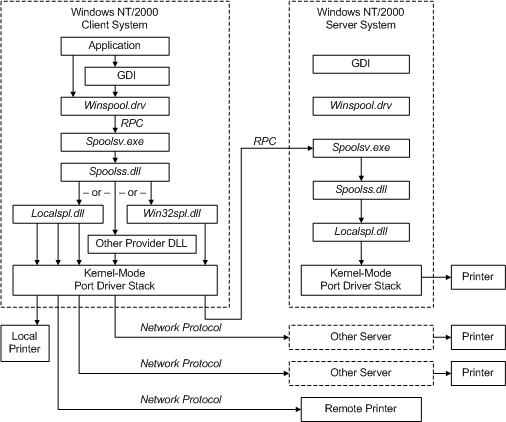

# Introduction to Print Providers

## 

**Warning**  
Starting with Windows 10, the APIs which support third-party print providers are deprecated. Microsoft does not recommend any investment into third-party print providers. Additionally, on Windows 8 and newer products where the v4 print driver model is available, third-party print providers may not create or manage queues which use v4 print drivers.

 

Print providers are responsible for directing print jobs to local or remote print devices. They are also responsible for print queue management operations, such as starting, stopping, and enumerating a server's print queues. Print providers define a high-level, machine-independent, operating system-independent view of a print server.

All print providers implement a common set of [print provider capabilities](print-provider-capabilities.md). These capabilities are defined by a set of API functions, which are called by the spooler's router (Spoolss.dll).

Most functions defined by print providers require a printer handle as input. A spooler client obtains a printer handle by calling **OpenPrinter** (described in the Microsoft Windows SDK documentation) in Winspool.drv, which calls the API server (Spoolsv.exe). The spooler's router (Spoolss.dll) calls each print provider's **OpenPrinter** function until one of them supplies a printer handle and a return value indicating the print provider recognizes the specified printer name. The router then returns its own handle to the API server. The router's handle includes both the printer handle and a provider handle. This handle is returned to the application so that subsequent calls from the application can be directed to the correct provider and printer.

Microsoft provides the following print providers with Windows 2000 and later:

**Localspl.dll**  
[Local print provider](local-print-provider.md). Handles all print jobs directed to printers that are managed from the local server.

**Win32spl.dll**  
Windows network print provider. Handles print jobs directed to remote Win32 (NT-based-operating system or Windows for Workgroups) servers. When the job arrives at the remote server, it is passed to the server's local print provider.

**Nwprovau.dll**  
Novell NetWare print provider. Handles print jobs directed to Novell NetWare print servers.

**Inetpp.dll**  
HTTP print provider. Handles print jobs sent to a URL.

Vendors can create additional network print providers. For more information, see [Writing a Network Print Provider](writing-a-network-print-provider.md).

The following diagram illustrates possible flow paths involving these print providers.

When viewing the diagram, you should consider the following points:

-   If the printer is managed by the client system, the print job is handled by the [local print provider](local-print-provider.md) (Localspl.dll). Printers managed by Localspl.dll do not have to be physically local to the client; they can be directly connected to network cards.

-   If the printer is located on a NT-based-operating system server, the network provider (Win32spl.dll) uses RPC to redirect calls from the client's router to the server's Spoolsv.exe process. Because the printer is local to the server, the server's local print provider will handle the print job.

-   If the printer is located on some other type of server, it can be accessed by either the local print provider or by a network print provider that supports that server type, using data formats and network protocols supported by the server.

-   For the local print provider to access a remote printer, it must contain a [*port monitor*](https://msdn.microsoft.com/library/windows/hardware/ff556325#wdkgloss-port-monitor) that can use network protocols recognized by the remote printer or server.

 

 

--------------------
[Send comments about this topic to Microsoft](mailto:wsddocfb@microsoft.com?subject=Documentation%20feedback%20%5Bprint\print%5D:%20Introduction%20to%20Print%20Providers%20%20RELEASE:%20%289/1/2016%29&body=%0A%0APRIVACY%20STATEMENT%0A%0AWe%20use%20your%20feedback%20to%20improve%20the%20documentation.%20We%20don't%20use%20your%20email%20address%20for%20any%20other%20purpose,%20and%20we'll%20remove%20your%20email%20address%20from%20our%20system%20after%20the%20issue%20that%20you're%20reporting%20is%20fixed.%20While%20we're%20working%20to%20fix%20this%20issue,%20we%20might%20send%20you%20an%20email%20message%20to%20ask%20for%20more%20info.%20Later,%20we%20might%20also%20send%20you%20an%20email%20message%20to%20let%20you%20know%20that%20we've%20addressed%20your%20feedback.%0A%0AFor%20more%20info%20about%20Microsoft's%20privacy%20policy,%20see%20http://privacy.microsoft.com/default.aspx. "Send comments about this topic to Microsoft")

