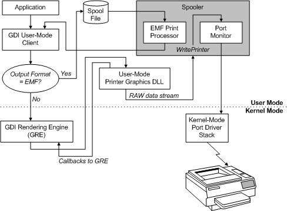
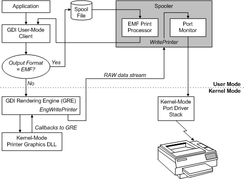

# Introduction to Printer Graphics DLLs

Printer graphics DLLs implement Drv-prefixed graphics DDI functions that are described in [Using the Graphics DDI](https://msdn.microsoft.com/library/windows/hardware/ff570139). These DLLs have the following two responsibilities:

-   Assist GDI in rendering a print job.

    A printer graphics DLL can provide graphics DDI drawing functions to handle drawing operations that must be performed in a device-specific manner and thus cannot be handled exclusively by GDI's rendering engine.

-   Deliver a rendered data stream to the spooler.

    Printer graphics DLLs typically produce an output stream in a [RAW data type](raw-data-type.md) (including command sequences) that the spooler can send to printer hardware through [*print monitors*](https://msdn.microsoft.com/library/windows/hardware/ff556325#wdkgloss-print-monitor).

The amount of rendering assistance that a printer graphics DLL must provide is printer type-specific, depending on the hardware's drawing capabilities, and includes the following scenarios:

-   The GDI rendering engine does all rendering, using a GDI-managed surface. The graphics DLL does not provide any DDI drawing functions.

-   The graphics DLL provides some graphics DDI drawing functions to work in conjunction with GDI's rendering engine, using a GDI-managed surface. The graphics DDI drawing functions provided by the graphics DLL can optionally call back to the GDI rendering engine's [GDI support services](https://msdn.microsoft.com/library/windows/hardware/ff566714).

-   The graphics DLL does all rendering by providing graphics DDI drawing functions and using a device-managed surface.

For example, the [Microsoft Universal Printer Driver](microsoft-universal-printer-driver.md) (Unidrv) uses a GDI-managed surface and provides some graphics DDI drawing functions, while the [Microsoft PostScript Printer Driver](microsoft-postscript-printer-driver.md) uses a device-managed surface.

For more information about providing rendering assistance in graphics drivers, see [Surface Types](https://msdn.microsoft.com/library/windows/hardware/ff569900) and [Using the Graphics DDI](https://msdn.microsoft.com/library/windows/hardware/ff570139).

The following two figures illustrate the data flow that occurs when an application creates a print job using GDI. EMF recording and playback are combined in these figures.

The first diagram depicts a user-mode printer graphics DLL.

**Note**   In Windows Vista printer graphics DLLs can only execute in user mode. For more information, see [Choosing User Mode or Kernel Mode](choosing-user-mode-or-kernel-mode.md).

 

The second diagram depicts a kernel-mode printer graphics DLL.

Note in these diagrams that if the output format from GDI is [*enhanced metafile (EMF)*](https://msdn.microsoft.com/library/windows/hardware/ff556279#wdkgloss-enhanced-metafile--emf-), the printer graphics DLL does not receive the job until the EMF print processor plays back EMF records. Note also that the EMF Print Processor changes output format to non-EMF.

The diagrams illustrate an entirely local environment. If the printer is connected to a server, EMF records are typically produced by the client's copy of the GDI rendering engine (GRE) and then spooled to a local file that is sent to the server. The server's copy of the spooler reads the file and sends the records to the server's EMF print processor, and the server's copy of the GRE calls the server's printer graphics DLL.

 

 

