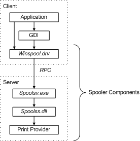

# Introduction to Spooler Components

The primary components of the Microsoft Windows 2000 and later print spooler are illustrated in the following diagram.

**Application**   
The print application creates a print job by calling GDI functions.

**GDI**   
The Graphics Device Interface ([*GDI*](https://msdn.microsoft.com/library/windows/hardware/ff556283#wdkgloss-graphics-device-interface--gdi-)) includes both user-mode and kernel-mode components. The user-mode component, Microsoft Win32 GDI, is used by Win32 applications that require graphics support. The kernel-mode component, the [*graphics engine*](https://msdn.microsoft.com/library/windows/hardware/ff556283#wdkgloss-graphics-engine) (or graphics rendering engine), exports services and functions that graphics device drivers can use.

**Winspool.drv**   
Winspool.drv is the client interface into the spooler. It exports the functions that make up the spooler's Win32 API, and provides RPC stubs for accessing the server. (GDI is the primary client, but applications also call some of its Win32 functions.)

**Spoolsv.exe**   
Spoolsv.exe is the spooler's API server. It is implemented as a Windows 2000 (or later) service that is started when the operating system is started. This module exports an RPC interface to the server side of the spooler's Win32 API. Clients of Spoolsv.exe include Winspool.drv (locally) and Win32spl.dll (remotely). The module implements some API functions, but most function calls are passed to a [print provider](print-providers.md) by means of the router (Spoolss.dll).

**Router**   
The router, Spoolss.dll, determines which print provider to call, based on a printer name or handle supplied with each function call, and passes the function call to the correct provider.

**Print Provider**   
The print provider that supports the specified print device.

**Print Monitor**   
Windows XP supports two types of print monitors: language monitors, and port monitors.

If printer hardware is local to the system on which the application is running, the "client" and "server" are the same system (although this is not evident in the diagram).

All spooler components execute in user mode.

 

 

