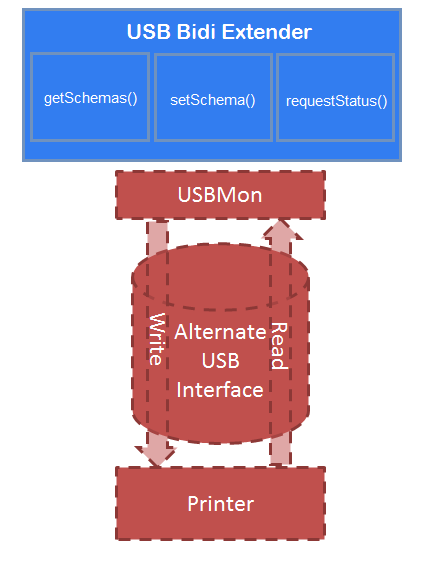

# JavaScript API Reference


Manufacturers can use the JavaScript API presented here, in combination with a Bidi XML file to provide support for Bidi over a USB connection to a print device.

For more information about USB Bidi communication with a print device, see [USB Bidi Extender](usb-bidi-extender.md).

## Bidi over USB


## getSchemas method


This method handles Bidi GET queries such as \\Printer.Consumables.YellowInk:Level. The JavaScript code is able to make queries to the printer using the USB bus and read responses as they come back.

Syntax

```javascript
function getSchemas(scriptContext, printerStream, schemaRequests, printerBidiSchemaResponses);
```

Parameters

*scriptContext*

\[in\] An [**IPrinterScriptContext**](https://msdn.microsoft.com/library/windows/hardware/hh768279) object that provides access to relevant property bags.
*printerStream*

\[in\] An [IPrinterScriptableSequentialStream](https://msdn.microsoft.com/library/windows/hardware/hh439697) object that allows read and write access to the USB bus.
*schemaRequests*

\[in\] Array object containing all of the requested Bidi query strings.
*printerBidiSchemaResponses*

\[out\] Object that the script uses to store all responses to query keys.
Return values

| Return value | Description                                                                                                                                                                             |
|--------------|-----------------------------------------------------------------------------------------------------------------------------------------------------------------------------------------|
| 0            | The script completed successfully.                                                                                                                                                      |
| 1            | The attached device was not ready to provide some requested information. Indicates that the print system should call the function again using any Requery Keys added during processing. |


## setSchema method


This method handles Bidi SET operations. The script can determine the incoming Bidi Schema value to either set data in the device, or perform some action on the device like clean ink heads.

If the device is not ready to process the specified data, the method can return a value of 1 to indicate the call should be retried after a wait period.

Parameters

*scriptContext*

\[in\] An [**IPrinterScriptContext**](https://msdn.microsoft.com/library/windows/hardware/hh768279) object that provides access to relevant property bags.
*printerStream*

\[in\] An [IPrinterScriptableSequentialStream](https://msdn.microsoft.com/library/windows/hardware/hh439697) object that allows read and write access to the USB bus.
*printerBidiSchemaElement*

\[in\] An [IPrinterBidiSchemaElement](https://msdn.microsoft.com/library/windows/hardware/hh406590) object that contains all the data associated with the Bidi Schema Value to set.
Return values

| Return value | Description                                                                                                                                                                          |
|--------------|--------------------------------------------------------------------------------------------------------------------------------------------------------------------------------------|
| 0            | The script completed successfully.                                                                                                                                                   |
| 1            | The attached device was not ready to provide some requested information. Indicates that the print system should call the function again using the supplied printerBidiSchemaElement. |


## getStatus method


This method is used to obtain unsolicited status from a printer while the device is printing. This function is only called during printing. The device should provide data on the read channel which this script can interpret into Bidi Schema values. Since the write channel to the device is blocked by print data, only unsolicited status is supported here.

This method is called repeatedly during printing. It is expected that the device will only return data if it is available and the script can understand it. If the device does not support unsolicited status or there is no need to call this function again, the script should return a value of 2 which will tell the **getStatus** execution thread in USBMon to exit successfully.

Parameters

*scriptContext*

\[in\] An **IPrinterScriptContext** object that provides access to relevant property bags.
*printerStream*

\[in\] An [IPrinterScriptableSequentialStream](https://msdn.microsoft.com/library/windows/hardware/hh439697) object that allows read access to the USB bus.
*printerBidiSchemaResponses*

\[out\] Object that the script uses to store all responses to query keys.
Return values

| Return value | Description                                                                                             |
|--------------|---------------------------------------------------------------------------------------------------------|
| 0            | The script completed successfully.                                                                      |
| 2            | The attached device no longer supports unsolicited status and this function should not be called again. |


## startPrintJob method


USBMon calls this method during StartDocPort. Calling **startPrintJob** allows the driver to modify the print stream or to implement a host-based request/response protocol that is used while the print device is printing a job. The job context object is passed into the function to allow the manufacturer's JavaScript code to manage job properties and to get access to the persistent data streams. The print data is passed in as a JavaScript array for the JavaScript code to process. **startPrintJob** also provides access to the printer device in the following ways:

-   Via the print stream

-   Via an object which can return Bidi Schema responses for USBMon to process

Syntax

```javascript
function startPrintJob(jobScriptContext, printerStream, printerBidiSchemaResponses);
```

Parameters

*jobScriptContext*

\[in\] An [**IPrinterScriptUsbJobContext**](https://msdn.microsoft.com/library/windows/hardware/dn425143) object that gives the manufacturer's JavaScript code access to the job property bag and the persistent data stream(s).
*printerStream*

\[in\] An **IPrinterScriptableSequentialStream** object, that the manufacturer's JavaScript code can use to read and write data to the print device.
*printerBidiSchemaResponses*

\[out\] An [**IPrinterBidiSchemaResponses**](https://msdn.microsoft.com/library/windows/hardware/hh920397) object that the manufacturer's JavaScript code can use to return any Bidi Schema value changes/updates.

| Return value | Description                                                                             |
|--------------|-----------------------------------------------------------------------------------------|
| 0            | Success.                                                                                |
| 1            | Failure – Cleanup the Job Context object and return an error code to the print spooler. |


## writePrintData method


USBMon calls this method during writePort. Calling **writePrintData** allows the driver to modify the print stream or to implement a host-based request/response protocol that is used while the print device is printing a job. The job context object is passed into the method to allow the manufacturer's JavaScript code to manage job properties and to get access to the persistent data streams. The print data is passed in as a JavaScript array for the JavaScript code to process. **writePrintData** also provides access to the printer device in the following ways:

-   Via the print stream

-   Via an object which can return Bidi Schema responses for USBMon to process

```javascript
function writePrintData(jobScriptContext, writePrintDataProgress, printData, printerStream, printerBidiSchemaResponses);
```

Parameters

*jobScriptContext*

\[in\] An **IPrinterScriptUsbJobContext** object that gives the manufacturer's JavaScript code access to the job property bag and the persistent data stream(s).
*writePrintDataProgress*

\[in\] An **IPrinterScriptableSequentialStream** object that the manufacturer's JavaScript code can use to read and write data to the print device.
*printData*

\[in\] An **IDispatch** object, a JavaScript array of the current print data. The *printData* parameter allows the JavaScript code to manipulate the data before either caching it to one of the data streams in *jobScriptContext* or sending it to the printer via *printerStream*.
*printerStream*

\[in\] An **IPrinterScriptableSequentialStream** object that the manufacturer's JavaScript code can use to read and write data to the print device.
*printerBidiSchemaResponses*

\[out\] An **IPrinterBidiSchemaResponses** object that the manufacturer's JavaScript code can use to return any Bidi Schema value changes or updates.
<table>
<colgroup>
<col width="50%" />
<col width="50%" />
</colgroup>
<thead>
<tr class="header">
<th>Return value</th>
<th>Description</th>
</tr>
</thead>
<tbody>
<tr class="odd">
<td>0</td>
<td>Success. The number of bytes processed from the print data stream (<em>printData</em>) is returned via <em>writePrintDataProgress</em>.</td>
</tr>
<tr class="even">
<td>1</td>
<td>Failure – Return an error code to the print spooler.</td>
</tr>
<tr class="odd">
<td>2</td>
<td><p>Retry - Process any Bidi Schema updates (including Bidi Events) in <em>printerBidiSchemaResponses</em>, and then call the JavaScript function again to allow the manufacturer&#39;s code to continue processing the data.</p>
<p>The number of bytes processed from the print data stream (<em>printData</em>) is returned via <em>writePrintDataProgress</em>.</p></td>
</tr>
<tr class="even">
<td>3</td>
<td><p>DeviceBusy – The device communication channel is not accepting data at this time. This does not indicate a failure. USBMon should inform the spooler that the device is busy, and then call the function again at a later time.</p>
<p>The number of bytes processed from the print data stream (<em>printData</em>) is returned via <em>writePrintDataProgress</em>.</p></td>
</tr>
<tr class="odd">
<td>4</td>
<td>AbortTheJob – The device cannot continue processing the job, or the user has cancelled the job using the front panel of the print device. When USBMon receives the message to abort a print job, it passes the information to the print spooler to abort the job, before returning.</td>
</tr>
</tbody>
</table>


## endPrintJob method


USBMon calls this method during endDocPort. Calling **endPrintJob** allows the driver to modify the print stream or to implement a host-based request/response protocol that is used while the print device is printing a job. The job context object is passed into the method to allow the manufacturer's JavaScript code to:

-   Finish processing any print data that persisted

-   Access the printer device via the print stream

-   Access an object that can pass Bidi Schema responses for USBMon to process

```javascript
function endPrintJob(jobScriptContext, printerStream, printerBidiSchemaResponses);
```

Parameters

*jobScriptContext*

\[in\] An IPrinterScriptUsbJobContext object that gives the manufacturer's JavaScript code access to the job property bag and the persistent data stream(s).
*printerStream*

\[in\] An IPrinterScriptableSequentialStream object that the manufacturer's JavaScript code can use to read and write data to the print device.
*printerBidiSchemaResponses*

\[out\] An IPrinterBidiSchemaResponses object that the manufacturer's JavaScript code can use to return any Bidi Schema value changes or updates.

| Return value | Description                                                                                                                                                                                                               |
|--------------|---------------------------------------------------------------------------------------------------------------------------------------------------------------------------------------------------------------------------|
| 0            | Success – Cleanup the Job Context object and return success to the print spooler.                                                                                                                                         |
| 1            | Failure – Cleanup the Job Context object and return an error code to the print spooler.                                                                                                                                   |
| 2            | Retry - Process any Bidi Schema updates (including Bidi Events) in *printerBidiSchemaResponses*, and then call the JavaScript function again to allow the manufacturer's JavaScript code to continue processing the data. |


## Bidi over secondary USB


If the device supports a secondary USB interface, then the device can use the **getSchemas** and **setSchema** methods described in the preceding sections, in addition to the **requestStatus** method.

## requestStatus method


This method is called instead of **getStatus**, if the **BidiUSBStatusInterface** directive has been specified in the v4 driver’s manifest file. **requestStatus** is used to obtain status from a print device while the device is printing.

The following diagram provides an overview of the USB Bidi extension architecture, showing the scenario where the **BidiUSBStatusInterface** directive has been specified and communication is therefore routed over an alternate USB interface.



This method is called repeatedly during printing. It is expected that the device will only return data if it is available and the script can understand it. If the device does not support solicited status or there is no need to call this method again, the script should return a value of 2 which will tell the **getStatus** execution thread in USBMon to exit successfully.

Parameters

*scriptContext*

\[in\] An **IPrinterScriptContext** object that provides access to relevant property bags.
*printerStream*

\[in\] An **IPrinterScriptableSequentialStream** object that allows read and write access to the USB bus.
*printerBidiSchemaResponses*

\[out\] Object that the script uses to store all responses to query keys.
Return values

| Return value | Description                                                                                           |
|--------------|-------------------------------------------------------------------------------------------------------|
| 0            | The script completed successfully.                                                                    |
| 2            | The attached device no longer supports solicited status and this function should not be called again. |


## Related topics
[**IPrinterScriptContext**](https://msdn.microsoft.com/library/windows/hardware/hh768279)  
[IPrinterScriptableSequentialStream](https://msdn.microsoft.com/library/windows/hardware/hh439697)  
[USB Bidi Extender](usb-bidi-extender.md)  


