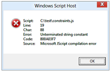

# JavaScript Constraints


The v4 printer driver model supports a new model for extended constraint and PrintTicket handling that is derived from the v3 [IPrintOemPrintTicketProvider](https://msdn.microsoft.com/library/windows/hardware/ff553174) interface.

Instead of using a compiled configuration plug-in however, v4 printer drivers use JavaScript to implement APIs called JavaScript constraints, and the printer driver can implement one or more of them as needed. For more information, see the functions in the **JavaScript Constraint APIs** section at the end of this topic.

JavaScript constraints can be used to augment PrintCapabilities, validate PrintTickets and handle conversion of PrintTicket to DEVMODE and vice versa. However, JavaScript constraints have a few limitations. The following is a list of the main limitations:

-   Features and options added using CompletePrintCapabilities, as well as constraints specified in validatePrintTicket are not shown in the desktop printer preferences window.

-   Features and options added in using CompletePrintCapabilities are not persisted into the public DEVMODE.

-   JavaScript constraints cannot access language resources from resource dlls to localize added features and options or parameters.

As such, we recommend that JavaScript constraints are used only where appropriate. Features and options should be specified in the GPD or PPD files where possible, and only complicated constraints should be represented in JavaScript.

## Debugging JavaScript files


Basic syntactical validation of JavaScript files is supported by opening the JavaScript file in the Windows based Script Host. To do this, right-click the JavaScript file and select **Open With**, and choose the Windows based Script Host entry in the list. If no errors are thrown, then the JavaScript is syntactically valid. Otherwise, it will point out the line number of the issue, as shown in the following screenshot.



Publically available JavaScript validation tools may also be valuable as an aide in evaluating the style of JavaScript files.

Interactive debugging can be enabled by creating the following registry key:

**Key Name:** HKEY\_LOCAL\_MACHINE\\SYSTEM\\CurrentControlSet\\Control\\Print

**Value Name:** EnableJavaScriptDebugging

**Type:** DWORD

**Value:** 1

However, since *PrintConfig.dll* is loaded and unloaded frequently, debugging an app that prints is not a recommended testing/debugging strategy. Instead, Microsoft recommends that manufacturers build a test app that calls each of the relevant entry points for JavaScript constraints using these public APIs: [PTGetPrintCapabilities](https://msdn.microsoft.com/library/windows/desktop/dd162881.aspx), [PTConvertDevModeToPrintTicket](https://msdn.microsoft.com/library/windows/desktop/dd162879.aspx), [PTConvertPrintTicketToDevMode](https://msdn.microsoft.com/library/windows/desktop/dd162880.aspx), and [PTMergeAndValidatePrintTicket](https://msdn.microsoft.com/library/windows/desktop/dd162884.aspx).

The test app alone is sufficient to enable debugging, but it is also beneficial to add unit tests to ensure that the whole driver is handling PrintTicket, PrintCapabilities and constraints as expected. For more information on how to build Unit tests in Visual Studio, please see the following topics:

[A Unit Testing Walkthrough with Visual Studio Team Test](https://msdn.microsoft.com/library/ms379625.aspx)

[Unit Testing with Microsoft Visual Studio 2010 and Team Foundation Server](http://channel9.msdn.com/Events/TechEd/Australia/2010/DEV362)

After the registry key shown in the preceding text is created, and the hosting process has been restarted, you can debug your JavaScript source file.

It is important to note that if the source file fails to parse, then the debugger is not invoked and it will seem as if the debug environment has failed. If the source file fails to parse, see [Windows Script Host](https://msdn.microsoft.com/library/9bbdkx3k.aspx) for more information about how to proceed.

If there are no errors and your source file is parsed successfully, debug your source file as follows:

1. Install Microsoft Visual Studio 2012 or later on the test machine

2. Create a print queue using the driver that has the constraints JavaScript code

3. Set this print queue as the default.

4. Start your test app or an app that prints and begin a scenario that will cause JavaScript constraints to be invoked. The app must call into the PrintTicket/PrintCapabilities APIs in order to break into the JavaScript constraints; older apps like Notepad do not call into these APIs, but the XPS Viewer app does. Microsoft recommends using a test app here, since the scenarios can be more easily isolated and reproduced.

5. At this time, the “Visual Studio Just-In-Time Debugger” will pop up saying “An unhandled exception occurred in &lt;your app&gt;”

6. Launch a new instance of Visual Studio 2012 or later

7. Choose Debug, then Attach To Process

8. In the Attach to Process dialog, ensure that Attach To: is set to Script code

9. Now choose the test app or app printing and finally choose Attach

10. Click on “Break All”

11. Now go back to the “Visual Studio Just-In-Time Debugger” dialog and click “No”

12. Visual Studio will break into the debugger at the location called by the current test. You may now debug the code normally.

## JavaScript Constraint APIs


This section specifies the functions that serve as API entry points for use in the JavaScript constraint file. These are the functions:

-   validatePrintTicket
-   completePrintCapabilities
-   convertDevModeToPrintTicket
-   convertPrintTicketToDevMode

## validatePrintTicket function


This API is called in order to validate that a PrintTicket object is valid for a particular printer. This is analogous in function to the [**IPrintOemPrintTicketProvider::ValidatePrintTicket**](https://msdn.microsoft.com/library/windows/hardware/ff553184) API.

Syntax

```javascript
function validatePrintTicket(printTicket, scriptContext)
```

Parameters

*printTicket*

\[in\]\[out\] The [**IPrintSchemaTicket**](https://msdn.microsoft.com/library/windows/hardware/hh451398) object to be validated.
*scriptContext*

\[in\] The [**IPrinterScriptContext**](https://msdn.microsoft.com/library/windows/hardware/hh768279) object that provides access to the driver property bag, the queue property bag and the user property bag.
Return value

| Return value | Description                                                                                                                                                                                                |
|--------------|------------------------------------------------------------------------------------------------------------------------------------------------------------------------------------------------------------|
| 0            | Indicates that the *printTicket* parameter was invalid and could not be corrected. Equivalent to [E\_PRINTTICKET\_FORMAT](https://msdn.microsoft.com/library/windows/desktop/dd162884.aspx). |
| 1            | Indicates that the *printTicket* parameter is a valid PrintTicket for this printer. Equivalent to [S\_PT\_NO\_CONFLICT](https://msdn.microsoft.com/library/windows/desktop/dd162884.aspx).   |
| 2            | Indicates that the *printTicket* parameter was modified to make it valid. Equivalent to [S\_PT\_CONFLICT\_RESOLVED](https://msdn.microsoft.com/library/windows/desktop/dd162884.aspx).       |

 

## completePrintCapabilities function


This API is called to allow the PrintCapabilities object to be modified. This should be used for conditional features (for example, borderless is only supported on photo paper) or to represent features that could not otherwise be generated by a GPD or PPD file (for example, nested feature definitions). This is analogous in function to the [**IPrintOemPrintTicketProvider::CompletePrintCapabilities**](https://msdn.microsoft.com/library/windows/hardware/ff553158) API.

Syntax

```javascript
function completePrintCapabilities(printTicket, scriptContext, printCapabilities)
```

Parameters

*printTicket*

\[in\] The [**IPrintSchemaTicket**](https://msdn.microsoft.com/library/windows/hardware/hh451398) object input to constrain the generated PrintCapabilities document to.
*scriptContext*

\[in\] The [**IPrinterScriptContext**](https://msdn.microsoft.com/library/windows/hardware/hh768279) object that provides access to the driver property bag, the queue property bag and the user property bag.
*printCapabilities*

\[in\]\[out\] The [**IPrintSchemaCapabilities**](https://msdn.microsoft.com/library/windows/hardware/hh451256) object representing the base PrintCapabilities object that was generated by the configuration module.
Return value

None.

## convertDevModeToPrintTicket function


This API is called to convert values from the DEVMODE property bag into a PrintTicket. This is analogous in function to the [**IPrintOemPrintTicketProvider::ConvertDevModeToPrintTicket**](https://msdn.microsoft.com/library/windows/hardware/ff553161) API, except that this implementation encapsulates the private section of the DEVMODE into an [**IPrinterScriptablePropertyBag**](https://msdn.microsoft.com/library/windows/hardware/hh973217) object and allows no access to the public section of the DEVMODE.

Syntax

```javascript
function convertDevModeToPrintTicket(devModeProperties, scriptContext, printTicket)
```

Parameters

*devModeProperties*

\[in\] The **IPrinterScriptablePropertyBag** object representing the DEVMODE Property Bag.
*scriptContext*

\[in\] The [**IPrinterScriptContext**](https://msdn.microsoft.com/library/windows/hardware/hh768279) object that provides access to the driver property bag, the queue property bag and the user property bag.
*printTicket*

\[in\]\[out\] The [**IPrintSchemaTicket**](https://msdn.microsoft.com/library/windows/hardware/hh451398) object representing the PrintTicket.
Return value

None.

## convertPrintTicketToDevMode function


This API is called to convert values from a PrintTicket into the DEVMODE property bag. This is analogous in function to the [**IPrintOemPrintTicketProvider::ConvertPrintTicketToDevMode**](https://msdn.microsoft.com/library/windows/hardware/ff553167) API, except that this implementation encapsulates the private section of the DEVMODE into an **IPrinterScriptablePropertyBag** object and allows no access to the public section of the DEVMODE.

Syntax

```javascript
function convertPrintTicketToDevMode(printTicket, scriptContext, devModeProperties)
```

Parameters

*printTicket*

\[in\] The **IPrintSchemaTicket** object representing the PrintTicket to be converted.
*scriptContext*

\[in\] The **IPrinterScriptContext** object that provides access to the driver property bag, the queue property bag and the user property bag.
*devModeProperties*

\[in\]\[out\] The **IPrinterScriptablePropertyBag** object representing the DEVMODE Property Bag.
Return value

None.

## Constraint Best Practices


The Windows 8 print dialog and the print preferences experience support only a subset of the Print Schema Keywords namespace. As a result, Microsoft does not recommend using constraints between features that are supported in the Windows 8 print dialog or print preferences UI and features that are not in that UI, since users will have no opportunity to resolve such constraints.

For example, if the PageMediaType option called Photo is constrained to only work with a PageResolution value of 1200dpi, then users will never be able to choose the Photo media type. In cases like this, it is better to match the user’s intent (Photo media) and adjust any settings necessary to make this occur. These adjustments can be made in JavaScript constraint code.

If a driver does not utilize JavaScript constraints, there is no requirement that a file is provided. If a driver utilizes JavaScript constraints for only a subset of the entry points (for example, validatePrintTicket), the other entry points should be entirely omitted from the JavaScript file.

For more information about how to use JavaScript constraints, see the [Print driver constraints sample](http://go.microsoft.com/fwlink/p/?LinkId=617946).

 

 


