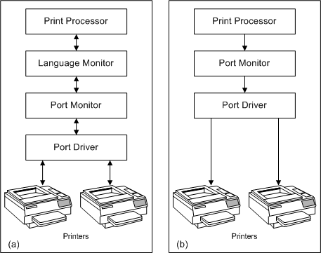

# Language and Port Monitor Interaction

The following illustration demonstrates the path taken by printer data from the print processor to a printer that a) has a language monitor associated with it; and b) does not have a language monitor associated with it.

If a language monitor is associated with a printer during the printer's installation, the language monitor receives the printer's data stream from the spooler's print processor. The language monitor modifies the data stream and passes it to the printer's port monitor.

Most of the [functions defined by print monitors](functions-defined-by-print-monitors.md) are the same for [language monitors](language-monitors.md) and [port monitors](port-monitors.md). Typically, if a language monitor is in the data stream path, the spooler calls the language monitor's implementation of a function and the language monitor calls the port monitor's implementation of the same function. For example, the [**WritePort**](https://msdn.microsoft.com/library/windows/hardware/ff563792) function in the PJL language monitor (Pjlmon.dll) adds [*PJL*](https://msdn.microsoft.com/library/windows/hardware/ff556325#wdkgloss-pjl) commands to the data stream and then calls the port monitor's **WritePort** to send the stream to the port driver.

If a language monitor is not installed, the spooler calls the port monitor's implementation of the function.

Because language monitors and port monitors are discrete components of the printing architecture, customized and Microsoft-supplied monitors can be used together. Thus, you can provide a customized language monitor that works in conjunction with a Microsoft-supplied port monitor, and vice versa.

You can also provide a single print monitor consisting of a [combined language and port monitor](combined-language-and-port-monitor.md).

 

 

