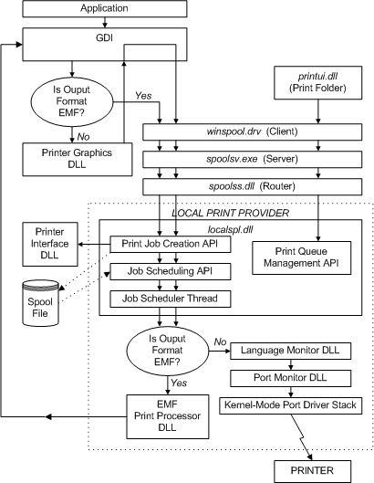

# Local Print Provider

**Warning**  
Starting with Windows 10, the APIs which support third-party print providers are deprecated. Microsoft does not recommend any investment into third-party print providers. Additionally, on Windows 8 and newer products where the v4 print driver model is available, third-party print providers may not create or manage queues which use v4 print drivers.

 

The local print provider for Microsoft Windows 2000 and later provides job control and printer management capabilities for all printers that are accessed through the local print provider's port monitors. (A client administrator sets up access to such printers by selecting the **Local Printer** option when using the Add Printer Wizard.) Such printers include those connected to the local system's serial and parallel ports. They can also include devices connected to other I/O channels, such as SCSI ports, along with printers connected to remote non-NT-based-operating system servers.

The local print provider implements the entire set of [functions defined by print providers](functions-defined-by-print-providers.md). It also supplies the following capabilities:

-   Print job spooler, with despooling of jobs directed to locally accessible print queues.

-   Support for the Windows 2000 and later operating system versions [printer driver architecture](printer-driver-architecture.md) with calls to local printer interface DLLs.

-   Support for vendor-supplied print processors (see [Writing a Print Processor](writing-a-print-processor.md)).

-   Support for vendor-supplied print monitors (see [Writing a Print Monitor](writing-a-print-monitor.md)).

The following diagram provides a (somewhat simplified) view of control flow among the local printer provider's components, when an application creates a print job.

As the diagram shows, an application creates a print job by calling the Graphics Driver Interface (GDI). Regardless of whether the print job's initial output format is EMF, the local print provider's job creation API creates a spool file. Later, when the job is scheduled, the spool file is read and, if the format is [*enhanced metafile (EMF)*](https://msdn.microsoft.com/library/windows/hardware/ff556279#wdkgloss-enhanced-metafile--emf-), the EMF print processor sends the job back to GDI for conversion to RAW format, with the help of a [printer graphics DLL](printer-graphics-dll.md). The converted data stream can then be sent back through the local print provider to the printer (without being respooled).

A vendor can create [*partial print providers*](https://msdn.microsoft.com/library/windows/hardware/ff556325#wdkgloss-partial-print-provider) that work in conjunction with the local print provider to support custom network configurations.

 

 

