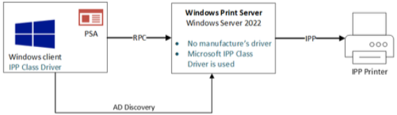

# More information on Windows protected print mode for enterprises
To read about the basics of Windows protected print mode for enterprises and developers, see [Windows protected print mode for enterprises and developers.](windows-protected-print-mode-for-enterprises-and-developers.md)

The Windows print system has historically been a frequent target for attacks and Print bugs accounted for 9% of all cases reported to the Microsoft Security Response Center (MSRC) over the past three years. The Spooler service, which handles printer management, data conversion and many other tasks, is the core of the Windows Print system. This process runs as SYSTEM, which is one of the highest privilege levels in Windows, which is why it's such an attractive target. The Spooler is also widely accessible to standard users and loads third-party code on demand. These drivers were historically required to support a wide range of printers during a time when the industry lacked uniform standards for document handling and printer communication. This vast ecosystem of drivers from various manufacturers allows Windows to support a wide range of older printers and their over 40 [Page Description Languages (PDL)](https://en.wikipedia.org/wiki/Page_description_language). However, that complexity makes it difficult to have a common set of criteria. This complexity presents many security challenges that limit Microsoft's ability to provide more secure options for users. This article discusses challenges related to securing the print stack and shares some information that can help users today. It also gives a preview of a collaboration between the [Microsoft Offensive Research & Security Engineering (MORSE)](https://news.microsoft.com/source/features/innovation/morse-microsoft-offensive-research-security-engineering/) team and Windows Print team on what we think will be the future of Windows Printing, an IPP-based revision to the print stack that no longer loads third-party drivers and runs with reduced attack surface.

## The driver problem

The security model for print drivers relies on a shared responsibility model where the Windows printing stack and third-party drivers must each play a role in providing functionality and enforcing security promises while avoiding introducing vulnerabilities. This is like other subsystems in Windows, but printing is a challenging scenario because customers want the process to be frictionless when loading remote code into a highly privileged system process.

Loading code from third parties presents several challenges from a security perspective. Not only must you ensure you're loading the code you intended to load, that code may change the behavior of your application in unexpected ways. For example, drivers support complex parsing logic that can lead to bugs allowing full control of the Spooler or related print process. In the event a vulnerability is discovered in a driver, Microsoft is dependent on the third-party to update the driver. When publishers no longer exist or consider older products out of support, there's no clear way to address the vulnerability.

The reliance on third-party drivers in a shared responsibility model limits Microsoft's agility and options to secure customers. We're often on the cutting edge of new security protections but can't uniformly deploy them when loading third-party code.

## Compatibility

One challenge with print drivers is their age. Many print drivers are decades old and are incompatible with modern security mitigations such as Control Flow Guard (CFG), Control Flow Enforcement Technology (CET), Arbitrary Code Guard (ACG) and the many other protections Microsoft has implemented over the years. These protections are often "all or nothing" meaning that all participating binaries must take steps to be compatible for the protection to be effective. Since not every print manufacturer has taken the necessary steps to update these drivers, the Print service doesn't currently benefit from these modern exploit mitigations. If a vulnerability is discovered, attackers are more likely to have success exploiting it.

## Excessive permissions

The Windows Print stack keeps many aspects of its original design that is over two decades old. The Print Spooler runs as SYSTEM with special privileges that make it more powerful than standard Administrator accounts on Windows. Drivers loaded into the Spooler (including third-party drivers) run at this privilege level for basic document printing and handling of user requests. For every user's request the Spooler receives it must determine the right level of access for that task that can prove to be difficult.

One reason the Spooler maintains these permissions is due to backwards compatibility concerns. Thousands of drivers, made over the course of 30 years, are in use in Windows and identifying all possible risks to users is difficult.

The ideal solution would be to remove drivers entirely and move the Spooler to a least privilege security model. Some operations may require SYSTEM level privileges but most certainly don't. The challenge that we often face at Microsoft is that any solution must consider the compatibility requirements of our customers. Balancing this need with the desire to improve security is a difficult task. Fortunately, we think we have a solution.

## IPP basics

IPP is an HTTP based protocol and supports many of the authentication methods one would expect from HTTP. Each IPP request is an HTTP POST message and printers are identified using URIs such as ipps://printer.example.com/ipp/print. IPP supports all the [common operations](https://www.iana.org/assignments/ipp-registrations/ipp-registrations.xhtml#ipp-registrations-10) one would expect from a printer such as:

- Create-Job: Create a new print job

- Send-Document: Add a document to a print job

- Print-Job: Create a new print job with a single document

- Get-Printer-Attributes: Get Printer status and capabilities

- Get-Jobs: Get a list of queued jobs

- Get-Job-Attributes: Get job status and options

- Cancel-Job: Cancel a queued job

Driverless printing supports a limited number of PDLs based on public standards such as PWG Raster and PDF. This limits the unique number of formats the operating system must handle for conversion and greatly simplifies code. Client-side rendering is used to generate the final document sent to the printer.

## Print Support App (PSA)

[PSAs](/windows-hardware/drivers/devapps/print-support-app-design-guide) allow printer OEMs and IHVs to extend our existing IPP support for their specific needs. Not all printers support the same features and configuration options. PSAs allow for tailored user experiences without compromising the experience users expect.

## Point and Print

[Point and Print](introduction-to-point-and-print.md) is a feature that allows users to connect to a remote printer without providing drivers, and has all necessary drivers installed on the client. Point and Print remains with IPP, but it works differently.  We no longer must install drivers, but some basic configuration is required to set up the printer. This process works as follows with IPP:

1. Windows client and server make a connection over RPC

1. Both server and client use their inbox Microsoft IPP driver

1. Server uses IPP to communicate with printer

1. PSA is installed, if available

## Security

IPP-based printing in Windows today removes the need for third-party drivers. IPP supports transport encyrption, and with a limited number of PDL's supported, parsing complexity is substantially decreased. This is a meaningful improvement over the model requiring the use of drivers.

IPP Printing in Windows today is already a great step forward from a security perspective, and we encourage users to switch whenever possible. We also encourage administrators to prioritize this action across your fleet.

## Spooler security in Windows protected print mode

Windows protected print mode builds on the existing IPP print stack where only [Mopria certified printers](https://mopria.org/certified-products) are supported, and disables the ability to load third-party drivers. By doing this, we can make meaningful improvements to print security in Windows that otherwise couldn't happen. Our goal is to ultimately provide the most secure default configuration and provide the flexibility to revert back to legacy (driver-based) printing at any time, if users find their printer isn't compatible. To use Windows protected print mode, ensure printers have IPP enabled.

When users enable Windows protected print mode, normal spooler operations are deferred to a new Spooler process that implements the Windows protected print mode improvements. Let's look at some of those changes.

### Limited and secure print configuration

In Windows protected print mode, many legacy configurations are no longer valid. A common attack on Windows would abuse the fact that a printer port monitor can be a Dynamic Link Library (DLL), and attackers would abuse this to load malicious code. Attackers would also use symbolic links to trick the Spooler into loading malicious code, and that is no longer possible. There are many legacy APIs's which are updated to restrict the configuration to values that make sense only when using IPP. This limits the opportunity for attackers to use the Spooler to modify files on the system.

### Module blocking

APIs that allow module loading will be modified to prevent loading of new modules. For example, AddPrintProviderW, and other calls, would result in loading modules that may be malicious.  We'll also enforce a restriction that ensures that only Microsoft Signed binaries required for IPP are loaded.

### Per-user XPS rendering

XPS rendering runs as the user instead of SYSTEM in Windows protected print mode. Most print jobs in Windows today involve some XPS conversion and the process that handles this task (PrintFilterPipelineSVC) is the source of many memory corruption vulnerabilities. As with the other issues, by running this process as the user, the impact of these bugs is minimized.

### Lower privileges for common Spooler tasks

Removing drivers also allows us to take common tasks performed by the Spooler process and move those to a process running as the user. If these processes have memory corruption vulnerabilities, that impact is limited to actions only the user can perform.

The new Spooler Worker process has a new restricted token that removes many privileges such as SeTcbPrivilege, SeAssignPrimaryTokenPrivilege, and no longer runs at SYSTEM IL.

### Binary mitigations

By removing third-party binaries, we're now able to enable many of the binary mitigations Microsoft has invested in over the years. Processes in Windows protected print mode run with many new binary mitigations. Here are some of the highlights:

Control Flow Enforcement Technology ([CFG](/cpp/build/reference/guard-enable-guard-checks), [CET](/cpp/build/reference/cetcompat)) – Hardware based mitigation that helps to mitigate Return Oriented Programming (ROP) based attacks.

Child Process Creation Disabled – Child process creation is blocked. This prevents attackers from spawning a new process if they manage to get code execution in the Spooler.

Redirection Guard – prevents many common path redirection attacks that often target the Print Spooler.

Arbitrary Code Guard – prevents dynamic code generation within a process.

These protections make it more difficult to abuse a vulnerability if one is found.

## Point and Print with Windows protected print mode

As mentioned above, Point and Print will normally allow driver loading as well as IPP printer configuration. Some users may have an environment with only IPP printers, but malicious attackers can pretend to be a printer and trick users into installing drivers. Windows protected print mode prevents Point and Print from ever installing third-party drivers, mitigating this risk.

