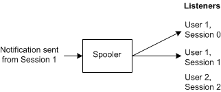
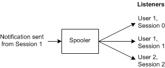
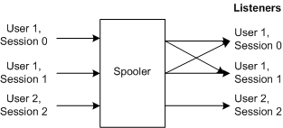
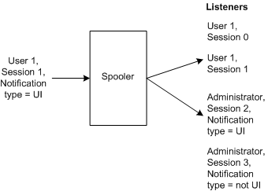

# Notification Filtering and Communication Styles


This section describes the interface between the spooler process and printing components such as the print processor, driver, and monitor.

### Notification Filtering

The PrintAsyncNotifyUserFilter enumerated type is used for two situations. In the first of these a print component running inside the spooler calls the [CreatePrintAsyncNotifyChannel](http://go.microsoft.com/fwlink/p/?linkid=124750) function to create a notification channel. The caller passes one enumerator of the PrintAsyncNotifyUserFilter enumerated type to specify which listening clients are permitted to receive notifications. In the second situation, a listening client calls the [RegisterForPrintAsyncNotifications](http://go.microsoft.com/fwlink/p/?linkid=124752) function to register for notification. The caller passes one of the PrintAsyncNotifyUserFilter enumerators to indicate which notifications it should receive.

```cpp
typedef enum 
{
  kPerUser,
  kAllUsers
} PrintAsyncNotifyUserFilter; 
```

In the figure that follows, the **kPerUser** enumerator is used in the call to the **CreatePrintAsyncNotifyChannel** function. As a result, only those listeners running in the same user account as the user who made the registration are permitted to receive notifications.



In the next figure, the **kAllUsers** enumerator is used in the call to the **CreatePrintAsyncNotifyChannel** function. As a result, all listeners who are interested in the printer or server can receive notifications. Note that only administrators are permitted to use the **kAllUsers** setting in calls to this function.



The next figure shows the situation in which both User 1 and User 2 have registered for notifications by calling the **RegisterForPrintAsyncNotifications** function, passing the **kPerUser** enumerator in the call. Of the three notifications sent, listener User 1 receives notifications from User 1 in either session 0 or session 1. Listener User 2 receives notifications from User 2 in session 2.



If the listening clients shown in the preceding figure had called **RegisterForPrintAsyncNotifications**, but this time passing the **kAllUsers** enumerator in the call, all listeners in all sessions would have received the three notifications. Note that only administrators are permitted to use the **kAllUsers** enumerator in calls to this function.

### <a href="" id="administrators-"></a>Administrators

An administrator is a user with PRINTER\_ACCESS\_ADMINISTER rights for the specified print object. An administrator can send notifications to anyone and can receive notifications from anyone. Note that the notification filter is still enforced.

In the following figure, Joe sends a notification on a channel with a **kPerUser**. When the channel is filtered on the basis of this enumerator, the notification should be sent only to sessions that belong to User 1, namely session 1. However, the notification is also sent to session 2, because there is an administrator listening there and is listening for notifications of this type. Note that the administrator in session 3 does not receive the notification, because the notification types are not the same.



### Specifying the Type of Communication

By specifying a communication type, the printing component indicates whether a response is expected from the listener client, as well as the way the spooler handles the case when notifications are sent back from multiple clients.

```cpp
typedef enum 
{
  kBidirectional = 1, 
  kUnidirectional, 
} PrintAsyncNotifyConversationStyle
```

There are two types of communication -- unidirectional and bidirectional. In unidirectional communication, a listening client does not respond to a spooler notification. In this case, the listening client cannot send notifications back because it receives a **NULL**[IPrintAsyncNotifyChannel](http://go.microsoft.com/fwlink/p/?linkid=124758) interface pointer. In bidirectional communication, the client sends a response when it receives a notification, and carries on a dialog with the printing component. This is the UI notification case.

The situation in which multiple sessions receive a UI notification deserves comment. In this situation, the spooler opens a channel and notifies all listeners that match the filters, sending them the first notification. When the first listener responds, the spooler closes the other channels and the dialog continues with the first client.

If an administrator (for example) logs on before a registered listening client responds, the administrator receives the same UI notification as the listening client.

When the first user (the administrator, for example) sends the response, the spooler marks the connections with the other clients as "closed." When the other listening client eventually responds, it receives a "channel closed" message.

### Notification Types

The notification type is a GUID that the spooler accepts and uses to filter the listener clients. (See the PrintAsyncNotificationType type definition in header file Prnasnot.h.) Any client of the spooler asynchronous notification mechanism can define its own notification type. Even though the spooler is unaware of the meaning of the notification type that is sent, it still filters the listener clients based on the notification type.

Each notification must have a notification data type associated with it. This type identifies the notification data schema.

In addition to the notification data type, there is a type associated with the channel, the notification channel type. A notification sender and a listening client use the notification channel type for different purposes.

On the sender side of the channel, when a print component opens a channel, it can specify the type of notifications it intends to send through that channel. All of the notifications passing through that channel must be of the same type as the notification channel type.

The sender must always associate a type with a notification so that spooler "knows" how to send it to the appropriate listening clients. A listening client must validate the data according to its own schema. The notification type identifies this schema.

On the listener side of the channel, a listening client can ask to receive one type of notification by specifying a certain notification data type when it registers.

The spooler defines a special notification type used to announce to listening clients that the service or the application has died.

```cpp
const GUID NOTIFICATION_RELEASE;
```

The listening client can receive this type of message only when its [IPrintAsyncNotifyCallback::ChannelClosed](http://go.microsoft.com/fwlink/p/?linkid=124756) method is called.

### <a href="" id="notification-registration-handle-"></a>Notification Registration Handle

When a client registers for notifications, the server-side spooler maintains an internal table with information about the application, such as its security context. The notification registration handle is an opaque structure that the client receives.

The client can unregister for receiving notifications only by using this handle.

 

 


