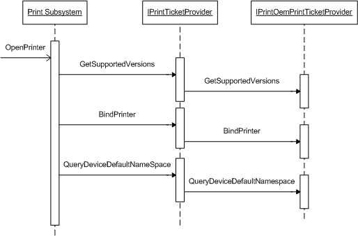

# OpenPrinter

When a print queue is opened using the **OpenPrinter** function, the print driver is loaded and the following methods of the [**IPrintTicketProvider**](/windows-hardware/drivers/ddi/prdrvcom/nn-prdrvcom-iprintticketprovider) interface are called in this order:

1. [**IPrintTicketProvider::GetSupportedVersions**](/windows-hardware/drivers/ddi/prdrvcom/nf-prdrvcom-iprintticketprovider-getsupportedversions)

1. [**IPrintTicketProvider::BindPrinter**](/windows-hardware/drivers/ddi/prdrvcom/nf-prdrvcom-iprintticketprovider-bindprinter)

1. [**IPrintTicketProvider::QueryDeviceNamespace**](/windows-hardware/drivers/ddi/prdrvcom/nf-prdrvcom-iprintticketprovider-querydevicenamespace)

The methods of the **IPrintTicketProvider** interface in a Unidrv or PScript5 print driver call the **IPrintOemPrintTicketProvider** interface methods of the each plug-in hosted by the driver. The following illustration and list show how these calls are made when **OpenPrinter** is called.

1. For each plug-in, call [**IPrintOemPrintTicketProvider::GetSupportedVersions**](/windows-hardware/drivers/ddi/prcomoem/nf-prcomoem-iprintoemprintticketprovider-getsupportedversions).

1. For each plug-in, call [**IPrintOemPrintTicketProvider::BindPrinter**](/windows-hardware/drivers/ddi/prcomoem/nf-prcomoem-iprintoemprintticketprovider-bindprinter).

1. For each plug-in, call [**IPrintOemPrintTicketProvider::QueryDeviceDefaultNamespace**](/windows-hardware/drivers/ddi/prcomoem/nf-prcomoem-iprintoemprintticketprovider-querydevicedefaultnamespace).
