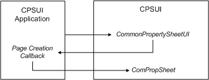

# Page Creation Callbacks

When an application makes an initial call into CPSUI's entry point function ([**CommonPropertySheetUI**](https://msdn.microsoft.com/library/windows/hardware/ff546148)), it must include the address of a [**PFNPROPSHEETUI**](https://msdn.microsoft.com/library/windows/hardware/ff559812)-typed callback function. This callback function is responsible for describing property sheet pages and sending these descriptions to CPSUI for creation.

CPSUI's **CommonPropertySheetUI** function immediately calls back to the PFNPROPSHEETUI-typed function, supplying the address of a [**PROPSHEETUI\_INFO**](https://msdn.microsoft.com/library/windows/hardware/ff561767) structure. The application can then call CPSUI's [**ComPropSheet**](https://msdn.microsoft.com/library/windows/hardware/ff546207) function, supplying page descriptions that CPSUI can use to create the pages, as illustrated in the following diagram:

For more information, see [Methods for Specifying Pages](methods-for-specifying-pages.md).

 

 

