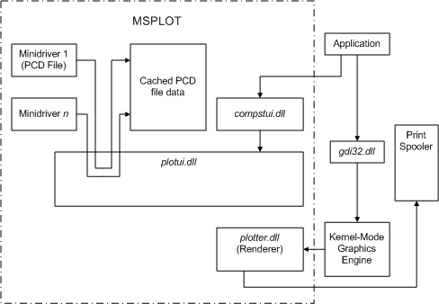

# Plotter Driver Components

MSPlot components consist of DLLs and binary data files, as illustrated in the following diagram.

Components in the diagram include:

**Application**  
A user application that provides users with printing capabilities.

**gdi32.dll**  
User-mode DLL that exports Win32 GDI functions.

**Kernel-Mode Graphics Engine**  
NT-based operating system executive code that implements GDI functionality.

**Minidrivers**  
MSPlot minidrivers (.pcd files).

**Cached .pcd file data**  
Minidriver data read from .pcd files.

**plotui.dll**  
[Plotter driver user interface](plotter-driver-user-interface.md) DLL, providing common UI code for all MSPlot-supported printers.

**compstui.dll**  
[CPSUI](common-property-sheet-user-interface.md) user interface for printers.

**plotter.dll**  
[Plotter driver renderer](plotter-driver-renderer.md), which renders images and sends the image data stream to the spooler.

 

 

