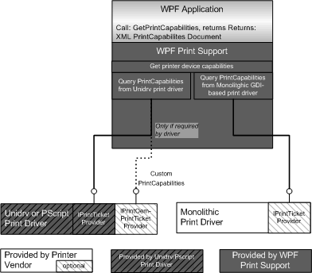

# Print Capabilities Architecture

The PrintCapabilities object is returned by the [**IPrintTicketProvider::GetPrintCapabilities**](/previous-versions/windows/hardware/drivers/ff554365(v=vs.85)) method of the print driver's implementation of the [IPrintTicketProvider interface](/previous-versions/windows/hardware/drivers/ff554375(v=vs.85)). XPSDrv print drivers must implement the IPrintTicketProvider interface in addition to the [**DrvDeviceCapabilities**](/windows-hardware/drivers/ddi/winddiui/nf-winddiui-drvdevicecapabilities) function.

You can modify older, GDI-based print drivers to provide a PrintCapabilities document directly but this modification is not required. The Windows Vista print subsystem creates an XML PrintCapabilities document for GDI-based drivers that do not add the ability to return one. The PrintCapabilities document that the Windows Vista print subsystem creates, however, includes only the limited set of parameters that the Microsoft Win32 function, **DeviceCapabilities** , supports. For a GDI-based print driver to provide a complete list of the printer's features and capabilities, it must include support for the [IPrintTicketProvider interface](/previous-versions/windows/hardware/drivers/ff554375(v=vs.85)).

The following list and diagram illustrate how the different types of print drivers can support the Print Capabilities technology:

Unidrv or PScript5 print driver  
The [IPrintTicketProvider interface](/previous-versions/windows/hardware/drivers/ff554375(v=vs.85)) has been added to Universal (Unidrv) and PostScript (PScript5) print drivers in Windows Vista.

Unidrv or PScript5 print driver plug-in  
Unidrv and Pscript5 print drivers that have custom features require plug-ins to add or remove the features and return an accurate PrintCapabilities document. The custom feature plug-ins for a Unidrv and a PScript5 print driver must support the [IPrintOemPrintTicketProvider interface](/windows-hardware/drivers/ddi/prcomoem/nn-prcomoem-iprintoemprintticketprovider).

 Monolithic GDI-based and XPSDrv print drivers  
XPSDrv print drivers must support the [IPrintTicketProvider interface](/previous-versions/windows/hardware/drivers/ff554375(v=vs.85)). GDI-based, monolithic print drivers must support the IPrintTicketProvider interface to return printer capabilities and features that the Win32 function, **DeviceCapabilities**, does not provide.

 

