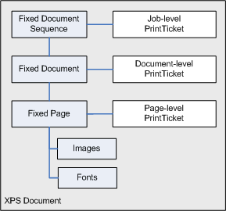
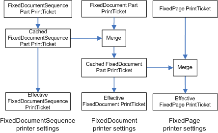

# Print Ticket Merging


The PrintTicket objects processed in the Print Driver have a hierarchical relationship based on the document part they are associated with. The following diagram illustrates the relationship of these parts within an XPS Document.



Each of the Print Ticket levels in the hierarchy has a different scope. The print driver filter modules that use the Print Ticket information must maintain that scope as the Print Ticket objects are read from the document stream. The following diagram illustrates how this can be done in a print driver filter module.



As the document parts are read by the filter, the Print Ticket objects are read, merged and validated and cached by the filter for configuring how the filter will process each document part. The previous diagram illustrates how the different Print Ticket levels are logically merged and the pseudo code below illustrates how this merge might be implemented.

```cpp
class Filter
{
 PrintTicket Saved_FDS_PT;
 PrintTicket Saved_FD_PT;

 ProcessFDS(pIFixedDocumentSequence)
    {
 Saved_FDS_PT = pIFixedDocumentSequence->GetPrintTicket();

        // continue processing the FixedDocumentSequence part
    }

 ProcessFD(pIFixedDocument)
    {
 Saved_FD_PT->Release();

        temp = pIFixedDocument->GetPrintTicket();

 Saved_FD_PT = PrintTicketMergeAndValidate(
 Saved_FDS_PT, temp);

        // continue processing the FixedDocument part
    }

 ProcessPage(IFixedPage)
    {
        temp = pIFixedPage->GetPrintTicket();

 PagePT = PrintTicketMergeAndValidate(Saved_FD_PT, temp);

        // continue processing the FixedPage part
    }

 PrintTicket PrintTicketMergeAndValidate(
 ParentPT,
 PartPT)
    {
        // Entries in the Part PrintTicket 
        // take precedence over the corresponding entries 
        // in the Parent PrintTicket
    }
};
```

 

 


