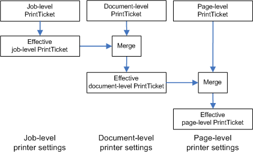

# Print Ticket Organization

A PrintTicket document can contain commands that apply to different parts of a document. A Print Ticket document can contain one of the following content levels that are ranked according to their specificity:

-   The high-level job (job-level Print Ticket)

-   The documents in the job (document-level Print Ticket)

-   The pages in the document (page-level Print Ticket)

The job-level Print Ticket is the most general, followed by the document-level Print Ticket, and finally the page-level Print Ticket, which is the most specific. The elements of the Print Schema Framework that apply to these levels are prefixed with "Job", "Document", or "Page" accordingly. The Print Ticket hierarchy corresponds to the hierarchy of XPS Document parts.

The hierarchical nature of Print Tickets enables elements in lower-level Print Tickets to override corresponding elements of higher-level Print Tickets. Before you can use PrintTickets, they must be merged with the PrintTicket objects of higher levels in the document that apply to obtain the effective Print Ticket for a specific document part. This merge is performed before the effective Print Ticket is required for processing, such as in a print driver.

The following figure shows the relationships among the different levels of PrintTicket documents and how this merge is performed.

 

 

