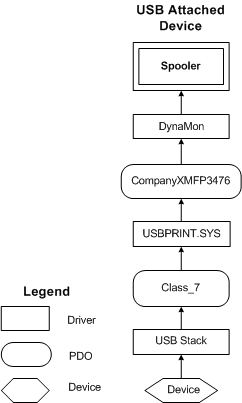

# Printer Connected to a USB Port


When a Universal Serial Bus (USB) printer is connected over a USB port, the USB bus driver creates a physical device object (PDO) with a [*hardware ID*](https://msdn.microsoft.com/library/windows/hardware/ff556288#wdkgloss-hardware-id) of the form VIDvvPIDpp, and [*compatible ID*](https://msdn.microsoft.com/library/windows/hardware/ff556274#wdkgloss-compatible-id) Class\_7. The [*devnode*](https://msdn.microsoft.com/library/windows/hardware/ff556277#wdkgloss-devnode) for this is created under Enum\\USB\\ ...Class\_7 and identifies a printer device connected over a USB port. Plug and Play loads usbprint.sys using a compatible ID match on Class\_7 from usbprint.inf.

The entry from usbprint.inf that is used to load usbprint.sys for any USB printer device is:

```cpp
[Microsoft]
%USBPRINT.DeviceDesc% = USBPRINT_Inst,USB\Class_07,GENERIC_USB_PRINTER
```

Usbprint.sys queries the Plug and Play printer to get the 1284 string, and generates a hardware ID that is compatible with the parallel bus enumerator. (For more information, see [USBPRINT Interface](usb-printing.md).) It creates a physical device object (PDO) whose devnode is under Enum\\USBPRINT, and with two hardware IDs in the following form:

```cpp
USBPRINT\Company_NameModelNam1234
```

The following figure shows the driver stack for a printer connected over a USB port.



The following example shows the entries in an [**INF Manufacturer section**](https://msdn.microsoft.com/library/windows/hardware/ff547454) that can be used to install a USB or other bus-type printer driver. The first line guarantees a rank-0 hardware ID match if the printer is installed on a USB bus. The second line guarantees a rank-0 hardware ID match if the printer is installed on another bus. For more information, see [Installing a Custom Plug and Play Printer Driver](installing-a-custom-plug-and-play-printer-driver.md).

```cpp
 "Model Name XYZ" = Install_Section_XYZ, USBPRINT\Company_NameModelNam1234, Company_NameModelNam1234 ; plus any other compatible IDs  
"Model Name XYZ" = Install_Section_XYZ, Company_NameModelNam1234, Company_NameModelNam1234 ; plus any other compatible IDs
```

 

 


