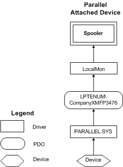

# Printer Connected to an LPT Port


The LPT enumerator is an example of a [bus driver](https://msdn.microsoft.com/library/windows/hardware/ff540704). The LPT enumerator is capable of obtaining identification information from LPT port hardware that conforms to the *IEEE 1284 Extended Capabilities Port Protocol and ISA Interface Standard*.

When a Windows 2000 or later system starts, the configuration manager calls the LPT enumerator to enumerate the IEEE 1284-compatible devices connected to LPT ports. For each device found, the configuration manager calls the printer class installer. The printer class installer calls **SetupDi**-prefixed [device installation functions](https://msdn.microsoft.com/library/windows/hardware/ff541299), which obtain information from [printer INF files](printer-inf-files.md).

For a parallel-connected printer, the parallel enumerator creates a [*devnode*](https://msdn.microsoft.com/library/windows/hardware/ff556277#wdkgloss-devnode) with a unique [*hardware ID*](https://msdn.microsoft.com/library/windows/hardware/ff556288#wdkgloss-hardware-id) generated from the 1284 string it receives from the printer.

An example 1284 string is:

```cpp
"MANUFACTURER:Hewlett-Packard;COMMAND SET:PJL,MLC,PCL,POSTSCRIPT;MODEL:HP Color LaserJet 550;CLASS:PRINTER;COMMENT:HP LaserJet;"
```

From this 1284 string the parallel enumerator produces the following hardware ID:

```cpp
LPTENUM\Hewlett-PackardHP_Co3115
```

The hardware ID is made up of the enumerator prefix, followed by the Manufacturer Name, the Model name, and a cyclic redundancy check (CRC) code. The CRC code, which is the last four digits of the hardware ID, is generated from the manufacturer and model strings. Spaces in the string are replaced with underscores.

To read the 1284 ID string from the device, send [**IOCTL\_PAR\_QUERY\_DEVICE\_ID**](https://msdn.microsoft.com/library/windows/hardware/ff544076). Note that the spooler redirects the LPT*x* symbolic link (where *x* is the LPT number 1, 2, or 3) to the spooler's named pipe, which means that if the spooler is running, then parport never sees the IOCTLs sent to LPTx.

The devnode for a parallel-connected Plug and Play printer is placed under **HKLM\\SYSTEM\\CurrentControlSet\\Enum\\LPTENUM** and has a single hardware ID of the form:

```cpp
LPTENUM\Company_NameModelNam1234
```

The driver stack appears in the figure following the next code sample.

The INF code that will correctly "plug and play" a hardware ID of the form LPTENUM\\*Company\_NameModelNam1234* is shown in the following example. Notice that the "Model Name XYZ" device description appears twice in the [**INF Manufacturer section**](https://msdn.microsoft.com/library/windows/hardware/ff547454). The hardware ID in the first line includes the bus enumerator, while the hardware ID in the second line does not. The two lines guarantee a rank-0 hardware ID match regardless of the type of bus on which the printer is installed. See [Installing a Custom Plug and Play Printer Driver](installing-a-custom-plug-and-play-printer-driver.md) for more information.

```cpp
[Manufacturer]
%Company_Name%=Company_Name

; Section name for all drivers for Company_Name
[Company_Name]
"Model Name XYZ" = Install_Section_XYZ, LPTENUM\Company_NameModelNam1234 ; plus any compatible IDs
"Model Name XYZ" = Install_Section_XYZ, Company_NameModelNam1234 ; plus any compatible IDs

; The install section for the XYZ model
[Install_Section_XYZ]

[Strings]
Company_Name="Company Name"
```



For a printer that shares its [*device ID*](https://msdn.microsoft.com/library/windows/hardware/ff556277#wdkgloss-device-id) with other models, the INF file should be similar to the following:

```cpp
[Manufacturer]
%Company_Name%=Company_Name

; The section for all drivers for Company_Name
[Company_Name]
"Model Name XYA" = Install_Section_XYA, LPTENUM\Company_NameModelNam1234, Company_NameModelNam1234 ; plus any other compatible IDs
"Model Name XYA" = Install_Section_XYA, Company_NameModelNam1234, Company_NameModelNam1234 ; plus any other compatible IDs
"Model Name XYB" = Install_Section_XYB, LPTENUM\Company_NameModelNam1234, Company_NameModelNam1234; plus any other compatible IDs
"Model Name XYB" = Install_Section_XYB, Company_NameModelNam1234, Company_NameModelNam1234 ; plus any other compatible IDs

; The install sections
[Install_Section_XYA]

[Install_Section_XYB]

[ControlFlags]
InteractiveInstall = LPTENUM\Company_NameModelNam1234, Company_NameModelNam1234

[Strings]
Company_Name = "Company Name"
```

Just as in the previous example, each model in the [**INF Manufacturer section**](https://msdn.microsoft.com/library/windows/hardware/ff547454) is represented by a pair of nearly identical lines. For a given model, one line in the pair includes the bus enumerator; the other does not. The two lines guarantee a rank-0 hardware ID match regardless of the type of bus on which the printer is installed. See [Installing a Custom Plug and Play Printer Driver](installing-a-custom-plug-and-play-printer-driver.md) for more information.

 

 


