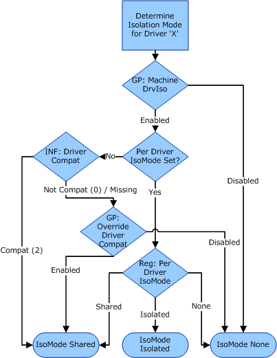

# Printer Driver Isolation

Printer driver isolation improves the reliability of the Windows print service, by enabling printer drivers to run in processes that are separate from the process in which the print spooler runs.

Support for printer driver isolation is implemented in Windows 7, Windows Server 2008 R2 and later operating systems.

For Windows 7 and Windows Server 2008 R2, an inbox printer driver must support printer driver isolation and be able to run in an isolated process.

###  Previous Versions of Windows

In previous versions of Windows, including Windows Server 2008, printer drivers always ran in the same process as the spooler. Printer driver components that ran in the spooler process included the following:

-   Print driver configuration modules

-   Print processors

-   Rendering modules

The failure of a single print driver component could cause the print subsystem to fail, halting print operations for all users and for all print components.

###  New Versions of Windows

With Windows 7 and Windows Server 2008 R2, an administrator can, as an option, configure a printer driver to run in an isolated process--a process that is separate from the spooler process. By isolating the driver, the administrator can prevent a fault in a driver component from halting the print service.

For more information about the spooler functions, see [Spooler Component Functions and Structures](https://msdn.microsoft.com/library/windows/hardware/ff562686).

###  Driver Isolation Support in INF Files

By default, if the INF file that installs a printer driver does not indicate that the driver supports driver isolation, the printer class installer configures the driver to run in the spooler process. However, if the INF file indicates that the driver supports driver isolation, the installer configures the driver to run in an isolated process. An administrator can override these configuration settings and specify, for each driver, whether to run the driver in the spooler process or in an isolated process.

To support driver isolation, the INF file that installs a printer driver can use the **DriverIsolation** keyword to indicate whether the driver supports printer driver isolation. Setting **DriverIsolation**=2 indicates that the driver supports driver isolation. Setting **DriverIsolation**=0 indicates that the driver does not support driver isolation. Omitting the **DriverIsolation** keyword from the INF file has the same effect as setting **DriverIsolation**=0.

###  Spooler Functions for Driver Isolation Settings

The following table shows the spooler functions that an administrator can use to configure the driver-isolation settings.

<table>
<colgroup>
<col width="50%" />
<col width="50%" />
</colgroup>
<thead>
<tr class="header">
<th>Function name</th>
<th>Operation</th>
</tr>
</thead>
<tbody>
<tr class="odd">
<td>
<a href="http://go.microsoft.com/fwlink/p/?linkid=135631" data-raw-source="[GetPrinterDataEx](http://go.microsoft.com/fwlink/p/?linkid=135631)">GetPrinterDataEx</a>
</td>
<td>
Get the driver-isolation settings for a printer.
</td>
</tr>
<tr class="even">
<td>
<a href="http://go.microsoft.com/fwlink/p/?linkid=135632" data-raw-source="[SetPrinterDataEx](http://go.microsoft.com/fwlink/p/?linkid=135632)">SetPrinterDataEx</a>
</td>
<td>
Set the driver-isolation settings for a printer.
</td>
</tr>
<tr class="odd">
<td>
<a href="http://go.microsoft.com/fwlink/p/?linkid=135633" data-raw-source="[EnumPrinterDataEx](http://go.microsoft.com/fwlink/p/?linkid=135633)">EnumPrinterDataEx</a>
</td>
<td>
Enumerate driver-isolation settings for a printer.
</td>
</tr>
<tr class="even">
<td>
<a href="http://go.microsoft.com/fwlink/p/?linkid=135634" data-raw-source="[FindFirstPrinterChangeNotification](http://go.microsoft.com/fwlink/p/?linkid=135634)">FindFirstPrinterChangeNotification</a>

<a href="http://go.microsoft.com/fwlink/p/?linkid=135635" data-raw-source="[FindNextPrinterChangeNotification](http://go.microsoft.com/fwlink/p/?linkid=135635)">FindNextPrinterChangeNotification</a>
</td>
<td>
Request notifications of changes to the driver-isolation settings for a printer.
</td>
</tr>
</tbody>
</table>

 

The format for the data is as follows:

-   Driver in each group is separated by '\\'
-   Each driver group is separated by '\\\\'

The first group loads the driver into the spooler processes. Each subsequent group loads the drivers in isolated processes per group. The second group is considered the 'shared' group in which other isolation-capable drivers are loaded by default.

###  Configuring Driver Isolation Mode through Administration

A computer administrator can use the Windows Print Management console or call the Windows spooler functions to configure the driver-isolation settings for each printer driver installed on a computer. The administrator configures the driver to use one of the settings listed in the following table.

<table>
<colgroup>
<col width="50%" />
<col width="50%" />
</colgroup>
<thead>
<tr class="header">
<th>Driver-isolation mode</th>
<th>Meaning</th>
</tr>
</thead>
<tbody>
<tr class="odd">
<td>
Shared
</td>
<td>
Run the driver in a process that is shared with other printer drivers but is separate from the spooler process.
</td>
</tr>
<tr class="even">
<td>
Isolated
</td>
<td>
Run the driver in a process that is separate from the spooler process and is not shared with other printer drivers.
</td>
</tr>
<tr class="odd">
<td>
None
</td>
<td>
Run the driver in the spooler process.
</td>
</tr>
</tbody>
</table>

 

Ideally, a printer driver is able to run in shared mode. That is, it runs in an isolated process shared with other printer drivers but separate from the spooler process. A driver might need to run in isolated mode if it can run in a process separate from the spooler process, but has difficulty sharing the process with other drivers. For example, a poorly designed driver might have file names that conflict with those of related drivers or of different versions of the same driver, or the driver might fault frequently or have a memory leak that interferes with the operation of other drivers that run in the same process.

To support troubleshooting, the domain administrator can disable the driver-isolation feature on a computer in the domain, or the administrator can force all of the printer drivers on the computer to run in isolated mode. In isolated mode, each driver must run in a process separate from the spooler and from the other printer drivers.

If driver isolation is disabled by group policy, the isolation is off for all printer drivers. If isolation is enabled, then the individual drivers are mode-checked. If a driver has isolation mode set, it runs in shared, isolated, or none mode, based on the registry entry. However, if the driver does not have isolation mode set and it is compatible with isolation, it runs in shared mode. If the driver is not compatible with the mode, the group policy override determines whether the driver runs in shared mode or none mode.

The following chart shows a decision map for choosing the driver isolation mode:

### Spooler Functions Allowed under Driver Isolation

Only specific functions are allowed under driver isolation.

### Spoolss.dll Functions

The following functions are exported by spoolss.dll and are available to spooler plugins by linking to spoolss.lib.

**AddMonitorW**

**AppendPrinterNotifyInfoData**

**ClosePrinter**

**DeletePortW**

**DeletePrintProcessorW**

**EndDocPrinter**

**EndPagePrinter**

**EnumFormsW**

**EnumJobsW**

**FlushPrinter**

**GetJobAttributes**

**GetJobAttributesEx**

**GetJobW**

**GetPrinterDataExW**

**GetPrinterDataW**

**GetPrinterDriverDirectoryW**

**GetPrinterDriverW**

**GetPrinterW**

**ImpersonatePrinterClient**

**OpenPrinterW**

**ReadPrinter**

**RouterCreatePrintAsyncNotificationChannel**

**RouterGetPrintClassObject**

**SetJobW**

**SetPrinterDataExW**

**SetPrinterDataW**

**StartDocPrinterW**

**StartPagePrinter**

**WritePrinter**

### WinSpool.drv Functions

The following functions are exported by winspool.drv and are available to spooler plugins by linking to Winspool.h.

**AppendPrinterNotifyInfoData**

**ExtDeviceMode**

**ImpersonatePrinterClient**

**IsValidDevmode**

**PartialReplyPrinterChangeNotification**

**ReplyPrinterChangeNotification**

**RevertToPrinterSelf**

**RouterAllocBidiMem**

**RouterAllocBidiResponseContainer**

**RouterAllocPrinterNotifyInfo**

**RouterCreatePrintAsyncNotificationChannel**

**RouterFreeBidiMem**

**RouterFreeBidiResponseContainer**

**RouterFreePrinterNotifyInfo**

**RouterGetPrintClassObject**

**RouterRegisterForPrintAsyncNotifications**

**RouterUnregisterForPrintAsyncNotifications**

 

 

