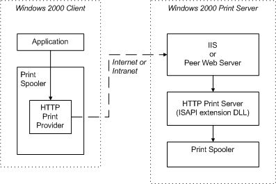

# Printing to URLs from Applications

From an application's perspective, printing to a URL-identified print queue is identical to printing to a UNC-identified print queue. The application is typically unaware that the print queue is accessed by means of a URL.

By [viewing print Web pages](viewing-print-web-pages.md), a user can install and connect to a URL-identified print queue. When this happens, the print queue is assigned the same "friendly name" that it has on the print server, and this friendly name is listed in the user's print folder.

Applications generally refer to the print queue by its friendly name, as they do for UNC-identified print queues. Calls to the **OpenPrinter** function in the local print provider (caused, for example, by the application making GDI calls), include the friendly name. The local print provider, in turn, calls **OpenPrinter** in the HTTP print provider (Inetpp.dll), specifying the print queue's URL.

Applications that refer to print queues by friendly names are generally unaware of whether the print queue is local or on a network, or whether the network protocol is RPC, SMB, or HTTP. However applications can, if necessary, call **OpenPrinter** directly, specifying a URL. When specifying a URL to **OpenPrinter**, the following URL format must be used:

http://&lt;ServerName&gt;/printers/&lt;ShareName&gt;/.printer

where &lt;ServerName&gt; is the server name (either a DNS name for Internet connections, or a WINS name for intranet connections), "printers" represents a virtual directory on the server, and &lt;ShareName&gt; is the print queue's share name, as specified in its property sheet. (Virtual directories are discussed in the Microsoft Windows SDK documentation.)

When a client spooler component or application calls **OpenPrinter** and specifies a URL, subsequent calls to spooler functions, such as **StartDocPrinter**, **WritePrinter**, and so on, are handled by the client's HTTP print provider. The HTTP print provider appends arguments to the URL and sends the resulting URL string to the print server.

For a Microsoft Windows 2000 print server to accept print requests containing URLs, it must be running either:

-   Windows 2000 Server software with Microsoft Internet Information Server (IIS), or

-   Windows 2000 Professional software with Microsoft Peer Web Server

For a Windows XP print server to accept print requests containing URLs, it must be running either:

-   Microsoft Windows Server 2003 software with Microsoft Internet Information Server (IIS), or

-   Windows XP Professional software with Microsoft Peer Web Server

**Note**   A Windows XP Home Edition print server cannot accept requests containing URLs.

 

On the print server, IIS or the Peer Web Server receives the URL string. Arguments appended to the string by Inetpp.dll on the client system cause the server to call the HTTP print server, which is contained in Msw3prt.dll. The HTTP print server accepts RAW-formatted printer data and sends it to the local print spooler.

Printer data is sent from client to server using the Internet Printing Protocol (IPP 1.0), defined by the Printer Working Group (PWG) of the Internet Engineering Task Force (IETF).

The following figure illustrates the path that print data takes from a client application to a print server spooler, if the client prints to a URL-identified print queue.

If both the client and server are Windows 2000 or later systems, as illustrated, RPC protocol is typically (but not always) used for client-server communication. (For more information, see [Installing Print Drivers from a Web Page](installing-print-drivers-from-a-web-page.md).) If the client and server are not both Windows 2000 or later systems, HTTP is used. HTTP is also used for printers that contain internal network cards and support IPP 1.0, and are therefore not connected to a server.

Print server security is provided by IIS, which executes on the print server. Security mechanisms supported by IIS are described in the *IIS Resource Guide*, which is contained in the **

*Microsoft Windows 2000 Server Resource Kit*. Additionally, the resource kit describes specifically how system administrators can control security methods associated with printing to URLs.

 

 

