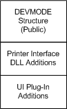

# Providing DEVMODE Structure Additions

Your UI plug-in can add its own private members to the [**DEVMODEW**](/windows/win32/api/wingdi/ns-wingdi-devmodew) structure, as illustrated in the following figure.

A UI plug-in can use these private DEVMODE members to store values associated with customized printer options. The plug-in makes these options available to the user by [modifying a driver-supplied property sheet page](modifying-a-driver-supplied-property-sheet-page.md) or by [adding new property sheet pages](adding-new-property-sheet-pages.md).

If your UI plug-in adds private DEVMODE members, the [**OEM\_DMEXTRAHEADER**](/windows-hardware/drivers/ddi/printoem/ns-printoem-_oem_dmextraheader) structure must prefix the added members.

You are not required to add members to the DEVMODE structure, but if you do, your UI plug-in must implement the [**IPrintOemUI::DevMode**](/windows-hardware/drivers/ddi/prcomoem/nf-prcomoem-iprintoemui-devmode) method. This method's purpose, depending on input arguments, is to return the size of, initialize, convert, or validate the additional DEVMODE members.

 

