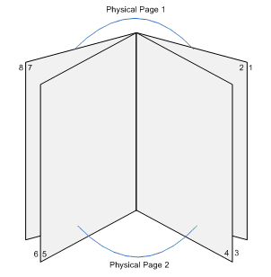

# Providing Support for Asian Layout

The Microsoft Windows print processor supports Asian languages that read from right to left, such as Arabic, Japanese, and Urdu, with the following features:

-   **N-Up Direction**: When printing multiple pages on a single sheet, users can print the pages in a right-to-left order on the sheet.

-   **Booklet Edge**: When printing a booklet, in which sheets are folded and pages are laid out side-by-side, users can order the booklet pages from right to left. The following diagram shows the page layout for a booklet by using the BOOKLET\_EDGE\_RIGHT flag.

The flags that enable you to change the N-up direction and booklet edge in a driver to support an Asian layout are available in Windows Vista. For details about how to set these values, see [**DrvQueryJobAttributes**](https://msdn.microsoft.com/library/windows/hardware/ff548581) and [**ATTRIBUTE\_INFO\_4**](https://msdn.microsoft.com/library/windows/hardware/ff545096).

 

 

