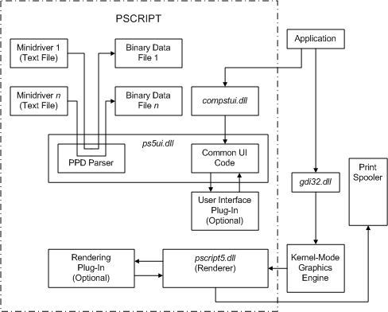

# Pscript Components

Pscript components consist of DLLs, plus text and binary data files, as illustrated in the following diagram:

Components in the diagram include:

**Application**  
A user application, such as a word processor, that provides users with printing capabilities.

**gdi32.dll**  
User-mode DLL that exports Win32 GDI functions.

**Kernel-Mode Graphics Engine**  
NT-based operating system executive code that implements GDI functionality.

**Minidriver Text Files**  
Text-based [Pscript minidrivers](pscript-minidrivers.md), created using [*PPD*](https://msdn.microsoft.com/library/windows/hardware/ff556325#wdkgloss-postscript-printer-description--ppd-) files.

**Binary Data Files**  
Temporary files (with a .bpd extension) that Pscript creates after parsing information contained in minidriver text files.

**ps5ui.dll**  
[Pscript user interface](pscript-user-interface.md) DLL, providing common UI code for all Pscript-supported printers.

**User Interface Plug-In**  
Optional, printer-specific, [user interface plug-in](user-interface-plug-ins.md).

**compstui.dll**  
[CPSUI](common-property-sheet-user-interface.md) user interface for printers.

**pscript5.dll**  
[Pscript renderer](pscript-renderer.md), which handles text output and renders images, then sends the text and image data to the print spooler.

**Rendering Plug-In**  
Optional, printer-specific, [rendering plug-in](rendering-plug-ins.md).

 

 

