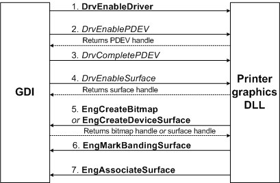

# Rendering a Print Job

Print jobs are either rendered as they are created, or they are written to a spool file as EMF records. In the case of EMF records, rendering takes place when the EMF [*print processor*](https://msdn.microsoft.com/library/windows/hardware/ff556325#wdkgloss-print-processor) (localspl.dll) plays back the records. Rendering consists of a series of calls to the user-mode GDI drawing functions, beginning with **CreateDC** (described in the Microsoft Windows SDK documentation). The call to **CreateDC** is the first in a series of application calls that lead to a chain of actions involving the graphics rendering engine (GRE, also known as kernel-mode GDI), and the printer graphics DLL.

The following figure shows the interaction between kernel-mode GDI and the printer graphics DLL after **CreateDC** is called.

1.  When an application calls the **CreateDC** function to create a printer device context, GDI checks to see if the appropriate printer graphics DLL is loaded. If it is not, GDI loads the DLL and calls the [**DrvEnableDriver**](https://msdn.microsoft.com/library/windows/hardware/ff556210) function in the DLL. The function is not called again unless the driver is reloaded.

2.  Next, GDI calls the printer graphics DLL's [**DrvEnablePDEV**](https://msdn.microsoft.com/library/windows/hardware/ff556211) function so the driver can create a physical device instance and return device characteristics. GDI uses the returned information to create an internal description of the device instance.

3.  GDI then calls the graphics DLL's [**DrvCompletePDEV**](https://msdn.microsoft.com/library/windows/hardware/ff556181) function to supply a GDI handle to the device instance. The graphics DLL must use this handle as input to some of the **Eng**-prefixed callbacks provided by the GDI drawing engine (see [GDI Support Services](https://msdn.microsoft.com/library/windows/hardware/ff566714)).

4.  After GDI receives the device instance handle, it then makes a call to the graphics DLL's [**DrvEnableSurface**](https://msdn.microsoft.com/library/windows/hardware/ff556214) function, which sets up the surface for drawing, and associates it with the physical device instance.

5.  The driver can create a drawing surface for the device instance by calling [**EngCreateBitmap**](https://msdn.microsoft.com/library/windows/hardware/ff564199). Alternatively, if the drawing surface is device-managed, the driver can call [**EngCreateDeviceSurface**](https://msdn.microsoft.com/library/windows/hardware/ff564206).

6.  If **EngCreateBitmap** cannot supply a bitmap large enough to contain an entire physical page, and if the driver supports page banding, [**EngMarkBandingSurface**](https://msdn.microsoft.com/library/windows/hardware/ff564975) can be called to inform GDI that banding will be employed.

7.  Finally, the [**EngAssociateSurface**](https://msdn.microsoft.com/library/windows/hardware/ff564183) must be called to allow GDI to associate the created surface with a specified device instance, and to let GDI know which driver-supplied graphics DDI drawing functions (if any) it should call when it draws on this particular surface.

At this point, a drawing surface has been created and rendering can begin. The functions that GDI calls depend on whether banding is in effect.

### Banding in use

For each document to be rendered when banding is used, GDI calls the following functions in the printer graphics DLL:

[**DrvStartDoc**](https://msdn.microsoft.com/library/windows/hardware/ff556296)
For each physical page {
[**DrvStartPage**](https://msdn.microsoft.com/library/windows/hardware/ff556298)
[**DrvStartBanding**](https://msdn.microsoft.com/library/windows/hardware/ff556292)
For each banding pass on a physical page{
[*DrvQueryPerBandInfo*](https://msdn.microsoft.com/library/windows/hardware/ff556268)
Rendering operations
[**DrvNextBand**](https://msdn.microsoft.com/library/windows/hardware/ff556250) // Send raster data for this band, then clear surface to reuse with next band
    }
}
[**DrvEndDoc**](https://msdn.microsoft.com/library/windows/hardware/ff556215)
###  Banding not in use

For each document to be rendered when banding is not used, GDI calls the following functions in the printer graphics DLL:

[**DrvStartDoc**](https://msdn.microsoft.com/library/windows/hardware/ff556296)
For each physical page
[**DrvStartPage**](https://msdn.microsoft.com/library/windows/hardware/ff556298)
Rendering operations
[*DrvSendPage*](https://msdn.microsoft.com/library/windows/hardware/ff556281) // Send raster data for the page
}
[**DrvEndDoc**](https://msdn.microsoft.com/library/windows/hardware/ff556215)
With the exception of [*DrvQueryPerBandInfo*](https://msdn.microsoft.com/library/windows/hardware/ff556268), these functions are intended to allow the printer graphics DLL to send control sequences to the printer hardware (by calling [**EngWritePrinter**](https://msdn.microsoft.com/library/windows/hardware/ff565467)), and to perform any internal operations needed to initialize or complete processing of a document, page, or band.

The printer graphics DLL is responsible for sending the rendered image (that is, the contents of the drawing surface) to the printer at appropriate times (by calling **EngWritePrinter**), as follows:

-   For GDI-managed or device-managed bitmap surfaces

    The drawing surface is a GDI-supplied or driver-supplied bitmap. The printer graphics DLL might hook some drawing functions (see [Surface Negotiation](https://msdn.microsoft.com/library/windows/hardware/ff569899)). If page banding is in use, the [**DrvNextBand**](https://msdn.microsoft.com/library/windows/hardware/ff556250) function should send drawing surface contents. If banding is not in use, the [*DrvSendPage*](https://msdn.microsoft.com/library/windows/hardware/ff556281) function should send the drawing surface contents.

-   For device-managed vector surfaces

    The drawing surface is within the device. The printer graphics DLL hooks all drawing functions (see [Surface Negotiation](https://msdn.microsoft.com/library/windows/hardware/ff569899)), and these functions send image data to the printer during rendering operations. Page banding is not used.

If you anticipate that any graphics DDI function provided by a printer graphics DLL could potentially take more than five seconds to execute, you should include code that calls [**EngCheckAbort**](https://msdn.microsoft.com/library/windows/hardware/ff564189) at least every five seconds to see if the print job should be terminated.

After GDI calls [**DrvEndDoc**](https://msdn.microsoft.com/library/windows/hardware/ff556215) to indicate that a document has been completely rendered, it calls [**DrvDisableSurface**](https://msdn.microsoft.com/library/windows/hardware/ff556200). If [**DrvEnableSurface**](https://msdn.microsoft.com/library/windows/hardware/ff556214) called [**EngCreateBitmap**](https://msdn.microsoft.com/library/windows/hardware/ff564199), then **DrvDisableSurface** must call [**EngDeleteSurface**](https://msdn.microsoft.com/library/windows/hardware/ff564827).

GDI calls a printer graphics DLL's [**DrvDisablePDEV**](https://msdn.microsoft.com/library/windows/hardware/ff556198) function when an application calls **DeleteDC**.

If an application calls **ResetDC** function during the printing of a document, GDI creates a new device context and calls the printer graphics DLL's [**DrvEnablePDEV**](https://msdn.microsoft.com/library/windows/hardware/ff556211) function for the new context. Then GDI calls the [**DrvResetPDEV**](https://msdn.microsoft.com/library/windows/hardware/ff556276) function, so the graphics DLL can update the new context with information from the old one. Next, [**DrvDisableSurface**](https://msdn.microsoft.com/library/windows/hardware/ff556200) and [**DrvDisablePDEV**](https://msdn.microsoft.com/library/windows/hardware/ff556198) are called for the old context, followed by [**DrvEnableSurface**](https://msdn.microsoft.com/library/windows/hardware/ff556214) for the new context. Finally, GDI calls [**DrvStartDoc**](https://msdn.microsoft.com/library/windows/hardware/ff556296) and rendering resumes on a new page.

GDI calls [**DrvDisableDriver**](https://msdn.microsoft.com/library/windows/hardware/ff556196) prior to unloading the printer graphics DLL.

If printer hardware supports drawing operations that are not supported by GDI drawing functions, the printer graphics DLL can provide a [**DrvDrawEscape**](https://msdn.microsoft.com/library/windows/hardware/ff556203) function.

A printer graphics DLL can provide a [**DrvEscape**](https://msdn.microsoft.com/library/windows/hardware/ff556217) function if it is necessary to support drawing or nondrawing operations that are not available through GDI functions. For example, the [Microsoft PostScript printer driver](microsoft-postscript-printer-driver.md) uses escapes to support PostScript injection points. Or, an application might need to obtain a fax machine's phone number. The **DrvEscape** function is also used for indicating the operations supported by the **DrvDrawEscape** function.

**CreateDC**, **ResetDC**, and **DeleteDC** are described in the Microsoft Windows SDK documentation.

 

 

