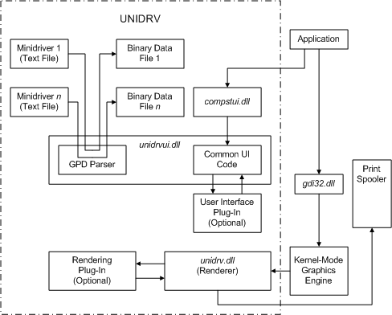

# Unidrv Components

Unidrv components consist of DLLs, plus text and binary data files, as illustrated in the following diagram:

Components in the diagram include:

**Application**  
A user application, such as a word processor, that provides users with printing capabilities.

**gdi32.dll**  
User-mode DLL that exports Win32 GDI functions.

Kernel-Mode Graphics Engine   
NT executive code that implements GDI functionality.

**Minidriver Text Files**  
Text-based [Unidrv minidrivers](unidrv-minidrivers.md) that describe printers by using [GPD file entries](gpd-file-entries.md).

**Binary Data Files**  
Temporary files (with a .bud extension) that Unidrv creates after parsing information contained in minidriver text files.

**unidrvui.dll**  
[Unidrv user interface](unidrv-user-interface.md) DLL, providing common UI code for all Unidrv-supported printers.

**User Interface Plug-In**  
Optional, printer-specific, [user interface plug-in](user-interface-plug-ins.md).

**compstui.dll**  
[CPSUI](common-property-sheet-user-interface.md) user interface for printers.

**unidrv.dll**  
[Unidrv renderer](unidrv-renderer.md), which renders images and sends the image data stream to the print spooler.

**Rendering Plug-In**  
Optional, printer-specific, [rendering plug-in](rendering-plug-ins.md).

 

 

