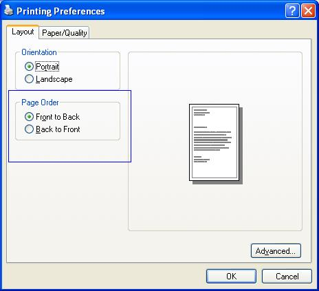
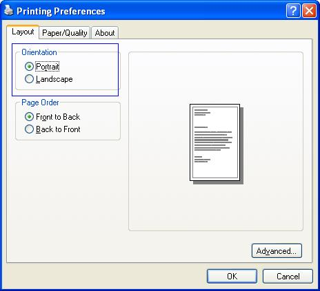
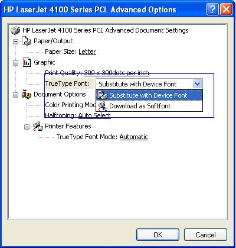
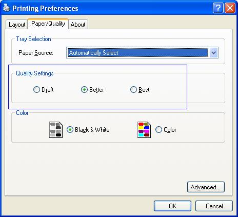
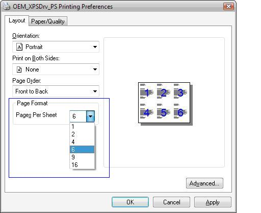

# Unidrv/PScript5 UI Standard Tab vs. Advanced Tree View Changes

The following public Print Schema features are supported by the UniDrive/PScript5 user interface (UI):

JobPageOrder

PageOrientation (PS only)

PageDeviceFontSubstitution

PageOutputQuality

JobNUpAllDocumentsContiguously or DocumentNUp

If there are custom GPD or PPD features or options that are mapped to the preceding Print Schema features and their standard Print Schema options by using GPD's **PrintSchemaKeywordMap** keyword or PPD's **MSPrintSchemaKeywordMap** keyword, the Unidrv/PScript5 driver UI shows the features in the standard tabs in the same way that they appear for Unidrv or PScript5 drivers that are running in non-XPSDrv mode, unless the feature in the GPD file has "\*ConcealFromUI?" set to "TRUE".

When these Print Schema features (which are mapped from GPD or PPD custom features) are shown in Unidrv/Pscript5 driver UI standard tabs rather than in the generic "Printer Features" group in the **Advanced** tree view UI, the standard display names and icons for COMPSTUI are displayed. Any display name or icon that is specified in the GPD or PPD files for these features are ignored.

To present a consistent Unidrv/PScript5 driver UI for these standard printing features, the Unidrv/PScript5 driver that is running in XPSDrv mode has the following behavior.

<table>
<colgroup>
<col width="50%" />
<col width="50%" />
</colgroup>
<thead>
<tr class="header">
<th>Print Schema mapped feature</th>
<th>XPSDrv Behavior</th>
</tr>
</thead>
<tbody>
<tr class="odd">
<td>
JobPageOrder
</td>
<td>
If the GPD or PPD file defines a feature with the "JobPageOrder" Print Schema keyword, and the feature has exactly two options with the "Standard" and "Reverse" Print Schema keywords, then that feature is shown in the <strong>Page Order</strong> area in the standard <strong>Layout</strong> tab. Otherwise, the GPD or PPD feature is shown in the generic "Printer Features" group in the <strong>Advanced</strong> tree view UI.

When the feature is shown in the <strong>Page Order</strong> area in the standard <strong>Layout</strong> tab, then the following is true:

<ul>
<li>
If the driver’s GPD file doesn’t specify “<em>OutputOrderReversed?: TRUE” or its PPD file doesn’t specify "DefaultOutputOrder: Reverse", then the GPD/PPD "Standard" option is shown as the Front to Back UI option, and the GPD/PPD "Reverse" option is shown as the Back to Front UI option.
</li>
<li>
If the driver’s GPD file does specify “</em>OutputOrderReversed?: TRUE” or its PPD file does specify "DefaultOutputOrder: Reverse", then the GPD/PPD "Standard" option is shown as the Back to Front UI option, and the GPD/PPD "Reverse" option is shown as the Front to Back UI option.
</li>
</ul>

The following screen shot shows the Page Order area on the Printing Preferences dialog box.

</td>
</tr>
<tr class="even">
<td>
PageOrientation

(PS only)
</td>
<td>
If PPD defines a feature with the "PageOrientation" Print Schema keyword and the feature has either exactly three options with the "Portrait", "Landscape", and "ReversePortrait" Print Schema keywords or exactly two options with the "Portrait" and "Landscape" Print Schema keywords, that feature will be shown in the <strong>Orientation</strong> area in the standard <strong>Layout</strong> tab.

Otherwise, the PPD feature is shown in the generic "Printer Features" group in the <strong>Advanced tree view</strong> UI.

The following screen shot shows the Orientation area on the Printing Preferences dialog box.

The following screen shot illustrates the Orientation area (without the Rotated Landscape option) on the Printing Preferences dialog box.

</td>
</tr>
<tr class="odd">
<td>
PageDeviceFont-Substitution
</td>
<td>
If GPD or PPD defines a feature with the "PageDeviceFontSubstitution" Print Schema keyword and the feature has exactly two options with the "On" and "Off" Print Schema keywords that feature is shown in the <strong>TrueType Font</strong> list in the <strong>Advanced</strong> tab's "Graphic" group. The "On" option is shown as <strong>Substitute with Device Font</strong>, and the "Off" option is shown as <strong>Download as Softfont</strong>.

Otherwise, the GPD or PPD feature is shown in the generic "Printer Features" group in the <strong>Advanced tree view</strong> UI.

The following screen shot of the Advanced Options dialog box shows the Substitute with Device font option selected.

</td>
</tr>
<tr class="even">
<td>
PageOutput-Quality
</td>
<td>
If GPD or PPD defines a feature with the "PageOutputQuality" Print Schema keyword and the feature has exactly three options with the "Draft", "Normal", and "High" Print Schema keywords, that feature is shown in the <strong>Quality Settings</strong> area in the standard <strong>Paper/Quality</strong> tab. The "Draft" option is shown as the <strong>Draft</strong> option, the "Normal" option is shown as the <strong>Better</strong> option, and the "High" option is shown as the <strong>Best</strong> option.

Otherwise, the GPD or PPD feature is shown in the generic "Printer Features" group in the <strong>Advanced tree view</strong> UI.

The following screen shot of the Printing Preferences dialog box lustrates the Quality Settings area.

</td>
</tr>
<tr class="odd">
<td>
JobNUpAllDocumentsContiguously or DocumentNUp
</td>
<td>
If GPD or PPD defines a feature with the "JobNUpAllDocumentsContiguously" or "DocumentNUp" Print Schema keyword (the "DocumentNUp" feature is used only if no "JobNUpAllDocumentsContiguously" feature exists) and the feature has exactly six options whose GPD or PPD keyword names are numeric strings (that is, "1", "2", "4", "6", "9", and "16"), the feature is shown in the <strong>Pages Per Sheet</strong> list in the standard <strong>Layout</strong> tab.

Otherwise, the GPD or PPD feature is shown in the generic "Printer Features" group in the <strong>Advanced tree view</strong> UI.

</td>
</tr>
</tbody>
</table>

 

For any other custom GPD or PPD features, no matter if they are mapped to public Print Schema features or not, they will always be shown in the generic "Printer Features" group in the **Advanced tree view** UI.

 

 

