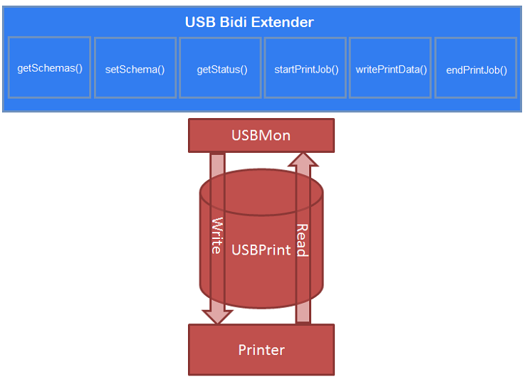

# USB Bidi Extender


Windows allows manufacturers to support bidirectional communication (Bidi) for USB devices by using a combination of a Bidi XML file and a Javascript file known as a USB Bidi extender.

The USB Bidi extender allows applications to use Bidi with USB as the transport mechanism. The Javascript implementation does not support any device flow control, or any multiplexing of control information with print jobs during printing.

By default, Bidi queries and status requests are routed over the USB device interface that is used for printing. This allows full bidirectional communication for status using the **getSchemas** JavaScript method, as well as allowing Set operations using the **setSchema** JavaScript method. Full bidirectional communication is possible while there are no print jobs being sent to the print device.

During printing, writes are blocked by the print job data, so the **getStatus** method is used to obtain unsolicited status from the device, using only the read channel. But if the device supports a secondary USB interface, then the **requestStatus** method function is used to obtain status from a printer while the device is printing.

In Windows 8.1 the v4 driver model has been extended to provide support for host-based devices. In addition to this, USBMon has been updated to allow IHVs to use JavaScript code to gain better control of the print path and to perform print job-based actions. The update includes the addition of APIs that provide new Bidi JavaScript entry points. These APIs are aligned with existing functions in USBMon.

**startPrintJob**. This new function aligns with startDocPort in USBMon. As each new USB print job is started on a port that is connected to a Host-Based print device USBMon will call the IHV provided JavaScript to allow it to do any pre-job processing it requires. This could include setting job global properties in the Job Property Bag, querying the device for current status and configuration data or nothing. The tasks completed are completely dependent on the device and IHV.

**writePrintData**. This new function aligns with writePort in USBMon. When USBMon receives each writePort function call from the spooler during the act of printing, the supplied print data needs to be sent to the Host Based device via the IHV JavaScript function. This allows the IHV JS to decide what should be sent to the device at this time. The IHV can remove, add or save parts of the data buffer as needed. This allows the IHV to completely control what is sent to the device when. This will help enable such scenarios as manual duplex by giving the IHV a chance to save away (within one of the persistent streams) data for the even pages of the print job for processing once all the data has been received from the spooler. The IHV can also use the printerBidiSchemaResponses object to return print job status or device status during processing of the job.

**endPrintJob**. This new function aligns with endDocPort in USBMon. When USBMon receives the endDocPort call for each USB print job on a port that is connected to a Host-Based print device USBMon will call the IHV provided JavaScript to allow it to do any post-job processing it requires. This could include sending any retained data to the device, returning Bidi Schema values to kick off manual duplex or anything else that the IHV/device requires.

The following diagram provides an overview of the USB Bidi extension architecture, showing the scenario where the **getStatus** method is used to obtain unsolicited status from the device via the USBPrint interface.



For more information about working with a USB printer, see [USB Printing](usb-printing.md).

## USB Bidi extender API reference


The JavaScript code in the USB Bidi extender uses the following functions for communicating with the print device:

-   **getSchemas**

-   **setSchema**

-   **getStatus**

-   **requestStatus**

-   **startPrintJob**

-   **writePrintData**

-   **endPrintJob**

For more information about these APIs, see [JavaScript API Reference](javascript-api-reference-.md).

## USBMon Bidi extension XML schema


The USBMon Bidi Extension file uses the same basic structure as the SNMP Bidi Extension file and the WSDMon Bidi Extension file. The XML schema file is published in the Windows Driver Kit and USBMon Bidi extension files will be automatically schema-validated during the INFGate WHCK test. When you're developing a Bidi extension schema and working with the USB bus, it is important to note the following information:

-   Values may specify an accessType of either Get, Set, or GetSet. This indicates where the described schema element is supported in the Bidi Get or Set operation types.

-   Values may specify a queryKey. This should be used to denote the physical operations used to obtain data from your device. The [Print driver USB monitor and Bidi sample](https://github.com/Microsoft/Windows-driver-samples/tree/master/print/v4PrintDriverSamples/v4PrintDriver-USBMon-Bidi-Extension) demonstrates a USB device that supports two different queryKeys. All properties under the same queryKey should be retrievable in one USB read/write operation.

-   Bidi values are immediately polled if they are requested in a Bidi API call. The refreshInterval value is the initial value that indicates when to poll the device for updates on a particular Bidi schema value. After each poll, the refreshInterval increases until we stop polling. The following formula shows how refreshInterval is incremented:

    ```javascript
    currentRefreshInterval = refreshInterval * (3 * numPolls);
    ```

## USBMon and USB Bidi extension file interaction


As each new USB port is created or opened, USBMon will determine if the attached device and the associated driver include a new Bidi Extension file and a Bidi Extension JavaScriptfile. USBMon searches the v4 driver manifest or the driver INI file and retrieves the name of the files. If USBMon finds the relevant files, it uses them to determine the list of extended Bidi Schema values supported by this device and then communicate with the device to query their values. At this point USBMon supports the IHV-specified Bidi Schema actions through existing Print Spooler APIs.

## Windows driver samples on GitHub


**USBMon Bidi XML File Sample** - this provides a sample of a USBMon Bidi Extension XML file. It uses the standard Bidi schema properties DeviceInfo, Configuration, and Memory and also defines a few custom extensions. For more information, see [Print driver USB monitor and Bidi sample](https://github.com/Microsoft/Windows-driver-samples/tree/master/print/v4PrintDriverSamples/v4PrintDriver-USBMon-Bidi-Extension).

And for more information about Bibi extension files, see [Bidirectional Communication Schema](bidirectional-communication-schema.md).

**USBMon Bidi JavaScript File Sample**. This sample includes a USBMon Bidi Extender JavaScript file. It demonstrates how to support Bidi's SET and GET operations, as well as how to listen for events while the printer is printing. For more information, see [Print driver USB monitor and Bidi sample](https://github.com/Microsoft/Windows-driver-samples/tree/master/print/v4PrintDriverSamples/v4PrintDriver-USBMon-Bidi-Extension).

Debugging

Interactive debugging can be enabled by creating the following registry key. For USB Bidi JavaScript, the print spooler must be restarted before debugging will be enabled.

**Key Name:** HKEY\_LOCAL\_MACHINE\\SYSTEM\\CurrentControlSet\\Control\\Print

**Value Name:** EnableJavaScriptDebugging

**Type:** DWORD

**Value:** 1

After the registry key shown in preceding section is created, and the hosting process has been restarted, the script can be debugged as follows:

1. Attach your debugger to the hosting process. For USB Bidi JavaScript, this is spoolsv.exe.

2. Set the debugger to script debugging mode.

3. Select “Break All” (Ctrl + Alt + Break) to break into the process the next time a script runs.

4. Run the scenario to reproduce your issue.

5. Once the debugger breaks into a JavaScript function, set any necessary breakpoints and step through the code.

## Related topics

[Bidirectional Communication Schema](bidirectional-communication-schema.md)  

[IPrinterBidiSchemaElement](iprinterbidischemaelement-interface.md)  

[IPrinterScriptContext](https://docs.microsoft.com/windows-hardware/drivers/ddi/content/printerextension/nn-printerextension-iprinterscriptcontext)  

[IPrinterScriptableSequentialStream](https://docs.microsoft.com/windows-hardware/drivers/ddi/content/printerextension/nn-printerextension-iprinterscriptablesequentialstream)  

[JavaScript API Reference](javascript-api-reference-.md)  

[Print driver USB monitor and Bidi sample](https://github.com/Microsoft/Windows-driver-samples/tree/master/print/v4PrintDriverSamples/v4PrintDriver-USBMon-Bidi-Extension)  

[USB Printing](usb-printing.md)  

[V4 Printer Driver Connectivity](v4-printer-driver-connectivity.md)


