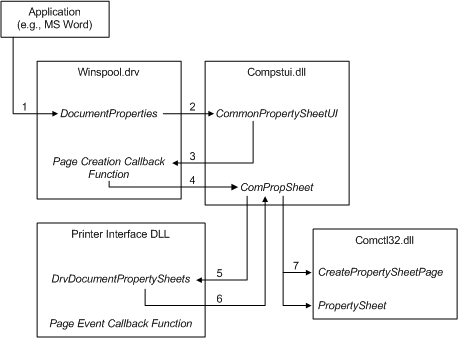

# Using CPSUI with Printer Drivers

The print spooler, in conjunction with [printer interface DLLs](printer-interface-dll.md), uses CPSUI to create property sheet pages for print documents and printer devices. The following steps are involved when an application (such as Microsoft Word) displays a property sheet for a print document:

1.  The application calls the print spooler's **DocumentProperties** function (described in the Microsoft Windows SDK documentation), specifying the printer on which the document is to be printed.

2.  The print spooler calls CPSUI's entry point function, [**CommonPropertySheetUI**](https://msdn.microsoft.com/library/windows/hardware/ff546148), specifying an internal [**PFNPROPSHEETUI**](https://msdn.microsoft.com/library/windows/hardware/ff559812)-typed callback function.

3.  CPSUI calls the spooler's PFNPROPSHEETUI-typed callback function.

4.  The spooler's PFNPROPSHEETUI-typed callback function calls CPSUI's [**ComPropSheet**](https://msdn.microsoft.com/library/windows/hardware/ff546207) function (with a [**CPSFUNC\_ADD\_PFNPROPSHEETUI**](https://msdn.microsoft.com/library/windows/hardware/ff546391) function code) to notify CPSUI of the address of the appropriate printer interface DLL's [**DrvDocumentPropertySheets**](https://msdn.microsoft.com/library/windows/hardware/ff548548) function.

5.  CPSUI calls the printer interface DLL's **DrvDocumentPropertySheets** function.

6.  The printer interface DLL's **DrvDocumentPropertySheets** function calls CPSUI's **ComPropSheet** function (typically with a [**CPSFUNC\_ADD\_PCOMPROPSHEETUI**](https://msdn.microsoft.com/library/windows/hardware/ff546388) function code) to provide CPSUI with property sheet page descriptions and [page event callbacks](page-event-callbacks.md).

7.  CPSUI's **ComPropSheet** function calls **CreatePropertySheetPage** (described in the Windows SDK documentation) to create the property sheet pages specified by the printer interface DLL. CPSUI then calls **PropertySheet** (described in the Windows SDK documentation) to display the property sheet pages.

The following diagram illustrates these steps.

As the application user traverses the property sheet pages and modifies option values, the operating system notifies CPSUI of page events and CPSUI, in turn, calls the page event callback supplied by the printer interface DLL. The page event callback handles page events and stores newly selected option values internally, as necessary.

When the user dismisses the property sheet by clicking on the **Ok** or **Cancel** button, CPSUI destroys the pages and causes the **CommonPropertySheetUI** function to return to the print spooler, which then returns control to the application.

When an application displays a property sheet for a printer device instead of a print document, the same steps are followed, except that the application calls the spooler's **PrinterProperties** function and the spooler passes the address of the printer interface DLL's [**DrvDevicePropertySheets**](https://msdn.microsoft.com/library/windows/hardware/ff548542) function to CPSUI.

 

 

