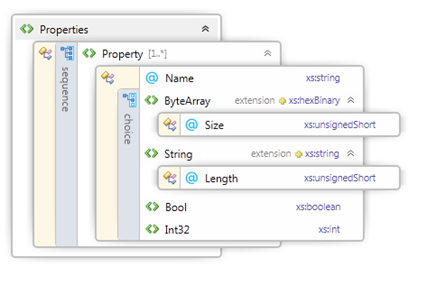
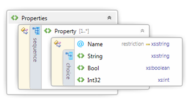

# V4 Printer Driver Property Bags


The v4 print driver model provides a number of property bags that facilitate a data flow from customized UI applications to the rendering process.

These property bags allow custom properties and feature definitions to be created in a customized UI and then be consumed by the rendering process. All property bags are exposed by using the [**IPrinterScriptablePropertyBag**](https://msdn.microsoft.com/library/windows/hardware/hh973217) interface in JavaScript or by using the [**IPrinterPropertyBag**](https://msdn.microsoft.com/library/windows/hardware/hh439547) interface in other environments.

The following table provides an overview of how to use different components to obtain the property bag object from different parts of a v4 print driver.

<table>
<colgroup>
<col width="50%" />
<col width="50%" />
</colgroup>
<thead>
<tr class="header">
<th>Component</th>
<th>Description</th>
</tr>
</thead>
<tbody>
<tr class="odd">
<td>JavaScript constraint script</td>
<td>The driver and queue property bags are passed to JavaScript constraint scripts using the scriptContext parameter. This parameter is of type <a href="https://msdn.microsoft.com/library/windows/hardware/hh768279" data-raw-source="[&lt;strong&gt;IPrinterScriptContext&lt;/strong&gt;](https://msdn.microsoft.com/library/windows/hardware/hh768279)"><strong>IPrinterScriptContext</strong></a> and contains children:
DriverProperties – refers to the driver property bag.
QueueProperties – refers to the queue property bag.
UserProperties – The user property bag.
The DEVMODE property bag is passed into the DEVMODE &lt;-&gt; PrintTicket conversion methods as the <em>devModeProperties</em> parameter (which is of type <strong>IPrinterScriptablePropertyBag</strong>). It is unavailable on the other methods.</td>
</tr>
<tr class="even">
<td>USB Bidi JavaScript</td>
<td>The driver and queue property bags are passed to USB Bidi JavaScript scripts using the scriptContext parameter. This parameter is of type <strong>IPrinterScriptContext</strong> and contains children:
DriverProperties – refers to the driver property bag.
QueueProperties – refers to the queue property bag.</td>
</tr>
<tr class="odd">
<td>Printer extension app</td>
<td>All property bags are passed in as part of the <a href="https://msdn.microsoft.com/library/windows/hardware/hh973207" data-raw-source="[&lt;strong&gt;IPrinterExtensionEventArgs&lt;/strong&gt;](https://msdn.microsoft.com/library/windows/hardware/hh973207)"><strong>IPrinterExtensionEventArgs</strong></a> parameter to the OnDriverEvent handler. They are all of type <strong>IPrinterPropertyBag</strong>. They are specified as the following:
DriverProperties – refers to the driver property bag.
UserProperties – The user property bag.
PrinterQueue.GetProperties()– refers to the queue property bag</td>
</tr>
<tr class="even">
<td>UWP device app</td>
<td>All property bags are passed in during activation using the <a href="https://msdn.microsoft.com/library/windows/hardware/hh406649" data-raw-source="[&lt;strong&gt;IPrinterExtensionContext&lt;/strong&gt;](https://msdn.microsoft.com/library/windows/hardware/hh406649)"><strong>IPrinterExtensionContext</strong></a> object. They are specified as:
DriverProperties – refers to the driver property bag.
UserProperties – The user property bag.
PrinterQueue.GetProperties()– refers to the queue property bag</td>
</tr>
<tr class="odd">
<td>XPS rendering filter</td>
<td><p>XPS filters can access the driver property bag from within the <a href="https://msdn.microsoft.com/library/windows/hardware/ff561066" data-raw-source="[&lt;strong&gt;Print Filter Pipeline Property Bag&lt;/strong&gt;](https://msdn.microsoft.com/library/windows/hardware/ff561066)"><strong>Print Filter Pipeline Property Bag</strong></a> using the property name &quot;DriverPropertyBag&quot;, or the defined value XPS_FP_PROPERTY_BAG from <em>filterpipeline.h</em>. Here is information about DriverPropertyBag:</p>
<strong>Property type:</strong> VT_UNKNOWN
<strong>Description:</strong> A pointer to an IUnknown interface. Call QueryInterface to obtain a pointer to the IPrinterPropertyBag interface to the driver property bag.
<p>And XPS filters can access the queue property bag from within the Print Filter Pipeline Property Bag using the property name &quot;QueuePropertyBag&quot;, or the defined value XPS_FP_QUEUE_PROPERTY_BAG from <em>filterpipeline.h</em>. Here is information about QueuePropertyBag:</p>
<strong>Property type:</strong> VT_UNKNOWN
<strong>Description:</strong> A pointer to an IUnknown interface. Call QueryInterface to obtain a pointer to the IPrinterPropertyBag interface to the queue property bag.</td>
</tr>
</tbody>
</table>


In JavaScript implementations, property bags are passed in as parameters. In printer extension applications, property bags are passed in as members of the event argument used to start the application.

The property bag accessors provided by the COM IPrinterQueue, IPrinterExtensionContext and IPrinterExtensionEventArgs interfaces as well as the property bag accessors in Javascript implementations will throw an exception if the property bag is not specified or not found. Additionally, querying for individual properties on an IPrinterPropertyBag interface will throw exceptions if the property is not found. You should use a try catch statement to avoid crashing if a property is not available.

## Driver Property Bag


The driver property bag is a data store for drivers to predefine properties or data blobs for read-only use by the driver. It can be specified by using the "PropertyBag" directive in the v4 manifest file and may not be modified at runtime.

The Windows Driver Kit includes a template project for a driver property bag. The driver property bag is a compiled, binary blob. Visual Studio includes a template to generate a compiled driver property bag. The XML file generated for this template is not the property bag, instead the compiled output of this template is the property bag file that should be specified in the v4 manifest file.

## User Property Bag


The user property bag allows partners to store settings in a per-user, machine local context. This property bag is well suited as a storage mechanism for user preferences like "Don't show this again". This property bag is not manageable by administrators and is not synchronized between client and server during printer sharing. The user property bag is only set at runtime and is only available to the printer extensions, UWP device apps, and JavaScript constraints.

**Note**  Since JavaScript constraints may also be called outside of a user context, during despooling, the user property bag is unavailable at this time and Windows will return HRESULT\_FROM\_WIN32(ERROR\_NOT\_FOUND).


## DEVMODE Property Bag


The DEVMODE property bag is used to organize content in the private section of the DEVMODE structure. During ConvertPrintTicketToDevMode calls, JavaScript is invoked to populate the contents of the DEVMODE property bag. During ConvertDevModeToPrintTicket calls, JavaScript is invoked to read the persisted settings from the DEVMODE property bag and store them back in the PrintTicket.

This property bag is limited in size to less than 60 KB (the exact amount will vary based on the size of the allocated sections of the DEVMODE), because it must be serialized into a DEVMODE structure in order to avoid data loss in some scenarios. The exact size available will vary per driver because it is determined by the size of the public section of the DEVMODE plus the private section managed by the configuration module.

The DEVMODE property bag uses an XML file to specify the members of the property bag and uses the convertPrintTicketToDevMode and convertDevModeToPrintTicket APIs to handle the conversions. The XML DEVMODE mapping file must be specified in the v4 manifest by using the DevModeMap directive.

The follwoing code snippet shows a DEVMODE Property Bag Mapping XML Sample.

```xml
<?xml version="1.0" encoding="utf-8"?>
<Properties xmlns="http://schemas.microsoft.com/windows/2011/08/printing/devmodemap">
  <Property Name="FabrikamAccountCode">
    <String Length="32"></String>
  </Property>  
</Properties>
```

The following screenshot shows the DEVMODE Property Bag Mapping XML Schema, and it can be found at the following path in the WDK installation folder: \\Include\\um\\printerdriverdevmodemap.xsd.pr



The XML files for the DEVMODE property bag mapping are validated by the INFGate tool.

## Queue Property Bag


The queue property bag stores per-queue configuration settings, including form to tray mappings and the configuration of printer properties like installable options. Driver-defined properties and printer properties are configurable in PowerShell, whereas form to tray mappings are configurable in the printer properties UI. Printer extensions cannot edit any of the property values.

The queue property bag is created automatically for many v4 print drivers, but drivers may also provide additional properties to configure using an XML file. This XML file should not be compiled using the driver property bag tool. Queue property bags are available for printers supported by v4 print drivers that do either of the following:

1. Specify multiple trays, OR

2. Specify installable options in the GPD or PPD file, OR

3. Specify a queue property bag in the driver manifest using the QueueProperties directive.

Administrators configure queue property bags using PowerShell. The following command-lets (cmdlets) are children of a printer object, that can be obtained using the Get-Printer cmdlet.

| Cmdlet Name                                                                                                  | Description                                                             |
|--------------------------------------------------------------------------------------------------------------|-------------------------------------------------------------------------|
| Get-PrinterProperty -printerName &lt;printerName&gt; -name &lt;propertyName\*&gt;                            | Retrieves one or more properties (-name supports globbing)              |
| Set-PrinterProperty -inputObject &lt;printerPropertyObject&gt;                                               | Changes a print queue property using a persisted printerPropertyObject. |
| set-PrinterProperty -printerName &lt;printerName&gt; -PropertyName &lt;propertyName&gt; -Value &lt;value&gt; | Changes the property specified to the value specified.                  |


**Installable options**. These options, for example, the state of a duplexer, will be exposed into the queue property bag as individual properties. Each property will be named as follows, where the feature name is based on the name of the feature from the driver’s GPD or PPD file:

- Config:&lt;feature name&gt;

For example, Config:DuplexUnit

The value of the property is the keyword name for the option that has been selected by the administrator. For example, Installed. Installable options are editable using the same Set-PrinterProperty cmdlet that is used for queue properties.

**Note**  Starting with Windows 8.1, a user with Administrator rights, or a user who created a print queue can change the Installable options and the per-queue configuration settings for a queue property bag from a UWP device app.


**Form to Tray Mappings**. For printers with a v4 print driver, and with more than one tray, "form to tray" mappings are exposed via the queue property bag in the property named “FormTrayTable”.

This property is formatted as a null-terminated string containing pairs of the format “&lt;tray name&gt;, &lt;form name&gt;,” where the form name is one of the following:

1. If the paper size is mapped into the Print Schema in the GPD or PPD file (either by using standard \*PaperSize/\*PageSize keywords, or \*(MS)PrintSchemaKeywordMap), then the form name will follow the following format:

PrintSchema:&lt;Paper Size name&gt;

For example, PrintSchema:NorthAmericaLetter

2. If the form is a user-defined form, as determined by the FORM\_USER flag, then the form name will be as follows. The form index is the same value used in the spooler’s form database. This is consistent with index used when the paper size is specified in the PrintTicket as UserForm&lt;Form index&gt;.

UserForm&lt;form index&gt;

For example, UserForm123

3. Otherwise, the form name will follow the following format, where the form name is the name that was specified in the GPD’s \*PaperSize or the PPD’s \*PageSize.

Config:&lt;name&gt;

For example, Config:\_8\_5x16

A complete example string would read as follows: "Config:Tray1,PrintSchema:NorthAmericaLetter,Config:Tray2,Config:\_8\_5X16,Config:Manual,UserForm123,\\0".

Rendering filters should read the incoming PrintTicket’s PageMediaSize setting, and search for that value in the form name values from the FormTrayTable.

**Queue Property Bag XML Sample**. The following code snippet shows the XML syntax that could be used for three properties, Name1, Name2, Name3 and their child elements:

```xml
<?xml version="1.0" encoding="utf-8"?>
<Properties xmlns= "http://schemas.microsoft.com/windows/2011/08/printing/queueproperties">
  <Property Name="Name1">
    <String>String1</String>
  </Property>
  <Property Name="Name2">
    <Int32>3244</Int32>
  </Property>
  <Property Name="Name3">
    <Bool>true</Bool>
  </Property>
</Properties>
```

**Queue Property Bag XML Schema**. The following screenshot shows the queue property bag XML schema, and it can be found at the following path in the WDK installation folder: \\Include\\um\\printqueueproperties.xsd.



## Related topics
[**IPrinterExtensionContext**](https://msdn.microsoft.com/library/windows/hardware/hh406649)  
[**IPrinterExtensionEventArgs**](https://msdn.microsoft.com/library/windows/hardware/hh973207)  
[**IPrinterPropertyBag**](https://msdn.microsoft.com/library/windows/hardware/hh439547)  
[**IPrinterScriptablePropertyBag**](https://msdn.microsoft.com/library/windows/hardware/hh973217)  
[**IPrinterScriptContext**](https://msdn.microsoft.com/library/windows/hardware/hh768279)  
[**Print Filter Pipeline Property Bag**](https://msdn.microsoft.com/library/windows/hardware/ff561066)  


