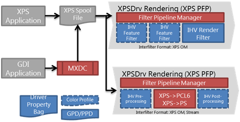

# V4 Printer Driver Rendering Architecture

The rendering architecture for the v4 printer driver model is the same as the XPSDrv architecture, and the XPS Filter Pipeline also follows the same design that was used in previous versions of Windows, with a few notable additions.

## Rendering Architecture Diagram

The following diagram shows the rendering architecture choices for v4 printer drivers.

The following paragraphs explain the roles of the IHV filters in the preceding diagram, and also provide guidelines for developing features to work within this rendering architecture.

## Print Filter Pipeline Configuration File

The print filter pipeline configuration file is unchanged in format. Recommended naming convention: vv&lt;PDL&gt;-pipelineconfig.xml, where vv is a placeholder for your manufacturer code. Example fapcl6-pipelineconfig.xml. All print filter pipeline configuration files must end with –pipelineconfig.xml in order to be compatible with Windows desktop applications that print XPS.

## IHV Rendering Filter

This filter completes the rendering from XPS to the device PDL output. It may use the XPS Rasterization Service or a third-party RIP as necessary. The following are some guidelines for designing rendering filters.

**Recommended input type:** IXpsDocumentProvider.
Using the IXpsDocumentProvider interface is faster than using stream interfaces because serialization steps are avoided at a number of points through the rendering process.

**Recommended output type:** IPrintWriteStream.
After this filter is complete, the device PDL should be output as a stream.

**Recommended naming convention:** Use vv&lt;PDL&gt;.dll.
Where vv is a placeholder for your manufacturer code. Example: faps.dll for a Fabrikam-provided PostScript renderer.

Devices that are capable of consuming XPS as a PDL may be supported without any rendering filters. However, some devices may require PrintTickets that do not work well with the Microsoft standard UI. In these cases, Microsoft recommends that you should convert to a device-compatible PrintTicket in an XPS rendering filter. This ensures the best compatibility with the standard UI and with devices.

## IHV Feature Filter

IHV Feature Filters enable the processing of features like N-up, watermarking, or page reordering. Using feature filters are a convenient way to add features to a driver without changing the underlying PDL rendering. The following are some guidelines for designing such feature filters.

**Recommended input type:** IXpsDocumentProvider.

**Recommended output type:** IXpsDocumentConsumer.

For manufacturers with multiple IHV Feature Filters, we recommend that these filters are implemented into the same DLL as separate logical filters. This encourages code sharing and can decrease the overall working set during printing.

## Color Management

Color management is supported in v4 print drivers. Drivers should include [Windows Color System](https://msdn.microsoft.com/library/windows/hardware/ff563783) (WCS) compliant color profiles or International Color Consortium (ICC) color profiles. V4 print drivers may also use the driver property bag for device-specific color tables.

## Related topics
[V4 Printer Driver Rendering](v4-driver-rendering.md)  
[Windows Color System](https://msdn.microsoft.com/library/windows/hardware/ff563783)  

