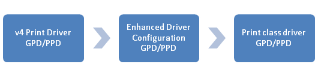

# V4 Driver Setup Concepts

The v4 print driver model uses a new setup model to improve the user experience and reduce support costs.

The v4 print driver is run directly from the Driver Store, which eliminates the possibility of file collisions and improves installation performance. The v4 setup model continues to use INF files, but also employs a new manifest file to capture the printer specific setup directives.

## Device Identifiers

**CompatibleID**. CompatibleIDs are a key concept for print class drivers because they enable the drivers to support devices that are released after new version of Windows is released, without the need to update the driver. This is possible because CompatibleIDs enable devices to advertise support for a less-specific print driver than a HardwareID does.

If a particular CompatibleID is already supported by a print class driver, v4 print drivers should not specify it again. If the date of a print driver is newer than the date of the print class driver, the print driver will be downloaded automatically from the Windows Update site.

Devices should include CompatibleIDs in their 1284ID string. If an existing print class driver supports the device, then the print driver should use that CompatibleID, otherwise we recommend that you use the following format.

1284\_CID\_&lt;manufacturer identifier&gt;\_&lt;PDL identifier&gt;\_device family identifier

For example: 1284\_CID\_FA\_PCL5e\_Laser

If CompatibleIDs are already implemented in existing devices, the print driver should continue to use those CompatibleIDs.

CompatibleIDs are not used in the installation of TCP/IP-based print devices. As a result, users will need to identify an appropriate driver using only the name of the driver. Where print class drivers are concerned, we recommend that manufacturers provide compatibility lists on their web sites for any devices that are supported by a print class driver. For more information about how to implement CompatibleIDs in your hardware, including a full list of rules and restrictions, see [How to Implement Compatible IDs in Printing Devices](https://msdn.microsoft.com/library/windows/hardware/gg463313.aspx).

Microsoft supports a few standard CompatibleIDs in order to support several manufacturer-neutral (standard) print class drivers. The following table shows these standard CompatibleIDs and their associated PDL file types.

| PDL file type      | Standard CompatibleID |
|--------------------|-----------------------|
| XPS                | 1284\_CID\_MS\_XPS    |
| OpenXPS (ECMA-388) | 1284\_CID\_MS\_OXPS   |
| PCL6               | 1284\_CID\_MS\_PCL6   |
| PS                 | 1284\_CID\_MS\_PS     |

 

These standard print class drivers support only a small set of features, so manufacturers that choose to utilize these class drivers should implement enhanced driver configuration, using Bidi to add more specific paper sizes and configuration. The following table shows the features and the associated options supported by the standard print class drivers.

| Feature    | Options           |
|------------|-------------------|
| Paper Size | Letter, A4        |
| Resolution | 300dpi, 600dpi    |
| Media Type | Plain paper       |
| N-Up       | 1, 2, 4, 6, 9, 16 |

 

**PrinterDriverID**. The PrinterDriverID is a new identifier that is used to determine the compatibility between drivers for printer sharing, as well as the compatibility between drivers and printer extensions. For example, if the driver on the server specifies a PrinterDriverID in its manifest file and the driver is then shared, clients that connect to this printer will search the local Driver Store and Windows Update for a driver that specifies the same PrinterDriverID in their driver INF. If a match is found, a connection will be made using that driver. Client machines do not filter matching results using the driver name.

PrinterDriverID must be specified for all compatible drivers in the following ways:

-   Using the PrinterDriverID directive in the v4 manifest.

-   As a HardwareID in the v4 driver INF.

For two different drivers to share the same PrinterDriverID, they must be compatible for sharing. For the connection to always be successful, the two drivers must be able to do the following:

-   Support the same PDL

-   Use the same kind of configuration files (GPD or PPD)

-   Be capable of rendering any features or options specified in the server driver’s GPD, PPD and/or constraint JS files

-   Support the same printer extensions

The spooler does not validate these limitations, and relies solely on the PrinterDriverID to indicate whether two drivers are compatible for sharing. Manufactures must be sure to change the PrinterDriverID for a driver if changes are made to any of the above items.

Printer extensions can also be associated with drivers via PrinterDriverIDs. As a result, two drivers that share a PrinterDriverID must both work with the same printer extensions. The last printer extension installed will overwrite any prior printer extensions for all devices using the targeted PrinterDriverIDs, so they must work properly using the same app.

**Best Practices for using GUIDs**. GUIDs are used broadly through the v4 print driver model, most notably in the PrinterDriverID, and also in the PrinterExtensionID, the EventID, and the ModelID. These are either used to uniquely identify different items in the system, or to identify them as the same for the sake of servicing, sharing, etc.

When creating new GUIDs, always use a GUID generator, such as the one included in Microsoft Visual Studio or the one included in the SDK. Manually crafted GUIDs and GUIDs that have been erroneously copied and pasted are prone to collisions.

## Setup Behaviors

**Print Queue Name**. For v3 drivers, the print queue name was dictated first by the driver name, then by the user. With the introduction of print class drivers, the driver name is much less useful for user recognition of the device. Windows will rename the queue automatically for any Plug and Play devices that are installed to run a v4 print driver as follows:

1. Initially, the print queue name is set to the driver name.

2. If the driver is a v4 print driver, Windows will query the device using Bidi.

a. If \\Printer.DeviceInfo:FriendlyName is specified, it will be used as the new queue name.

b. Otherwise, Windows will query \\Printer.DeviceInfo:Manufacturer, \\Printer.DeviceInfo:ModelName.

i. If both are specified, Windows will concatenate them into "Manufacturer ModelName".

ii. If only one of these Bidi queries fails, Windows will use the successful return from the other query as the queue name.

3. If all of the Bidi queries fail, then Windows will use the IEEE 1284ID to determine the manufacturer and model names.

a. If DESCRIPTION or DES is specified, it will be used as the new queue name.

b. Otherwise, Windows will search for MANUFACTURER or MFG and MODEL or MDL.

i. If both are specified, Windows will concatenate them into "MANUFACTURER MODEL".

ii. If only one of these fails, Windows will use the value from the other key as the queue name.

**The Add Printer Wizard**. The driver name will continue to be the only identifier available to users choosing a driver in the **Add Printer Wizard**. TCP/IP-based devices should implement the [Port Monitor MIB (PWG 5107.1-2005)](http://www.pwg.org/standards.html) to support TCP/IP auto-detection. Existing devices that are added to a print class driver using a hardware ID (HWID) mapping may additionally use a device-specific model name.

## Changing Ports and Dealing with Printer Devnodes

To provide a consistent UI experience, all print queues are given a software device node (devnode). This is how printers are discovered in the UI, and it allows virtual printers, connections to shared printers, and network printers to be enumerated and accessed in the same fashion as Plug and Play (PnP) printers. The software devnodes for physical PnP printers will inherit properties from the PnP devnode that triggered the creation of the queue.

The UI will group devnodes into Device Containers when two different objects are related. This grouping is what allows a multifunction printer (MFP) to appear as one icon in the **Devices and Printers** folder. The Container ID for all the functions in an MFP must be the same in order for the functions to all appear under the same icon. This is done automatically for PnP devices.

Changing the port associated with a queue will change the Container ID associated with the queue's devnode. This will cause the queue to no longer be grouped under the same device container as the rest of the PnP objects for the physical device. There is not enough information in the operating system to properly clean up situations where the queue and the PnP object become separated. In some cases, that is the actual intent of the user. Only the user or application that changes the port name knows what the intended outcome is, and it is up to the user/application to clean up any confusing state left behind after a queue's port is changed. Here are two example situations, with instructions showing how to clean up appropriately.

1. IT admin setting up printers – An IT admin uses WS Discovery to find a printer on the network and changes the port to TCP/IP because they like their TCP/IP management process.

a. Expectation – There is only one "device" in the devices and printers folder.

b. Solution – The IT admin removes the WSD PnP devnode from the devices and printers folder.

2. IHV setup software – The IHV installs a driver along with a custom port monitor (custom port monitors are not allowed in v4, but the same devnode handling applies to v3 drivers). The IHV changes the USB port of the print queue to a port the device manufacturer creates.

a. Expectation – There is only one "device" in the devices and printers folder.

b. Solution \#1 – The PnP devnode is still needed: The setup program changes the container ID of the queue devnode to match the PnP object.

c. Solution \#2 – The PnP devnode is extraneous: The setup program removes the original PnP device.

**Driver Ranking**. The introduction of v4 print drivers does not modify the Plug and Play ranking behavior. When a device is plugged in, the available driver with the highest score will be selected. If the selected driver is a print class driver, and there is a better ranked, matching driver on the Windows Update site, then the selected driver will automatically be replaced the next time the user downloads updates for Windows.

For more information about driver ranking, see [How Windows Ranks Drivers](https://msdn.microsoft.com/library/windows/hardware/ff546225.aspx).

## Driver Setup Best Practices

**Packaging**. V4 print drivers do not employ the **needs** and **includes** INF file directives, or core driver technologies in order to handle shared files. As a result, v4 print drivers must be self-contained, with only a few exceptions.

V4 print drivers may continue to take dependencies on common files that Windows provides. These include the files in NTPrint.INF or NTPrint4.INF. Drivers may include these files by specifying the **RequiredFiles** directive in the v4 manifest file.

If there are existing print class drivers that provide basic rendering functionality for your devices or your PDL, then there also exists a mechanism to take a dependency on the class driver by using the **RequiredClass** directive. This directive causes Windows to build a driver using the files from both the v4 print driver and the required print class driver. GPD and PPD files are merged, with the most specific files taking precedence over less specific files. The following diagram illustrates the logic used to merge the GPD/PPD files, and also includes enhanced driver configuration files obtained from Bidi. Other driver files, such as JavaScript constraints, are not merged in the driver package.

**Printer Model Lines**. Plug and Play maintains an implicit ranking of all HardwareIDs and CompatibleIDs on a model line. As a result, Microsoft recommends that partners should use the following best practices to avoid unpredictable behaviors with regard to ranking.

V4 Print Driver

1. V4 print driver INFs must define two different kinds of model lines:

a. HardwareID lines: "Driver name" = INSTALL\_SECTION, busenumerator\\HardwareID

b. PrinterDriverID lines: "Driver name" = INSTALL\_SECTION,{GUID}

2. V4 print driver INFs must define bus-specific HardwareIDs on individual lines:

a. " Driver name" = INSTALL\_SECTION,WSDPRINT\\HardwareID

b. " Driver name" = INSTALL\_SECTION,USBPRINT\\HardwareID

c. " Driver name" = INSTALL\_SECTION,LPTENUM\\HardwareID

Print Class Driver

1. Print class driver INFs must define three different kinds of model lines:

a. HardwareID lines: "Driver name" = INSTALL\_SECTION,HardwareID

b. PrinterDriverID lines: "Driver name" = INSTALL\_SECTION,{GUID}

c. CompatibleID lines: "Print Class Driver name" = INSTALL\_SECTION,,1284\_CID\_CompatID

2. Print class driver INFs must not define any bus enumerators (for example, WSDPRINT\)

## Related topics
[How to Implement Compatible IDs in Printing Devices](https://msdn.microsoft.com/library/windows/hardware/gg463313.aspx)  
[How Windows Ranks Drivers](https://msdn.microsoft.com/library/windows/hardware/ff546225.aspx)  
[Port Monitor MIB (PWG 5107.1-2005)](http://www.pwg.org/standards.html)  

