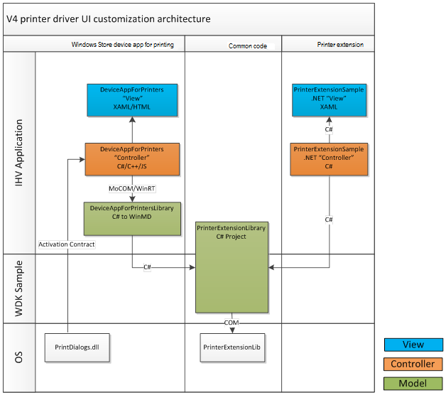

# V4 Driver UI Architecture

A high level design goal for the v4 driver architecture was to provide built-in support for the Microsoft Store app user interface.

The application-based UI paradigm that is employed is a clear example of this. UWP device apps provide users with a full screen experience that is supported in the Microsoft Store app UI. UWP device apps for printing provide extensibility for print preferences, and printer notifications for printers that support the v4 print driver. UWP device apps for printing also provide visibility for the print device on the new Start screen.

Printer extension apps support print preferences and printer notifications when users run existing applications on the Windows desktop. While the UIs for these applications are very different, with one tailored for touch and the other optimized for mouse and keyboard users, the business logic and the connection to v4 print drivers can still be similar, regardless of the UI.

The following diagram shows a high level architecture of the Microsoft Store device apps for the [v4 printer driver and printer extension samples](https://github.com/Microsoft/Windows-driver-samples/tree/master/print/v4PrintDriverSamples) that are provided on GitHub.



As shown in the preceding diagram, the model/view/controller-based architecture enables the apps to share code at the model layer, written in C#.

## Extending PrinterExtensionLibrary

The PrinterExtensionLibrary project that ships in the various samples can be extended using new classes, or by extending the provided set of classes. Since Microsoft periodically makes updates to the sample code, we recommend that partners should minimize the number of code changes that they make to the provided source files. For partners that are extending the provided set of classes, we recommend that you mark the existing classes as “partial” and add new functions or overrides in a separate source file.

## Sharing compiled binaries between UWP apps and Desktop apps

The PrinterExtensionLibrary project that is shipped in the Microsoft Store device app and printer extension samples utilizes the same source code, but it may be valuable to build the code so it is portable between the projects without being built separately for each project. To make the code for the PrinterExtensionLibrary project portable, you have to convert the project to a Portable Class Library. Perform the following steps to make the conversion.

1. In Microsoft Visual Studio, click **File** &gt; **New** &gt; **Project**, and then search for "Portable" in the **Search Installed Templates** box.

2. Select Portable Class Library Visual C#, and then provide a name for the project in the **Name** text box and click **OK.**

3. Copy the source code from your existing PrinterExtensionLibrary project into the new project.

4. Right-click your Portable Class Library project and choose **Unload**. Then open the .csproj file and add the following section to your file, just prior to the last tag in the document.

```xml
  <ItemGroup>
    <COMReference Include="PrinterExtensionLib">
      <Guid>{91CE54EE-C67C-4B46-A4FF-99416F27A8BF}</Guid>
      <VersionMajor>1</VersionMajor>
      <VersionMinor>0</VersionMinor>
      <Lcid>0</Lcid>
      <WrapperTool>tlbimp</WrapperTool>
      <Isolated>False</Isolated>
      <EmbedInteropTypes>True</EmbedInteropTypes>
    </COMReference>
  </ItemGroup>
```

5. If you see warnings as a result of COM references, add the following to the &lt;PropertyGroup&gt; tag:

```xml
<ResolveComReferenceSilent>true</ResolveComReferenceSilent>
```

## API for print UI scenarios

An API has been developed as part of the v4 print driver model to support Printer Extensions and UWP device apps for printing. At a high level, the print preferences scenario uses PrintTicket, PrintCapabilities and the new property bags to get and store all of its information. Printer notifications are driven by a new eventing system that is based on the Bidirectional Communication (Bidi) Schema, and this new system uses the AsyncUI protocol between client and server. The data-centric nature of this API means that one application could easily support many devices.

Printer extensions need to be built in such a way that they can gracefully degrade if the requested data is unavailable. For example, if a particular PrintCapabilities feature is unavailable, or if a property in one of the property bags is unavailable, this should not prevent the rest of the app from functioning. When accessing property bags, or specific properties in a property bag, the app should use the try-catch syntax in order to ensure that any exceptions that are thrown do not cause the app to crash. For more information, see [Printer Extension Interfaces](https://docs.microsoft.com/windows-hardware/drivers/ddi/content/printerextension/index#interfaces).

## Related resources

[Printer Extension Interfaces](https://docs.microsoft.com/windows-hardware/drivers/ddi/content/printerextension/#interfaces)

[v4 print driver samples on GitHub](https://github.com/Microsoft/Windows-driver-samples/tree/master/print/v4PrintDriverSamples)


