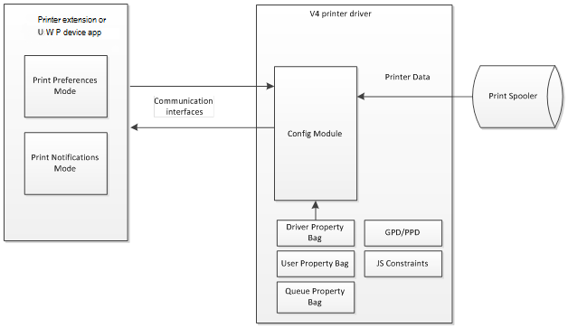

# V4 Printer Driver User Interfaces

V4 print drivers support customization in both the Windows Desktop UI, and the Microsoft Store app UI.

Due to the very different natures of these experiences, these UIs must be implemented as two different applications. However, both are built upon a common COM API provided by the configuration module. Printer extensions support v4 print drivers in the desktop and work with all existing applications. And printer extensions also work in printer sharing scenarios with the enhanced Point and Print driver. Support is planned for all operating systems from Windows Vista through Windows 8.

UWP device apps support v4 print drivers in the Microsoft Store app UI. For more information about developing UWP device apps, see [Developing a UWP device app for printing](https://msdn.microsoft.com/library/windows/hardware/br259129.aspx).

The following diagram shows a high level overview of the communication architecture between customized UIs and the print system.

The following topics provide a more detailed look at the v4 print driver's support for user interfaces.

[V4 Driver UI Architecture](v4-driver-ui-architecture.md)

[Driver Support for Customized UI](driver-support-for-customized-ui.md)

[Job Management](job-management.md)

[Device Maintenance](device-maintenance.md)

[Printer Extensions](printer-extensions.md)

[UWP device apps for Printers](uwp-device-apps-for-printers.md)

## Related topics
[v4 Printer Driver](v4-printer-driver.md)  

