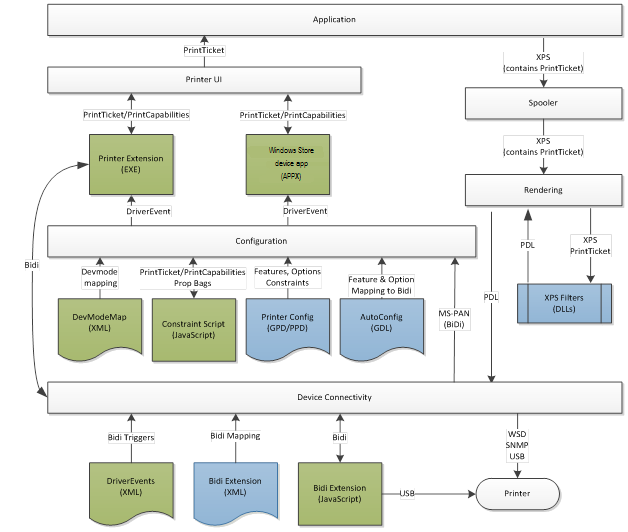

# V4 Printer Driver

The v4 printer driver model was designed to address known issues with the version 3 driver model, and thus improve the quality of the experience that users have with their printers.

**Note**  To help to better explain some of the concepts in this section, a fictional company called Fabrikam is used.

 

**Introduction**

The v4 printer driver model is a refinement of the existing v3 printer driver model, and it was designed to improve driver development, reduce IT management costs, and support new scenarios. The v4 print driver model continues to support many familiar technologies like [XPSDrv](xpsdrv-printer-driver.md), [GPD](introduction-to-gpd-files.md), [PPD](pscript-minidrivers.md), [Autoconfiguration](printer-autoconfiguration.md), and [Bidi](bidirectional-communication.md). The v4 print driver model also supports several new extensibility points.

The v4 print driver model is also optimized for several new scenarios including the following:

-   Windows 8 scenarios

    UWP apps present new design considerations regarding UI behavior and security context. So a printer driver model was needed that would provide deeply integrated support for this new environment. The v4 print driver model provides the only way for printer manufacturers to provide customized Print Preferences experiences or Printer Notification experiences in UWP apps.

-   Printer sharing

    Printer sharing is a key value proposition item for Windows servers. The v4 printer driver model was designed to make sharing easier and more efficient by eliminating the need to manage drivers across processor architectures.

-   Ease of driver development

    The v4 driver has to support existing development efforts from the version 3 printer driver model and from the XPSDrv architecture. And also, the v4 driver must be easier to develop and test.

**High-level Architecture**

The following is a high-level representation of a v4 print driver. With the exception of the rendering filters and user interface applications, all the other functional blocks in the diagram are implemented by Microsoft. V4 print drivers rely heavily on data files and JavaScript for extensibility. The blue boxes represent existing files that were used in the v3 driver model, and the green boxes represent new places to plug in.

This section discusses the following aspects of the v4 printer driver:

[V4 Printer Driver Rendering](v4-driver-rendering.md)

[V4 Printer Driver Configuration](v4-driver-configuration.md)

[V4 Printer Driver Setup](v4-driver-setup.md)

[V4 Printer Driver User Interfaces](v4-printer-driver-user-interfaces.md)

[V4 Printer Driver Connectivity](v4-printer-driver-connectivity.md)

[Build a v4 Printer Driver in Visual Studio](build-a-v4-print-driver-in-visual-studio.md)

 

 

