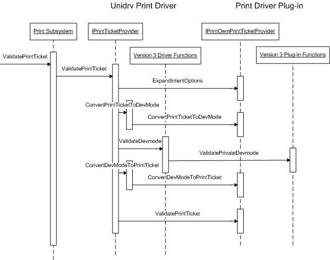

# ValidatePrintTicket overview

Unidrv and PScript5 print drivers validate the Print Ticket by using the sequence that the following illustration and list show.

1.  For each plug-in, call the [**IPrintOemPrintTicketProvider::ExpandIntentOptions**](https://msdn.microsoft.com/library/windows/hardware/ff553168) method.

2.  Call the [**IPrintOemPrintTicketProvider::ConvertPrintTicketToDevMode**](https://msdn.microsoft.com/library/windows/hardware/ff553167) method.

3.  For each plug-in, call **IPrintOemPrintTicketProvider::ConvertPrintTicketToDevMode** to convert the private portions of the [**DEVMODEW**](https://msdn.microsoft.com/library/windows/hardware/ff552837) structure.

4.  Validate public and private parts of the DEVMODEW structure that the Unidrv or PScript5 print driver supports.

5.  For each plug-in, validate the private parts of the DEVMODEW structure.

6.  Call the [**IPrintTicketProvider::ConvertPrintTicketToDevMode**](https://msdn.microsoft.com/library/windows/hardware/ff554363) method.

7.  For each plug-in, call the [**IPrintOemPrintTicketProvider::ConvertDevModeToPrintTicket**](https://msdn.microsoft.com/library/windows/hardware/ff553161) method to convert the private portions of the DEVMODEW structure.

8.  For each plug-in, call the [**IPrintOemPrintTicketProvider::ValidatePrintTicket**](https://msdn.microsoft.com/library/windows/hardware/ff553184) method to validate the PrintTicket.

 

 

