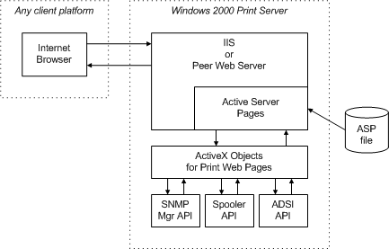

# Viewing Print Web Pages

With any Internet browser executing on any type of client platform, users can view Web pages that display the status of a Microsoft Windows 2000 or later print server and its connected printers. Microsoft provides a set of server-resident HTML files that generate these Web pages. Web pages for the print server and for each server-installed printer can be referenced by a client browser using URLs. Additional pages can be referenced by links from these pages.

For a Windows 2000 print server to support Web pages, it must be running either Windows 2000 Server software with Microsoft Internet Information Server (IIS), or Windows 2000 Professional software with Microsoft Peer Web Server.

For a Windows XP print server to support Web pages, it must be running either Microsoft Windows Server 2003 software with Microsoft Internet Information Server (IIS), or Windows XP Professional software with Microsoft Peer Web Server. Note that the print server in Windows XP Home Edition does not support Web pages.

To view a print server page, a user specifies the following URL format:

http://&lt;ServerName&gt;/printers

where &lt;ServerName&gt; is the server name (either a DNS name for Internet connections or a WINS name for intranet connections). The URL points to an HTML file that generates the print server's page.

The server page provides a link to a print queue page for each print queue available on the server. Shared print queues can be accessed by all users. A user can also reference the print queue pages for shared printers by specifying a URL with the following format:

http://&lt;ServerName&gt;/&lt;ShareName&gt;

where &lt;ShareName&gt; is the print queue's share name, as specified in its property sheet.

If a user selects a printer's link within the print folder, Windows Internet Explorer is automatically started and the print queue page's URL is accessed. Alternatively, as already described, a user can view a print server page or a print queue page by specifying the page's URL to any HTML browser.

Print Web pages are generated from template files that can be interpreted by Microsoft Active Server Pages (ASP). These templates (called ASP files) contain standard HTML tags and ASP script tags (&lt;% and %&gt;).

When the Active Server Pages interpreter encounters text within ASP script tags, it calls an appropriate scripting language interpreter (such as JScript or VBScript) to process the text. The resulting HTML data stream is then sent to the client browser.

For more information about Microsoft Active Server Pages, see the Microsoft Windows SDK documentation.

A set of COM-based [ActiveX objects for print Web pages](activex-objects-for-print-web-pages.md), with associated Automation interfaces, is provided (in Oleprn.dll) for obtaining printer properties and SNMP information.

When a user wants to view the Web page of a particular server or printer, the following steps occur:

1.  The user employs a browser to specify an appropriate URL. The URL points to one of the template files on the specified print server.

2.  The server-resident Active Server Pages interpreter, which is part of IIS, searches for ASP script tags, invokes the appropriate scripting language interpreter to interpret the script text, and places the returned results in the HTML data stream.

3.  The ASP interpreter, on the server, sends the resulting HTML stream to the client's browser.

The following figure illustrates the process by which a printer URL is sent from a client to a print server, and how its associated HTML stream is returned to the client.

 

 

