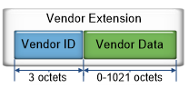
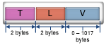
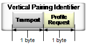
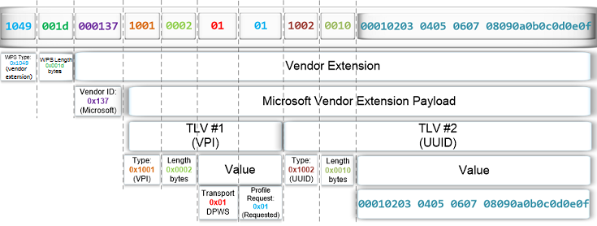

# Wi-Fi Direct Printing implementation

## Device Requirements

For a WFD-WSD device to get the seamless connectivity experience as described in [Wi-Fi Direct Printing Overview](wfd-overview.md), the device has to adhere to the following requirements:

-   The device must support Vertical pairing and send the relevant DPWS (WSD) data in the WPS messages (formats described in "Implementing Vertical Pairing Data Blob" below)
-   All logical devices in the physical device MUST use the same PnP-X Container ID in its PnP-X extension
    -   For details on implementing PnP-X Container IDs for Network Connected Devices, see [Overview of Container IDs](https://docs.microsoft.com/windows-hardware/drivers/install/overview-of-container-ids).
    -   For general information on PnP-X extensions, see the [PnP-X: Plug and Play Extensions for Windows Specification](https://msdn.microsoft.com/windows/hardware/gg463082).

Since the WFD Container ID will match the UUID of the printer, PnP-X Container ID will not be required in the device metadata. However, it is still recommended that the device supports PnP-X metadata in the device metadata and advertise a PnP-X Container ID as part of the PnP-X metadata in the device metadata. This Container ID should match the WFD Container ID.

Having the same container ID at WFD layer as well as WSD layer ensures the following:

-   Pairing UI, such as the Add-a-device wizard, can understand that multiple logical devices co-exist in a single physical device and handle the pairing in a more logical fashion for the user. (e.g. the user doesn’t have to pair the WFD and print devices manually in separate operations.)
-   Device & Printers can show a single device icon for the device even though there are two set of devnodes installed on the system (one set of WFD devnodes and one set of WSD devnodes).
-   Note that proper container ID implementation is required for the Windows Hardware Certification kit tests to run correctly. Improper implementation will cause the tests to recognize each logical device as a separate physical device.

If a WFD-WSD device does not conform to the above requirements, then the connectivity experience described in this implementation will not apply to those devices.

Devices should implement Persistent Groups and Concurrent Connection-Multiple Groups as specified in the [Wi-Fi Alliance - Wi-Fi Direct Industry Whitepaper](http://go.microsoft.com/fwlink/p/?LinkId=784967).

## How to Publish Container UUID over Wi-Fi Direct for Printers

Windows discovers Printers over Wi-Fi Direct using a Probe Request/Response per the Wi-Fi Alliance “Wi-Fi Peer-to-Peer (P2P) Specification v1.1” Section 3.1.2.1.2 (Scan Phase). The Device, Printer in this case will reply to the PC using the appropriate Probe Request/Response Frame.

Both the Probe Request & Probe Response Frames can be extended using Custom IEs. Microsoft has defined a Custom IE with several attributes to enable various extensions.

**How to construct a Microsoft 802.11 Custom IE**

A Custom IE consists of a Vendor ID & Vendor Data.

*WFD Vendor Extension*

Microsoft uses the Vendor ID 0x137 to represent IEs owned by Microsoft. The vendor data block that is in each vendor’s vendor extensions contains an arbitrary block of data that the vendor defines. The vendor data block in Microsoft vendor extensions consists of one or more Type-Length-Value (TLV) structures. The organization of the TLV structure is shown in Figure Below.

*WFD Vendor Data*

**TLV definition for Container UUID**

There are two TLVs that are relevant to Contained ID. There is a “Request for attributes” that Windows sends to the device & there is a “Container UUID” TLV that the devices responds with.

Definitions:

<table>
<colgroup>
<col width="25%" />
<col width="25%" />
<col width="25%" />
<col width="25%" />
</colgroup>
<thead>
<tr class="header">
<th>Name/Description</th>
<th>Type (2 Bytes)</th>
<th>Length (2 Bytes)</th>
<th>Value (defined by Length)</th>
</tr>
</thead>
<tbody>
<tr class="odd">
<td>
Request for Microsoft Attributes (this is sent by the PC in Probe Request during Discovery)
</td>
<td>
0x1005
</td>
<td>
0x0002
</td>
<td>
0x0001 = Microsoft is requesting Contained UUID
</td>
</tr>
<tr class="even">
<td>
Container UUID (this is sent by the Printer in th Probe Response during Discovery)
</td>
<td>
0x1006
</td>
<td>
0x0010
</td>
<td>
To be Defined by the Printer
</td>
</tr>
</tbody>
</table>

 

## Implementing Vertical Pairing Data Blob

The Vertical Pairing Data Blob allows for the PC to understand the WSD Print service before connecting to the Printer. This mechanism is a simple substitute for service discovery as it was implemented before the service discovery specification for Wi-Fi Direct was written.

Like the Container UUID, Vertical Pairing Data Blob is also an attribute of the Microsoft IE. Unlike the Container ID attribute, this must be published in either M7/M8 WPS message (during Wi-Fi Direct Pairing) from the Device depending upon its role.

**How to construct a Microsoft 802.11 Custom IE**

A Custom IE consists of a Vendor ID & Vendor Data.

*WFD Vendor Extension*

Microsoft uses the Vendor ID 0x137 to represent IEs owned by Microsoft. The vendor data block that is in each vendor’s vendor extensions contains an arbitrary block of data that the vendor defines. The vendor data block in Microsoft vendor extensions consists of one or more Type-Length-Value (TLV) structures. The organization of the TLV structure is shown in the following image:

*WFD Vendor Data*

**TLV definition for Vertical Pairing Blob**

Two specific TLV types are defined for Rally Vertical Pairing. These TLV types are listed in following table.

<table>
<colgroup>
<col width="25%" />
<col width="25%" />
<col width="25%" />
<col width="25%" />
</colgroup>
<thead>
<tr class="header">
<th>Name/Description</th>
<th>Type (2 Bytes)</th>
<th>Length (2 Bytes)</th>
<th>Value (defined by Length)</th>
</tr>
</thead>
<tbody>
<tr class="odd">
<td>
Vertical Pairing Identifier (Communicates the internal topology of the device)
</td>
<td>
0x1001
</td>
<td>
0x0002
</td>
<td>
See &quot;VERTICAL PAIRING IDENTIFIER TLV&quot; below.
</td>
</tr>
<tr class="even">
<td>
Transport UUID (The device’s transport UUID value)
</td>
<td>
0x1002
</td>
<td>
0x0010
</td>
<td>
See &quot;TLV definition for Container UUID&quot; above.
</td>
</tr>
</tbody>
</table>

 

*Rally Vertical Pairing TLVs*
**VERTICAL PAIRING IDENTIFIER TLV**

The Vertical Pairing identifier (VPI) TLV communicates a device’s internal topology, which specifies how Windows can communicate with the device’s services. At least one VPI is required to support Rally Vertical Pairing extensions, even if Vertical Pairing is not implemented in the device. In this situation, the VPI would specify that no transports are used. The VPI TLV must be sent as part of the Microsoft vendor extension in the WPS M1 message.

The data that is included with a VPI TLV is 2 bytes long and consists of two different fields: a Transport field and a Profile Request field, as shown in the following image (each field is 1 byte long):

*WFD Data included with a VPI TLV*

**VPI TRANSPORT FIELD**

The Transport field specifies the transport that Windows can use to communicate with the device. Only one transport can be specified per VPI. If the device supports multiple PnP-X transports, it can communicate this by including multiple VPI TLVs (one for each transport) in the Microsoft vendor extension. The valid values for the VPI Transport field are listed in the following table.

<table>
<colgroup>
<col width="50%" />
<col width="50%" />
</colgroup>
<thead>
<tr class="header">
<th>Value</th>
<th>Transport</th>
</tr>
</thead>
<tbody>
<tr class="odd">
<td>
0x00
</td>
<td>
None
</td>
</tr>
<tr class="even">
<td>
0x01
</td>
<td>
DPWS
</td>
</tr>
<tr class="odd">
<td>
0x02
</td>
<td>
UPnP
</td>
</tr>
<tr class="even">
<td>
0x03
</td>
<td>
Secure DPWS
</td>
</tr>
<tr class="odd">
<td>
0x04-0xFF
</td>
<td>
Reserved
</td>
</tr>
</tbody>
</table>

 

*VPI Transport Field Values*

**Note**  Windows 7 provides support for DPWS (0x01) or Secure DPWS (0x03), but not both.

 

**Note**  If a device does not implement Rally Vertical Pairing, it must specify only one VPI with a Transport value of 0x00 (None). In this situation, the device should not specify a Transport UUID TLV. This notifies Windows that it should not expect to pair with the device. Therefore, Windows does not try to pre-pair with the device while it configures the device's Wi-Fi settings.

 

**VPI PROFILE REQUEST FIELD**

The VPI lets a device use the WPS protocol to provision the device's services. In this situation, a device service can request that Windows send it information for configuring the service. This information is known as a profile. The VPI’s second field specifies whether the device is requesting that Windows send it a profile. The valid values for the VPI Profile Request field are listed in the following table.

<table>
<colgroup>
<col width="50%" />
<col width="50%" />
</colgroup>
<thead>
<tr class="header">
<th>Value</th>
<th>Description</th>
</tr>
</thead>
<tbody>
<tr class="odd">
<td>
0x01
</td>
<td>
Wi-Fi profile requested. This is the only value that is currently supported by Windows 7.
</td>
</tr>
<tr class="even">
<td>
0x00, 0x02–0xFF
</td>
<td>
Reserved
</td>
</tr>
</tbody>
</table>

 

*VPI Profile Request Field Values*

**Note**  The VPI Profile Request field value of 0x00 is considered reserved because it is not currently supported by Windows 7. The VPI Profile Request field should only be set to a value of 0x01 (Wi-Fi profile requested), even if a value of 0x00 (none) is specified for the transport.

 

**TRANSPORT UUID TLV**

The Transport UUID TLV specifies that a specific transport (DPWS or UPnP) has a different base UUID value than the WPS UUID. The Transport UUID TLV is optional. If the Transport UUID TLV is not included, the WPS UUID is used to form an identity for the specified transport.

If a Transport UUID TLV is included, it must immediately follow the VPI TLV that identifies the transport. If more than one VPI TLV is included, a Transport UUID TLV can be included after each VPI TLV.

**Note**  The Transport UUID TLV data value must be in network byte order.

 

**Note**  If the device specifies a VPI Transport value of 0x00 (none), do not include a Transport UUID TLV.

 

## WPS Example

For this example, assume that a printer device uses DPWS and implements the WS Print interface. The device uses the UUID values in the following table:

<table>
<colgroup>
<col width="50%" />
<col width="50%" />
</colgroup>
<thead>
<tr class="header">
<th>Service</th>
<th>Identity</th>
</tr>
</thead>
<tbody>
<tr class="odd">
<td>
WPS
</td>
<td>
ec742c0d-5915-4bcb-b969-008132afec5e
</td>
</tr>
<tr class="even">
<td>
DPWS Print
</td>
<td>
urn:uuid:00010203-0405-0607-0809-0a0b0c0e0e0f
</td>
</tr>
</tbody>
</table>

 

*WPS Example—Service UUID Values*

**Note**  UUID values are specified in all lowercase, and the DPWS identity string uses the format urn:uuid:uuid\_value.

 

**Note**  The UUID values in this example are fictitious and must not be used in a real device.

 

When the device sends out its WPS M7/M8 messages, it includes the Microsoft vendor extension that is shown in the following image:

*Example WFD vendor extension details*

In this example, the vendor extension contains a Vendor ID value of 0x137, which identifies it as a Microsoft vendor extension. Inside the vendor extension’s vendor data field are two TLV structures.

The first TLV has a Type value of 0x1001, which identifies the TLV as a VPI. The length of the data in the first TLV is 2 bytes, which contain a value of 0x0101. This specifies that the device supports the DPWS transport (0x01) and that it is requesting a profile (0x01).

The second TLV has a Type value of 0x1002, which identifies the TLV as a Transport UUID. The length of the data in the second TLV is 16 bytes, which contain the binary version of the UUID value 00010203-0405-0607-0809-0a0b0c0e0e0f.

When a customer vertically pairs the printer, Windows first configures the device’s Wi-Fi radio with appropriate settings. It then pairs the device’s DPWS device by using the specified transport UUID value.

After the device connects to the Wi-Fi network and announces its DPWS services, Windows creates the appropriate PnP device nodes and installs and loads the appropriate drivers.

 

 

