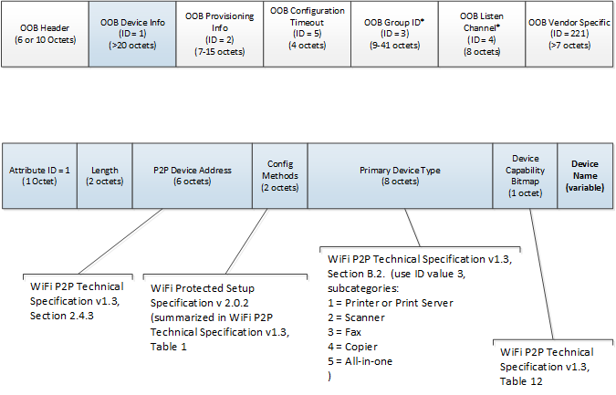

# Wi-Fi Direct Printing overview

## Supported User Experiences

**Pair with Wi-Fi Direct Printer from Windows**

While at a meeting with overseas partners, a business executive receives a revision to a contract and now must print updated copies before her meeting.

She locates a Windows Certified print device at the partner’s office that supports Wi-Fi Direct. She initiates pairing between the device and her Windows Surface and she quickly establishes a connection to the device and is ready to print. She prints several copies of the document and is able to present the new, approved contract to her partners.

A few hours later she is on her way to the airport; signed contracts in hand.

This scenario describes:

Pairing using PIN

-   After selecting the device in the control panel, she is prompted for the connection PIN. She enters the PIN number provided to her by the receptionist. The connection is completed and she is ready to print

Pairing using Ad-Hoc PIN

-   After selecting the device in the control panel, the device’s control panel asks for her to enter a PIN that will match one she will enter on her device (just like Bluetooth pairing). She enters a PIN on the control panel of the device and then enters the same number into the prompt on her PC. The connection is completed and she is ready to print.

**Printing to a Previously Paired Wi-Fi Direct Printer**

A different user uses only his mobile broadband connection to get Internet connectivity on his Windows PC when he is at home. He owns a Wi-Fi Direct print device, which he has previously paired to and installed on his Windows PC.

He is working on a document at home and needs to print a hard copy. He selects “Print” in his application. His Wi-Fi Direct printer is always broadcasting over Wi-Fi Direct and he is currently in range. When the print dialog appears, his Wi-Fi Direct printer appears as “online”. He selects the device and clicks print. His Windows PC establishes the connection to the device and sends the print job. To him, his Wi-Fi Direct printer appears to work as any other printer he has used over a network or direct connected. The print job outputs and he can continue editing.

## Use Cases

**Printer - First Time Pairing**

MANUAL CONNECTION TO WI-FI DIRECT PRINT DEVICE THROUGH MODERN DEVICES CONTROL PANEL
Preconditions

-   User is within range of a Wi-Fi Direct Print Device
-   A driver for the Wi-Fi Direct Print Device is on the user’s device
-   Wi-Fi Direct Print Device meets Windows Certification requirements

Trigger

User types in “add printer” in Windows Start screen, selects “settings”, and launches the devices control panel.

Steps

1.  Devices control panel searches for available print devices
2.  DAF issues L2 challenge for Wi-Fi Direct (WFD) devices
3.  Available WFD Print Devices appear as options for user in devices list
4.  User clicks on the WFD Print Device
5.  DAF makes L2/L3 connection with WFD device and triggers vertical pairing with the WSD provider. Queue is built for device and driver is configured.
6.  WFD provider disconnects from device

Postconditions

-   Print queue for Wi-Fi Direct Printer is established
-   Print queue will appear “available” whenever WFD L2 beacon challenge is successful

Alternate flows

N/A

Considerations

N/A

 

MANUAL CONNECTION TO WI-FI DIRECT PRINT DEVICE THROUGH ADD PRINTER WIZARD
Preconditions

-   User is within range of a Wi-Fi Direct Print Device
-   A driver for the Wi-Fi Direct Print Device is on the user’s device
-   Wi-Fi Direct Print Device meets Windows Certification requirements

Trigger

User opens classic control panel and launches Devices and Printers control panel.

Steps

1.  User launches Devices and Printers control panel
2.  User clicks “Add a Device”
3.  DAF issues L2 challenge for Wi-Fi Direct (WFD) devices
4.  Available WFD Print Devices appear as options for user in devices list
5.  User clicks on the WFD Print Device
6.  DAF makes L2/L3 connection with WFD device and triggers vertical pairing with the WSD provider. Queue is built for device and driver is configured.
7.  WFD provider disconnects from device

Postconditions

-   Print queue for Wi-Fi Direct Printer is established
-   Print queue will appear “available” whenever WFD L2 beacon challenge is successful

Alternate flows

N/A

Considerations

N/A

 

ERROR CONNECTING TO PRINT DEVICE
Preconditions

User initiates pairing using:

-   Modern device control panel, as described in "MANUAL CONNECTION TO WI-FI DIRECT PRINT DEVICE THROUGH MODERN DEVICES CONTROL PANEL" above
-   Devices and Printers control panel, as described in "MANUAL CONNECTION TO WI-FI DIRECT PRINT DEVICE THROUGH ADD PRINTER WIZARD" above

Trigger

Failure event occurs during pairing/queue setup.

Steps

1.  Any partially set-up print queue is removed.
2.  User is notified of failure.

Postconditions

-   User’s print system is returned to a its state before pairing attempt

Alternate flows

-   If the error is due to a missing driver AND the driver can be downloaded or added (x86 or amd64 on a non-metered connection), the user is prompted to do so and re-attempt pairing.

Considerations

N/A

 

CONNECTING TO WI-FI DIRECT PRINT DEVICE WITH A REQUIRED PIN
Preconditions

User initiates pairing using:

-   Modern device control panel, as described in "MANUAL CONNECTION TO WI-FI DIRECT PRINT DEVICE THROUGH MODERN DEVICES CONTROL PANEL" above
-   Devices and Printers control panel, as described in "MANUAL CONNECTION TO WI-FI DIRECT PRINT DEVICE THROUGH ADD PRINTER WIZARD" above

Trigger

Device requires a PIN for pairing

Steps

1.  1. User has received a PIN required by the print device
2.  2. During WSD setup, the user is prompted for the PIN
3.  3. The user enters the PIN and pairing completes

Postconditions

-   Print queue is properly set-up

Alternate flows

-   If the error is due to a missing driver AND the driver can be downloaded or added (x86 or amd64 on a non-metered connection), the user is prompted to do so and re-attempt pairing.

Considerations

-   Ad-hoc PIN
    1.  User is required to enter a PIN on BOTH the printer and device similar to Bluetooth pairing.
    2.  During WSD setup, the user enters the proper PIN on the device AND the client PC when prompted.
    3.  The user enters the PIN and pairing completes.

<!-- -->

-   PIN entry failure
    1.  User has received a client PIN OR ad-hoc PIN is required.
    2.  During WFD setup, the user is prompted for the PIN.
    3.  User enters the incorrect PIN.
    4.  User is informed that PIN is incorrect and pairing cannot complete.
    5.  Discovery is terminated. No queue is set-up.

**Postcondition**: No print queue is set-up.

 

**Printing**

USE OF WI-FI DIRECT PRINT DEVICE FROM APPLICATION
Preconditions

-   User is within range of a Wi-Fi Direct Print Device
-   User has successfully completed first-time pairing with the Wi-Fi Direct Print Device, as described in "Printer - First Time Pairing" above.

Trigger

User tries to print from an application

Steps

1.  DAF issues L2 challenge for Wi-Fi Direct (WFD) devices.
2.  Known WFD print devices responding to L2 challenge appear as “available” to the user
3.  The user selects the WFD print device and clicks “print”
4.  DAF makes L2/L3 connection with the user-selection WFD device and establishes a L3 WSD connection. Reference count to the device is incremented.
5.  Print job is spooled, rendered, and sent to the device
6.  Reference count to the device is decremented. If the reference count after decrement equals 0, then the connection will be closed.

Postconditions

-   Print job is successfully sent to the print device.

Alternate flows

N/A

Considerations

-   The queue is persisted on the Windows PC in the same way as all other print queues. The user is expected to be able to reconnect and print to the device regardless of how much time has lapsed between pairing and subsequent use. The only time the user should have to re-pair to print is if the printer has pruned the connection information and the user’s pairing information has been removed. Re-pairings should be minimized to provide a better user experience. This implies that the device must maintain in memory a number of pairings that is reasonable to maintain for the intended use. For example, a printer for home use may maintain 10-25 pairings. A printer for office use may maintain considerably more.

 

## Considerations for Pairing

**Persistent Groups**

Windows expects that once a print queue is created for a Wi-Fi Direct print device, the Windows client will be able to reconnect to that device without re-pairing. The DAF provider for Wi-Fi Direct will close the connection after the queues and devices are created. The pairing information must therefore be persisted in order for a user to reconnect with the device at print time.

If the pairing information is dropped on the device side after each connection, the user will never be able to print to the device. The user will be in a loop where they add the device in the PC settings, the connection is closed after setup, and the pairing is dropped requiring the user to add the device in PC settings again.

**Concurrent Connections**

It is expected that the print device will be able to respond to multiple PC connection requests. Thus the print device should implement concurrent connections with multiple groups in order to fulfill this scenario.

**Dropped Pairings**

Windows expects a Wi-Fi Direct device to maintain the pairing information to allow users to print to a Wi-Fi Direct queue without re-provisioning. However, it is understood that there are a finite number of pairings that a device can store. It is strongly recommended that the device have sufficient memory to maintain a reasonable number of pairing connections for the intended usage. For example, a device intended for home or small office use may remember 30 connections. However, a device that is intended for widespread use and reuse in a public environment may need to remember a much larger number of users to ensure connections are not pruned too frequently.

**DROPPED PAIRING SCENARIO**: Windows does not re-establish a full connection to Wi-Fi Direct devices until a user submits a print job. Thus, if the device has dropped the pairing information for the Windows PC, Windows will not know about this until a print job is already queued. **The user will be able to re-provision the connection and re-pair with the device, however, doing so will cause the print queue to be removed and rebuilt and any queued print job will be lost in the process.** By maintaining an adequate quantity of pairings in memory, the device can minimize the number of instances where the user must re-pair and re-submit their print jobs.

**Wi-Fi Driver Considerations for the PC**

Windows 8 Logo Requirements for Wi-Fi Modules requires the module to support Wi-Fi Direct. However, this functionality must also be supported in the driver provided for the module. Most inbox drivers from Windows 8 do not support Wi-Fi Direct even when the module is capable of doing so. The manufacturers of these modules have updated drivers available from their driver sites. Updated drivers will be more widely available after the next Windows release.

**Windows 8 LOGO WI-FI MODULES**: The following tables provide a non-exhaustive list of Wi-Fi direct modules submitted for logo for Windows 8. This information is shared under NDA and is not to be redistributed in any form. The data is provided to help partners identify Wi-Fi modules that are expected to work with Wi-Fi Direct. As noted in **6.2.4**, the inbox driver for these devices may not support Wi-Fi Direct and updated drivers will need to be downloaded and installed before testing.

Windows RT

Broadcom 802.11abgn Wireless SDIO Adapter
Marvell AVASTAR Wireless-N Network Controller (SDIO)
Windows 8 (64-bit)

Atheros Wireless Network Adapter
Broadcom 802.11ac Wireless Network Adapter
Broadcom 802.11ac Wireless USB Adapter
Broadcom 802.11n Dual-Band Network Wireless Adapter
Broadcom 802.11n Network Adapter
Broadcom 802.11n Wireless Network Adapter
Intel(R) Centrino(R) Advanced-N + WiMAX 6150
Intel(R) Centrino(R) Advanced-N + WiMAX 6250
Intel(R) Centrino(R) Advanced-N 6200
Intel(R) Centrino(R) Advanced-N 6205
Intel(R) Centrino(R) Advanced-N 6235
Intel(R) Centrino(R) Ultimate-N 6300
Intel(R) Centrino(R) Ultimate-N 6300 AGN
Intel(R) Centrino(R) Wireless-N 105
Intel(R) Centrino(R) Wireless-N 135
Intel(R) Centrino(R) Wireless-N 2200
Intel(R) Centrino(R) Wireless-N 2230
Killer Wireless N
Marvell AVASTAR 350N Wireless Network Controller
N150MA
N300MA
Qualcomm Atheros Wireless Network Adapter
Realtek 8812AU Wireless LAN 802.11ac USB NIC
Realtek RTL8188CE Wireless LAN 802.11n PCI-E NIC
Realtek RTL8188CU/RTL8191CU/RTL8192CU/RTL8188RU Wireless LAN 802.11n USB 2.0 Network Adapter
Realtek RTL8188E Wireless LAN 802.11n PCI-E NIC
Realtek RTL8188EE Wireless LAN 802.11n PCI-E NIC
Realtek RTL8723A Wireless LAN 802.11n USB 2.0 Network Adapter
Realtek RTL8723AE Wireless LAN 802.11n PCI-E NIC
Realtek Wireless LAN 802.11n USB 2.0 Network Adapter
WNA3100M
Windows 8 (32-bit)

Atheros Wireless Network Adapter
Broadcom 11ac Network Wireless adapter
Broadcom 802.11abgn Wireless LAN SDIO Adapter
Broadcom 802.11abgn Wireless SDIO Adapter
Broadcom 802.11ac Wireless Network Adapter
Broadcom 802.11ac Wireless USB Adapter
Broadcom 802.11n Dual-Band Network Wireless Adapter
Broadcom 802.11n Network Adapter
Broadcom 802.11n Wireless Network Adapter
Intel(R) Centrino(R) Advanced-N + WiMAX 6150
Intel(R) Centrino(R) Advanced-N + WiMAX 6250
Intel(R) Centrino(R) Advanced-N 6200
Intel(R) Centrino(R) Advanced-N 6205
Intel(R) Centrino(R) Advanced-N 6235
Intel(R) Centrino(R) Ultimate-N 6300
Intel(R) Centrino(R) Ultimate-N 6300 AGN
Intel(R) Centrino(R) Wireless-N 105
Intel(R) Centrino(R) Wireless-N 135
Intel(R) Centrino(R) Wireless-N 2200
Intel(R) Centrino(R) Wireless-N 2230
Killer Wireless N
Marvell AVASTAR 350N Wireless Network Controller
N150MA
N300MA
Qualcomm Atheros Wireless Network Adapter
Realtek 8812AU Wireless LAN 802.11ac USB NIC
Realtek RTL8188CE Wireless LAN 802.11n PCI-E NIC
Realtek RTL8188CU/RTL8191CU/RTL8192CU/RTL8188RU Wireless LAN 802.11n USB 2.0 Network Adapter
Realtek RTL8188E Wireless LAN 802.11n PCI-E NIC
Realtek RTL8188EE Wireless LAN 802.11n PCI-E NIC
Realtek RTL8723A Wireless LAN 802.11n USB 2.0 Network Adapter
Realtek RTL8723AE Wireless LAN 802.11n PCI-E NIC
Realtek Wireless LAN 802.11n USB 2.0 Network Adapter
WNA3100M
**Device Name in Windows**

Windows uses the Wi-Fi P2P IE format’s P2P Device Info sub element’s Device Name attribute to set the device name in Windows when the device is the group owner. This attribute should contain a meaningful name for the user as it will appear in as the device name in all Windows UI.

*P2P IE format OOB Device Info Element*

**Group Ownership**

The print device must always be the group owner. The Windows print system does not support scenarios where the Windows PC is the group owner.

There are known issues concerning group ownership and 5 GHz networks. Windows does not support pairing with a device using a 2.4 GHz channel if the PC is the group owner and it is already connected to a 5 GHz AP or to a P2P group over 5 GHz.

When Windows as the Group Owner negotiates the connection with the Wi-Fi Direct device, Windows provides a preferred channel for communication. If the preferred channel is in the 5 GHz range, a device supporting only 2.4 GHz will not be able to use that channel. Windows will not maintain a dual-bandwidth group and there is no functionality to move the existing group or AP connection to 2.4 GHz. In this case, the print device will be discovered but pairing will always fail since no channel can be established.

To prevent a user from encountering this scenario, Windows Printing requires the Print device to be the group owner. Windows as the client on a P2P network is able to manage a dual-band scenario. Thus there is never a situation where the user can discover the printer but will be unable to pair due to their existing AP connection.

 

 

