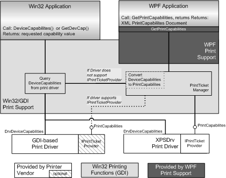

# Win32 API Support for Print Capabilities

The Windows Vista print subsystem provides compatibility support that enables Windows Presentation Foundation (WPF) applications to use GDI-based print drivers and enables Microsoft Win32-based applications to use XPSDrv print drivers. This compatibility is provided through a layer of software shims. Shims are software modules that perform transformation operations on the data so that otherwise incompatible software can interoperate. The following figure shows the data paths of this implementation for Print Capabilities.

Both [XPSDrv print drivers](xpsdrv-printer-drivers.md) and GDI-based, version 3 print drivers support the [**DrvDeviceCapabilities**](https://msdn.microsoft.com/library/windows/hardware/ff548539) function. When a Win32 application calls **DrvDeviceCapabilities** or the **GetDevCap** function, the print subsystem will call **DrvDeviceCapabilities** to collect the device capability information from the print driver.

When a WPF application requests a PrintCapabilities document from a print driver, the print subsystem will do one of the following:

-   If the print driver supports the [IPrintTicketProvider interface](https://msdn.microsoft.com/library/windows/hardware/ff554375), the print subsystem will query the print driver for the PrintCapabilities document by using the [**IPrintTicketProvider::GetPrintCapabilities**](https://msdn.microsoft.com/library/windows/hardware/ff554365) method.

-   If the print driver does not support the **IPrintTicketProvider** interface, the Print Ticket Manager will query the [**DrvDeviceCapabilities**](https://msdn.microsoft.com/library/windows/hardware/ff548539) function of the print driver and use the returned information to create a PrintTicket document that is returned to the application.

For more information about how the **IPrintTicketProvider** interface is supported by Microsoft print drivers, see [Printer Driver and Plug-in Interface Design in Windows Vista](printer-driver-and-plug-in-helper-interfaces.md).

 

 

