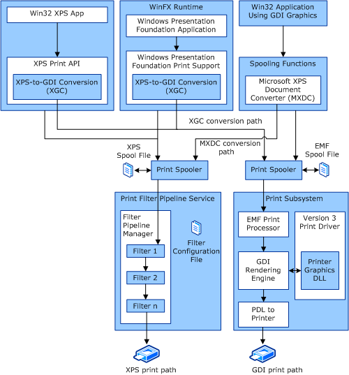

# Windows Print Path Overview

Windows Vista and later versions of Windows provide two primary print paths and two additional conversion paths. The two primary print paths are:

-   GDI print path (similar to the Windows Server 2003 print path). This path is also called the Win32 path and originates in a Win32 application by using the GDI graphic API.

-   XPS print path. This path originates in a Windows Presentation Foundation (WPF) application or from the XPS Print API.

The two conversion options are:

-   GDI-to-XPS conversion (MXDC).

-   XPS-to-GDI conversion (XGC).

### General Data Flow

The following illustration shows the different print path and conversion options of the XPSDrv subsystem.

For more information about configuring the filter pipeline service, see [Filter Pipeline Configuration File](filter-pipeline-configuration-file.md).

For more information about configuring the Version 3 Print Driver for Windows Vista and later versions of Windows, see [Version 3 XPSDrv Print Driver Components](version-3-xpsdrv-print-driver-components.md).

 

 

--------------------
[Send comments about this topic to Microsoft](mailto:wsddocfb@microsoft.com?subject=Documentation%20feedback%20%5Bprint\print%5D:%20Windows%20Print%20Path%20Overview%20%20RELEASE:%20%289/1/2016%29&body=%0A%0APRIVACY%20STATEMENT%0A%0AWe%20use%20your%20feedback%20to%20improve%20the%20documentation.%20We%20don't%20use%20your%20email%20address%20for%20any%20other%20purpose,%20and%20we'll%20remove%20your%20email%20address%20from%20our%20system%20after%20the%20issue%20that%20you're%20reporting%20is%20fixed.%20While%20we're%20working%20to%20fix%20this%20issue,%20we%20might%20send%20you%20an%20email%20message%20to%20ask%20for%20more%20info.%20Later,%20we%20might%20also%20send%20you%20an%20email%20message%20to%20let%20you%20know%20that%20we've%20addressed%20your%20feedback.%0A%0AFor%20more%20info%20about%20Microsoft's%20privacy%20policy,%20see%20http://privacy.microsoft.com/default.aspx. "Send comments about this topic to Microsoft")

