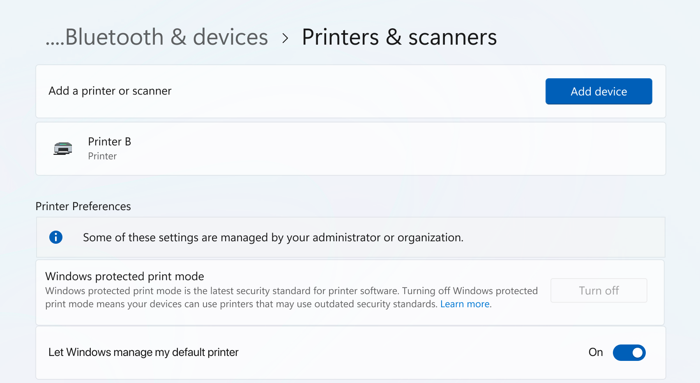

# Windows protected print mode for enterprises and developers

Windows protected print mode creates peace of mind for enterprise administrators by adding many security benefits as well as completely removing the need for any driver management. When Windows protected print mode is enabled, printers will "just work".  

- For more information about the basics of the modern print platform and Windows protected print mode, see [Modern print platform and Windows protected print mode](modern-print-platform.md) and [Windows protected print mode](windows-protected-print-mode.md).
  
- For a technical deep dive on Windows protected print mode, see [More information on Windows protected print mode for enterprises](more-information-on-windows-protected-print-mode-for-enterprises.md).

## Security

Windows protected print mode prevents the installation of third-party drivers and enables additional security features to help make environments more secure. Windows protected print mode would have mitigated over half of past reported security issues for Windows print.  

- [Module blocking](more-information-on-windows-protected-print-mode-for-enterprises.md#module-blocking)

- [Per-user XPS rendering](more-information-on-windows-protected-print-mode-for-enterprises.md#per-user-xps-rendering)

- [Lower privileges for common spooler tasks](more-information-on-windows-protected-print-mode-for-enterprises.md#lower-privileges-for-common-spooler-tasks)

- [Binary mitigations](more-information-on-windows-protected-print-mode-for-enterprises.md#binary-mitigations)
  
## Reliability and Compatibility

Windows protected print mode creates a reliable and consistent experience across a fleet of PCs regardless of manufacturer or model.

- Moving to a standard reduces risks of support calls and total cost of ownership and troubleshooting issues is simpler.

- Differentiation and unique features are still available via [Print Support Apps (PSAs)](more-information-on-windows-protected-print-mode-for-enterprises.md#print-support-app-psa).

- Ensures all printers will work with PCs of any architecture.

- Removes the need to keep drivers up to date.  

## Experience the best of Windows

As Windows moves away from third party drivers, new features will be catered to the modern print platform and will work best when Windows protected print mode is enabled.

## Enabling Windows protected print mode as group policy

1. Press **Start**.

1. Open the **Local Group Policy Editor**.

1. Navigate to **Computer Configuration** > **Administrative Templates** > **Printers**.

1. Right click on **Configure Windows protected print** and click **Edit**.

1. Select the **Enabled** radio button.

1. Click **Apply** and click **OK**.

Windows protected print is now enabled.

Windows protected print mode enabled machines should display this:



## Windows protected print mode Intune configuration

```inf
OMA-URI: ./Device/Vendor/MSFT/Policy/Config/Printers/ConfigureWindowsProtectedPrint
Data Type: String
Value: <enabled/>
```

To find more information on customizing settings via Intune, see [Add custom settings for Windows 10/11 devices in Microsoft Intune.](/mem/intune/configuration/custom-settings-windows-10)


## FAQ

See FAQs at [Windows protected print mode FAQ.](windows-protected-mode-faq.md)
