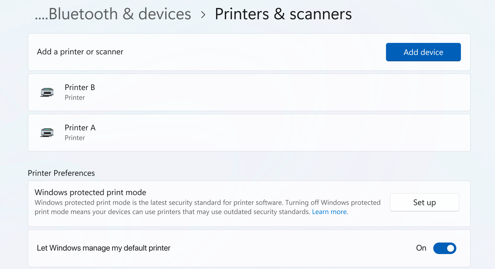
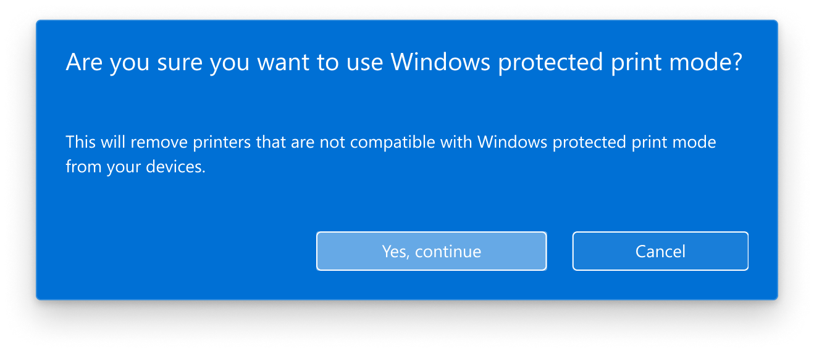
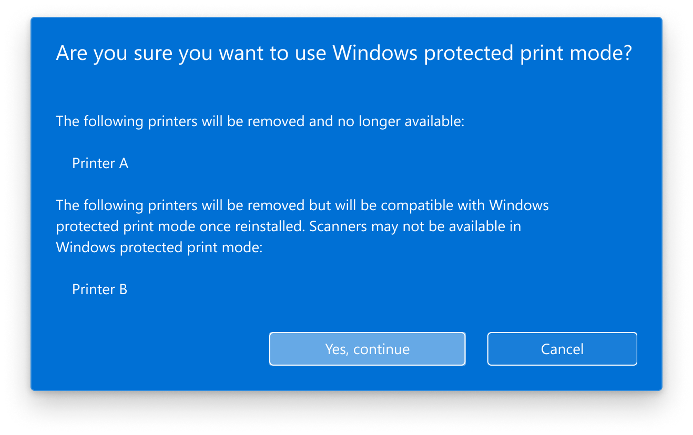
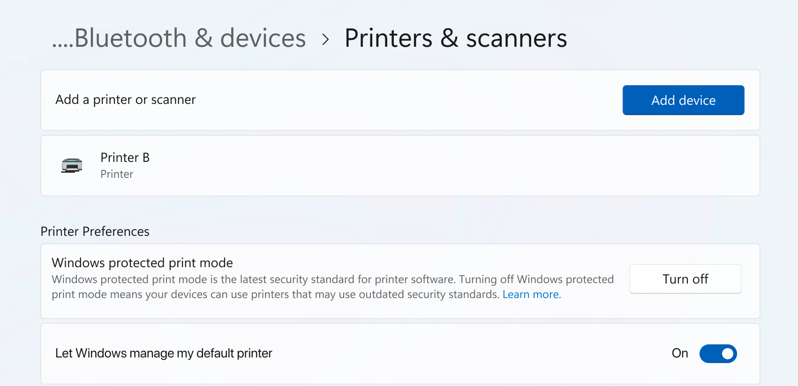
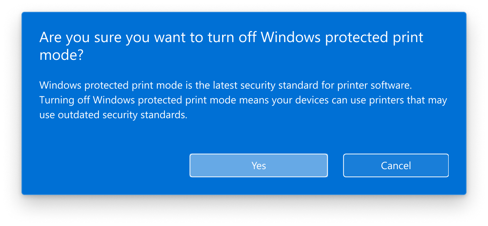

# Windows protected print mode

Windows protected print mode exclusively uses the [Windows modern print stack](modern-print-platform.md) which provides additional print security benefits on PCs. Enabling Windows protected print mode is highly recommended.  

The benefits of Windows protected print mode include:

- Increased PC security.

- Simplified and consistent printing experience, regardless of PC architecture.

- Removes the need to manage print drivers  

Windows protected print mode is designed to work with Mopria certified printers only. Many existing printers are already compatible. For more information, see [Windows protected print mode device compatibility](#windows-protected-print-mode-device-compatibility).

To find out more about Windows protected print mode, see [About Windows protected print mode](windows-protected-print-mode.md#about-windows-protected-print-mode).

Enterprise administrators can secure and simplify their printer management experience using Windows protected print mode. For more details, see a technical explanation of Windows protected print mode for enterprises [here.](windows-protected-print-mode-for-enterprises-and-developers.md)

## About Windows protected print mode

### Why should I enable Windows protected print mode?

By default, many [Mopria](https://mopria.org/) certified printers are installed using legacy drivers. Enabling Windows protected print mode ensures that printers are installed using the modern print platform, creating the best printing experience possible.

Enabling Windows protected print mode provides additional [security benefits.](windows-protected-print-mode-for-enterprises-and-developers.md#security) By creating an environment that exclusively uses modern print, the printing experience will be simplified and secured.

### What happens when I enable Windows protected print mode?

Upon enabling Windows protected print mode, printers that use third–party drivers are uninstalled.  

- The print driver is deleted from the print driver store, and it can't be used while Windows protected print mode is active.  

- When Windows protected print mode is disabled and the printer is reinstalled, the original driver is reinstalled.  

If a Mopria Certified printer was originally installed using a third-party driver:

- The printer is uninstalled, but can be reinstalled. When reinstalled, it uses the modern print stack instead of its third-party driver.

- If Windows protected print mode is disabled, installed printers continue to use the modern print stack unless they are removed and reinstalled with Windows protected print mode disabled.  

If a printer was originally installed with the modern print stack, enabling Windows protected print mode won't uninstall the printer.  

### Windows protected print mode device compatibility

#### Are my printers compatible with Windows protected print mode?

Only Mopria certified printers are compatible with Windows protected print mode. Most new printers and over 120 million printers already sold are Mopria certified. To see if a printer is compatible with Windows protected print mode, see [Mopria certified products.](https://mopria.org/certified-products)

#### Are my scanners compatible with Windows protected print mode?

Scanners must also be Mopria certified to be installed on a PC in Windows protected print mode.  

- Not all Mopria certified printers have Mopria certified scanners. In this case, when the device is installed, the printer is installed but the scanner is not.  

To see if a scanner is compatible with Windows protected print mode, see [Mopria certified products.](https://mopria.org/certified-products)  

### OneNote printer in Windows protected print mode

Turning on Windows protected print mode will uninstall all unsupported software printers on Windows, including "OneNote(Desktop)" and "OneNote for Windows 10". To continue using OneNote printers, Windows protected print mode will have to be disabled. After disabling Windows protected print mode, run Office repair. For more information, see our [support article](https://support.microsoft.com/office/repair-an-office-application-7821d4b6-7c1d-4205-aa0e-a6b40c5bb88b) about how to repair Office apps.

### How to use Windows protected print mode

#### How to enable Windows protected print mode

1. Press **Start.**

1. Navigate to **Settings** > **Bluetooth & Devices** > **Printers & scanners.**

1. Scroll down to **Printer Preferences** and under **Windows protected print mode** select **Set up.**

1. Select **Yes, continue** for all prompts.

Windows protected print is now enabled. Non-compatible printers are uninstalled.

#### How to disable Windows protected print mode

1. Select **Start.**

1. Navigate to **Settings** > **Bluetooth & Devices** > **Printers & scanners.**

1. Scroll down to **Printer Preferences** and under **Windows protected print mode**, select **Turn Off.**

41 Select **Yes.**

Windows protected print mode is now disabled. You can now install printers that use third party drivers.  

> [!NOTE]
> If Windows protected print mode is enabled as group policy, you will not be able to disable it without contacting your administrator.

For information on enabling Windows protected print mode as group policy, click here for [how to enable Windows protected print mode as group policy](windows-protected-print-mode-for-enterprises-and-developers.md#enabling-windows-protected-print-mode-as-group-policy).

## FAQ

See FAQs at [Windows protected print mode FAQ.](windows-protected-mode-faq.md)
